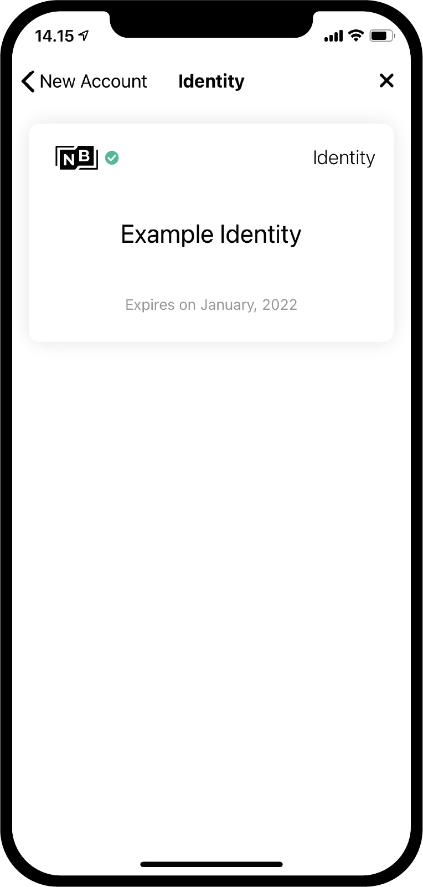
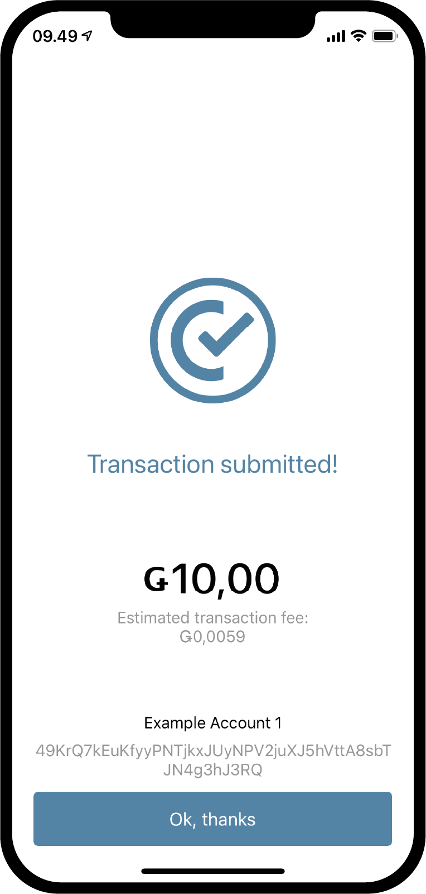
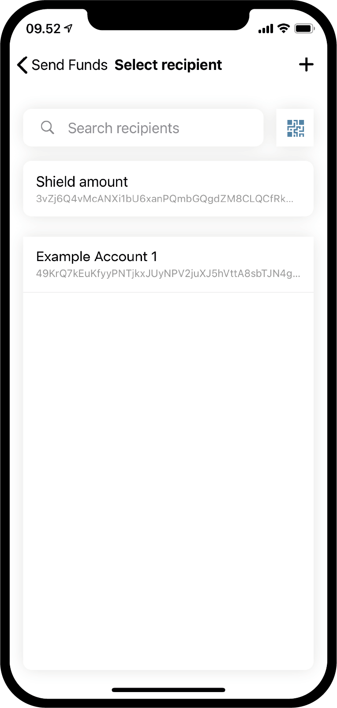
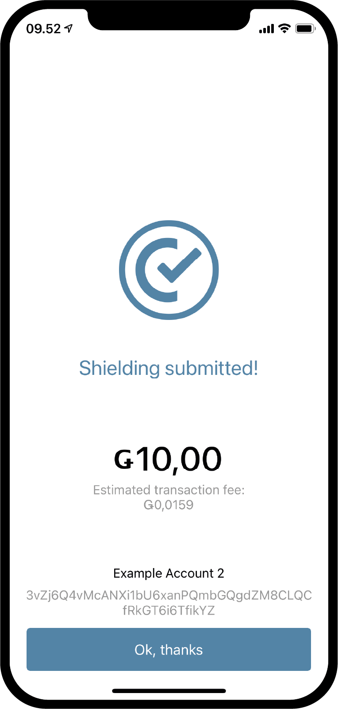

.. _Discord: https://discord.gg/xWmQ5tp

.. _guide-account-transactions:

=========================================================
Concordium ID: Erste Schritte mit Konten und Transaktionen
=========================================================

.. contents::
   :local:
   :backlinks: none

Bevor Sie dieser Anleitung folgen, sollten Sie die Beantragung Ihres anfänglichen Kontos und Ihrer Identität, wie in :ref:`dem vorherigen Kapitel<testnet-get-started>` beschrieben, abgeschlossen haben. 

Ein neues Konto erstellen
====================
Bevor wir uns damit beschäftigen, wie Konten, ihre Salden und Transaktionen funktionieren, lassen Sie uns ein zweites Konto anlegen. Gehen Sie zunächst auf die Seite *Konten*. In der oberen rechten Ecke sollten Sie ein **Pluszeichen** sehen. Drücken Sie darauf, um fortzufahren. Auf dem nächsten Bildschirm
werden Sie aufgefordert, Ihr neues Konto zu benennen. In diesem Beispiel wählen wir den Namen *Example Account 2*, aber Sie können jeden beliebigen Namen wählen.

.. image:: images/concordium-id/acc1.png
      :width: 32%
.. image:: images/concordium-id/acc2.png
      :width: 32%

Wenn Sie auf **Weiter** drücken, wird ein Bildschirm angezeigt, auf dem Sie entscheiden müssen, mit welcher Identität Sie das neue Konto eröffnen möchten.
Bis jetzt haben Sie wahrscheinlich nur eine Identität, aber wenn Sie mehrere Identitäten haben, können Sie eine Beliebige aus der Liste auswählen. Durch
das Anklicken einer Identität werden Sie zum nächsten Bildschirm weitergeleitet. Beim Erstellen eines nicht initialen Kontos, d.h. eines Kontos
das nicht bei der Identitätserstellung angelegt wird, können Sie wählen, ob Sie eine Anzahl von :ref:`glossary-attribute` offenlegen möchten. Dies ist generell nicht notwendig und wenn Sie keinen besonderen Grund dafür haben empfehlen wir ebenfalls keine offenzulegen. Offengelegte Attribute werden in die Blockchain aufgenommen und können nicht wieder entfernt werden.

.. image:: images/concordium-id/acc4.png
      :width: 32%

Wenn Sie auf die Schaltfläche **Reveal account attributes** klicken, werden Sie auf die folgende Seite weitergeleitet. Sie können ein Häkchen
bei den Attributen setzen die Sie offenlegen möchten und dann auf **Submit account** drücken. Durch Drücken von **Submit account** auf dieser oder der vorherigen
Seite gelangen Sie zur zusammenfassenden Seite für die Kontoerstellung die Ihnen einen kurzen Überblick gibt und Ihnen mitteilt, dass das Konto
angelegt wurde.

.. image:: images/concordium-id/acc5.png
      :width: 32%
.. image:: images/concordium-id/acc6.png
      :width: 32%

Durch Drücken von **Ok, thanks** auf der Einreichungsübersicht gelangen Sie zurück auf die Kontoseite. Möglicherweise sehen Sie, dass Ihr neues
Konto noch in der Schwebe ist, da es einige Minuten dauern kann, bis die Bestätigung auf der Blockchain abgeschlossen ist. Wenn Sie dies noch nicht versucht haben, können Sie
versuchen, den nach unten zeigenden Pfeil auf einer der Kontokarten zu drücken, um zu sehen, dass er die Karte ausklappt. Dies offenbart
zwei neue Informationen, *at disposal* und *staked*. Das Feld *at disposal* zeigt an, wie viel vom Kontostand
zur Verfügung steht, und über die Höhe des Einsatzes können Sie auf der Seite :ref:`Konten verwalten<verwalten_konten>` mehr lesen.

.. image:: images/concordium-id/acc7.png
      :width: 32%
.. image:: images/concordium-id/acc8.png
      :width: 32%

Eine Transaktion durchführen
====================
Versuchen Sie als Nächstes, den Bereich **Balance** Ihres neu angelegten Kontos auszuwählen. Auf diesem Bildschirm können Sie den aktuellen Kontostand sehen und an dieser Stelle können Sie auch 100 GTU anfordern, um sie im
Testnet zu verwenden. Die Anforderung von 100 GTU ist eine Testnet 4-Funktion und anstatt der 100 GTU werden 2000 GTU auf das Konto überwiesen. Die GTU-Abgabe ist nur einmal für ein Konto verfügbar. Wenn Sie sie drücken, wird eine Transaktion
erscheinen. Diese wird für eine Weile ausstehend sein, und nach einer Weile werden 2000 GTU zu Ihrem Konto hinzugefügt.

.. image:: images/concordium-id/acc9.png
      :width: 32%

Jetzt, wo wir etwas GTU auf unserem Konto haben, können wir versuchen, eine Transaktion durchzuführen. Drücken Sie dazu die Schaltfläche **SEND**. Auf der nächsten Seite
können Sie den Betrag eingeben, den Sie überweisen möchten. In diesem Beispiel werden wir 10 GTU überweisen.

.. image:: images/concordium-id/acc11.png
      :width: 32%
.. image:: images/concordium-id/acc12.png
      :width: 32%

Nachdem wir uns für einen Betrag entschieden haben, wählen wir nun den Empfänger aus. Drücken Sie dazu die Schaltfläche **Recipient or shield amount**. Auf dieser Seite können Sie nach Empfängern in Ihrem *address book* (Adressbuch) suchen oder den Empfänger durch Scannen des QR-Codes des Empfängerkontos hinzufügen.
Wie Sie im Screenshot sehen können, haben wir nur einen Empfänger gespeichert, *Example Account 1*. Darüber haben wir die Möglichkeit, *Shield an amount* abzuschirmen, aber darauf kommen wir später zurück. In diesem Beispiel wählen wir *Example Account 1* als Empfänger.

.. image:: images/concordium-id/acc13.png
      :width: 32%
.. image:: images/concordium-id/acc14.png
      :width: 32%

Nachdem wir den Betrag und den Empfänger ausgewählt haben, können wir auf **Send Funds** drücken, um fortzufahren. Daraufhin wird ein Bestätigungsbildschirm angezeigt, auf dem wir den Betrag, den Empfänger und das Sendekonto überprüfen können.  Wenn Sie auf **Yes, send funds** drücken, verifizieren Sie sich mit einem Passcode
(oder biometrisch) und dann wird die Transaktion an die Blockchain übermittelt. Es kann ein wenig dauern, bis die Transaktion abgeschlossen ist.

.. image:: images/concordium-id/acc15.png
      :width: 32%

Wir können jetzt sehen, dass die *Transfers* des *Example Account 2* zeigt, dass der Betrag abgezogen wurde, plus eine *fee*. Alle Transaktionen kosten eine Gebühr und je nach Art der Transaktion kann die Gebühr unterschiedlich hoch sein. Wenn Sie auf die Transaktion drücken, können Sie weitere Details sehen.

.. image:: images/concordium-id/acc17.png
      :width: 32%
.. image:: images/concordium-id/acc18.png
      :width: 32%

.. _move-an-amount-to-the-shielded-balance:

Verschiebe einen Betrag in den abgeschirmten Bereich
========================================
Wenn wir zurück zum Bildschirm *Accounts* gehen, können wir nun sehen, dass die 10 GTU auf die *Balance* von *Example Account 1* übertragen wurden. Vielleicht aben Sie auch bereits bemerkt, dass die Konten einen :ref:`glossary-shielded-balance` haben. Kurz gesagt, der abgeschirmte Saldo dient zur Aufbewahrung abgeschirmter (verschlüsselter) Beträge
von GTU auf dem Konto. Lassen Sie uns versuchen, einige abgeschirmte GTU zu unserem *Example Account 2* hinzuzufügen. Beginnen Sie, indem Sie auf den Bereich **Shielded Balance** auf der Kontokarte drücken.

.. image:: images/concordium-id/acc19.png
      :width: 32%
.. image:: images/concordium-id/acc20.png
      :width: 32%

Als nächstes drücken Sie erneut die Taste **SEND** und geben eine Menge GTU ein, die Sie *shielden* (abschirmen) möchten.
Nachdem Sie das getan haben, drücken Sie erneut **Select Recipient or shield amount**. Anstatt einen Empfänger zu wählen, drücken wir diesmal **Shield amount**.

.. image:: images/concordium-id/acc21.png
      :width: 32%

Wir können nun fortfahren und die Transaktion bestätigen, genau wie zuvor bei der regulären Überweisung. Die Transaktion kann einen Moment dauern, um in der Blockchain bestätigt zu werden.

.. image:: images/concordium-id/acc23.png
      :width: 32%

Wenn Sie zur Seite *Accounts* zurückgehen, können Sie jetzt sehen, dass sich in der *Shielded Balance* von *Example Account 2* 10 GTU befinden. Wenn der Bereich *Shielded Balance* der Kontokarte gedrückt wird, können wir sehen, dass im Protokoll der abgeschirmten Saldoübertragungen eine Transaktion mit einem *shielded Betrag* vorliegt.
Die Durchführung einer Abschirmungstransaktion kostet ebenfalls eine Gebühr, aber diese Gebühr wird vom regulären Saldo des Kontos abgezogen. Gehen Sie zurück und sehen Sie sich das Transferprotokoll der regulären *Balance* an.

.. image:: images/concordium-id/acc25.png
      :width: 32%
.. image:: images/concordium-id/acc26.png
      :width: 32%

Geschirmte Übertragung durchführen
========================
Da wir etwas abgeschirmte GTU zur Verfügung haben, können wir nun versuchen, einen *Shielded transfer* durchzuführen, was bedeutet, dass wir eine Übertragung mit einer verschlüsselten
Menge an GTU durchführen können. Der erste Schritt besteht darin, die Seite *shielded balance* des Kontos mit dem geschützten GTU aufzurufen, falls Sie dort noch nicht sind.
dort sind. Drücken Sie dann die Schaltfläche **SEND**. Sie können nun einen Betrag eingeben und einen Empfänger auswählen. In diesem Beispiel haben wir 2 GTU zum Übertragen gewählt. Wenn Sie auf die Schaltfläche **Select Recipient or unshield amount** drücken, können Sie einen Empfänger auswählen. Wir wählen
*Example Account 2* in diesem Beispiel.

.. image:: images/concordium-id/acc27.png
      :width: 32%
.. image:: images/concordium-id/acc28.png
      :width: 32%

Nachdem Sie den Betrag und den Empfänger eingegeben haben, können Sie nun fortfahren. Genau wie bei den anderen Transaktionen sehen Sie nun einen Bestätigungsbildschirm,
und wenn Sie von dort aus fortfahren, können Sie sich mit einem Passcode oder biometrischen Merkmalen verifizieren und dann die abgeschirmte Transaktion
an die Blockchain übersenden. Auch hier kann es einen Moment dauern, bis die Transaktion in der Blockchain bestätigt ist.

.. image:: images/concordium-id/acc29.png
      :width: 32%
.. image:: images/concordium-id/acc30.png
      :width: 32%

Wenn Sie nun zurück zum Bildschirm *Accounts* gehen, sollten Sie sehen können, dass ein kleines Schild neben dem Betrag auf dem *Shielded Balance* des Empfängerkontos angezeigt wird. Dies zeigt an, dass auf dem abgeschirmten Saldo neu eingegangene abgeschirmte Transaktionen vorhanden sind.
Klicken Sie auf den abgeschirmten Saldo und geben Sie einen Passcode ein oder verwenden Sie Ihre biometrischen Daten um sich zu verifizieren.
Dies geschieht, weil Sie empfangene abgeschirmte Transaktionen entschlüsseln müssen, bevor Sie den Betrag sehen können.

.. image:: images/concordium-id/acc31.png
      :width: 32%
.. image:: images/concordium-id/acc32.png
      :width: 32%

Einen Betrag wieder zur Verfügungn stellen (unshielden)
==================
Nach der Verschlüsselung ist der Betrag nun im *shielded Balance* und auf der Kontokarte auf dem Bildschirm *Accounts* sichtbar. Was ist nun, wenn wir
einige GTU von einem geschützten Saldo zu einem regulären Saldo verschieben wollen? Versuchen wir, die 2 GTU in den regulären Saldo zu verschieben und zwar über die Aktion
*Unshielding an amount*. Drücken Sie dazu in der abgeschirmten Balance die Taste **SEND**. Geben Sie 2 als Betrag ein und drücken Sie dann **Select Recipient
or unshield amount**. **Choose Unshield amount** wählen.

.. image:: images/concordium-id/acc33.png
      :width: 32%
.. image:: images/concordium-id/acc34.png
      :width: 32%
Schließen Sie nun die Transaktion ab, wie Sie es mit den anderen getan haben und versuchen Sie, den regulären Kontostand aufzurufen, um die Abschirmung zu sehen.
Wenn die Transaktion in der Blockchain abgeschlossen wurde, sollten Sie nun sehen können, dass ein *Unshielded amount* im regulären Saldo angezeigt wird.
Beachten Sie, dass es nicht 2 GTU sind, obwohl der Betrag, den Sie gerade abgeschirmt haben, 2 war.
Das liegt daran, dass die Gebühr für jede Transaktion, auch für eine Abschirmung, vom regulären Saldo des Kontos abgezogen wird, das für die Transaktion verantwortlich ist.

.. image:: images/concordium-id/acc35.png
      :width: 32%
.. image:: images/concordium-id/acc36.png
      :width: 32%

Teilen Sie Ihre Kontoadresse
==========================
Wenn Sie die Adresse Ihres Kontos freigeben möchten, können Sie dies ganz einfach durch Drücken der Schaltfläche **Accounts** tun. Dies führt Sie zu einer Seite
auf der Sie mehrere Optionen zum Freigeben der Kontoadresse haben. Versuchen Sie, die Schaltfläche **Share** zu drücken und geben Sie Ihre Adresse an jemanden weiter.

.. image:: images/concordium-id/acc37.png
      :width: 32%
.. image:: images/concordium-id/acc38.png
      :width: 32%

Freigabeplan prüfen
==========================
On the Concordium blockchain it is possible to make a transaction that releases the transferred amount over time. This is called a
*transfer with a schedule*. For now we will not get into how to make such a transfer as it cannot be done from Concordium ID,
but let’s check out how a release schedule can be inspected. If you receive a transfer with a release schedule, you can press the
**burger menu** in the upper right corner of the balance screen. This will allow you to press **Release schedule**, and by doing this you
will be taken to a screen containing information on how much GTU will be released and when. If you want to learn more about how to
make a transfer with a release schedule, you can have a look at the :ref:`concordium_client` and :ref:`transactions` pages.

Auf der Concordium-Blockchain ist es möglich, eine Transaktion durchzuführen, die den überwiesenen Betrag im Laufe der Zeit freigibt. Dies wird als eine
*transfer with a schedule* angezeigt. Im Moment werden wir nicht darauf eingehen, wie man eine solche Überweisung durchführt, da dies nicht über die Concordium ID möglich ist,
aber wir wollen uns ansehen, wie ein Freigabezeitplan eingesehen werden kann. Wenn Sie eine Übertragung mit einem Freigabeplan erhalten, können Sie das
**burger menu** in der oberen rechten Ecke des balance screens drücken. Dadurch können Sie auf **Release schedule** drücken. Dadurch gelangen Sie zu einem Bildschirm, der Informationen darüber enthält, wie viel GTU zu welchem Zeitpunkt freigegeben werden soll. Wenn Sie mehr darüber erfahren möchten, wie Sie
Überweisungen mit einem Freigabeplan durchführen, können Sie einen Blick auf die Seiten :ref:`concordium_client` und :ref:`transactions` werfen.

.. image:: images/concordium-id/rel1.png
      :width: 32%
.. image:: images/concordium-id/rel2.png
      :width: 32%
.. image:: images/concordium-id/rel3.png
      :width: 32%

Support & Feedback
==================
Wenn Sie auf Probleme stoßen oder Vorschläge haben, stellen Sie Ihre Frage oder
Feedback auf `Discord`_, oder kontaktieren Sie uns unter testnet@concordium.com.
