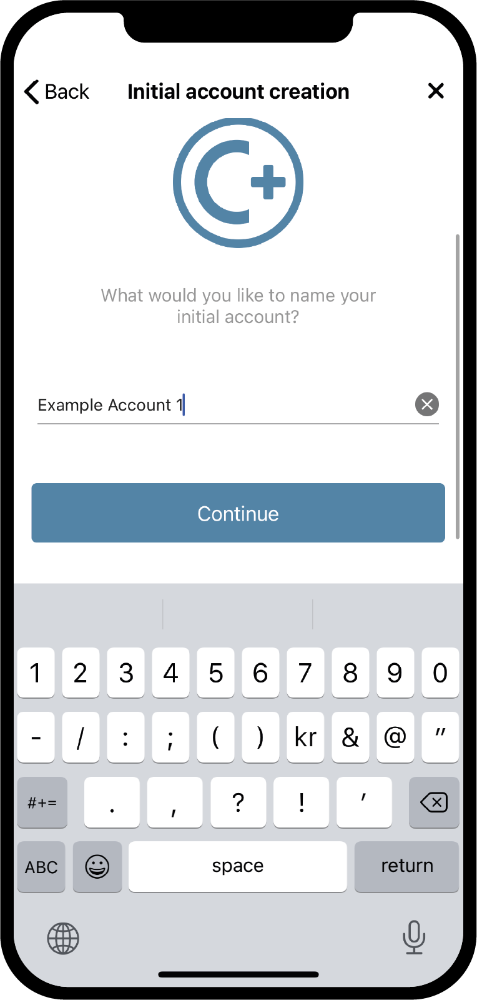

.. _Discord: https://discord.gg/xWmQ5tp

.. _testnet-get-started:

=======================================
Concordium ID: Erste Schritte mit der App
=======================================

.. contents::
   :local:
   :backlinks: none

Bevor Sie dieser Anleitung folgen, sollten Sie die Installation von Concordium ID, wie in :ref:`dem vorherigen Kapitel<testnet-get-the-app>`, abgeschlossen haben.

Richten Sie einen Passcode und biometrische Daten ein
================================

Wenn Sie die Concordium-ID-App zum ersten Mal öffnen, werden Sie von einer Mitteilung begrüßt
die Ihnen hilft, einen Passcode und eine biometrische Authentifizierung einzurichten, ein :ref:`glossary-initial-account` zu erstellen,
und es wird Sie auch durch das Erhalten einer :ref:`Glossar-Identität` führen. Das Anfangskonto ist eine besondere Art von Konto,
der vom :ref:`glossary-identity-provider` bei der Erstellung einer Identität an die Clockchain übergeben wird. Sie können dieselben Transaktionen von einem Initialkonto durchführen wie von regulären Konten, aber der Eigentümer des Initialkontos ist dem Identitätsanbieter bekannt. Nachdem Ihre Identität erstellt wurde, können Sie selbst Konten in die Blockchain einreichen und diese werden dem Identitätsanbieter neu sein. Mehr über Konten erfahren Sie auf den Seiten :ref:`Identitäten und Konten<referenz-id-konten>`.

Der erste Bildschirm, den Sie beim Öffnen von Concordium ID sehen, ist der folgende. Er erklärt Ihnen nur, dass Sie diesen Prozess durchlaufen müssen, um loszulegen.

Wenn Sie bereit sind, fortzufahren, können Sie auf **Yes, let's go** drücken und einen sechsstelligen Passcode eingeben. Wenn Sie lieber ein vollständiges Passwort mit Buchstaben verwenden möchten, können Sie dies auch hier tun.

.. image:: images/concordium-id/int1.png
      :width: 32%
.. image:: images/concordium-id/int2.png
      :width: 32%

.. todo::

   Eine Direktive schreiben, um zwei oder mehr Bilder nebeneinander zu zentrieren

Nachdem Sie entweder einen Passcode oder ein vollständiges Passwort gewählt haben, erhalten Sie die Option, auch biometrische Daten zu verwenden (wenn Ihr Telefon dies unterstützt, d. h. Gesichtserkennung oder Fingerabdruck). Wir empfehlen die Verwendung von Biometrie, wenn Sie die Möglichkeit dazu haben.

.. image:: images/concordium-id/int3.png
      :width: 32%
      :align: center

Beantragen Sie Ihr erstes Konto und Ihre Identität
=========================================

Als Nächstes haben Sie die Wahl zwischen der Erstellung eines neuen Kontos und einer neuen Identität oder dem Import eines bereits bestehenden Sets.
Angenommen, dies ist das erste Mal, dass Sie Concordium ID verwenden, können Sie **I want to create my initial account** wählen, um fortzufahren.

.. image:: images/concordium-id/int4.png
      :width: 32%
      :align: center

Auf dem nächsten Bildschirm sehen Sie eine Beschreibung, was das Initialkonto ist und die drei Schritte die Sie ausführen müssen, um es zu erhalten. Kurz gesagt ist das Anfangskonto ein Konto, das von dem Identitätsanbieter Ihrer Wahl an die Blockchain übermittelt wird, was bedeutet, dass diese weiß, dass Sie der Besitzer des Kontos sind. Später können Sie selbst Konten bei der
Blockchain einreichen, was bedeutet, dass der Besitzer dieser Konten nur Ihnen bekannt sein wird.

.. image:: images/concordium-id/int5.png
      :width: 32%
      :align: center

Die drei oben genannten Schritte sind:

1. Benennung Ihres Anfangskontos
2. Benennung Ihrer Identität
3. Beantragung des Anfangskontos und der Identität bei einem :ref:`glossary-identity-provider` Ihrer Wahl

Auf der nächsten Seite treffen Sie auf den ersten Schritt, bei dem Sie aufgefordert werden, einen Namen für Ihr Initialkonto einzugeben. Durch Drücken von Weiter
gelangen Sie auf die nächste Seite, auf der Sie Ihre Identität benennen müssen. Diese beiden Namen werden nur Ihnen selbst bekannt sein,
Sie können sie also mehr oder weniger benennen, wie Sie wollen (es gibt ein paar Einschränkungen, welche Buchstaben und Zeichen Sie verwenden können).

Im folgenden Beispiel wählen wir als Namen für unser erstes Konto *Example Account 1* und für unsere Identität *Example Identity*. Wie bereits erwähnt, können Sie beliebige Namen wählen.

.. image:: images/concordium-id/int7.png
      :width: 32%

Wenn Sie auf **Continue to identity providers** drücken, gelangen Sie zu einer Seite, auf der Sie zwischen *Identitätsanbietern* wählen müssen. Ein Identitätsanbieter ist eine externe Instanz, die verifiziert, wer Sie sind, bevor sie ein Identitätsobjekt zurückgibt, das in der Blockchain verwendet werden kann.
Im Moment können Sie wählen zwischen:

* *Notabene Development*, der Ihnen eine Testidentität ohne Identitätsüberprüfung liefert.
* *Notabene*, über die Ihre reale Identität verifiziert wird.

.. image:: images/concordium-id/int8.png
      :width: 32%
      :align: center

Wenn Sie sich für Notebene Development entscheiden, wird Ihnen kurzerhand eine Testidentität zugewiesen. Wenn Sie Notabene wählen, werden Sie
zum Ablauf der externen Identitätsvergabe weitergeleitet, der Sie durch den Prozess der Verifizierung für ein Identitätsobjekt führt.
Nach Beendigung dieses Ablaufs werden Sie zurück zu Concordium ID geleitet.

Nachdem Sie einen der beiden Identitätsausstellungsabläufe abgeschlossen haben, wird Ihnen der folgende Bildschirm angezeigt. Er zeigt Ihnen eine Übersicht über Ihre Identität und das anfängliche Konto.

.. image:: images/concordium-id/int9.png
      :width: 32%
      :align: center

Je nachdem, welchen Identitätsanbieter Sie gewählt haben, kann das Layout des Ausweises leicht abweichen. Sie können sehen, dass der Example Account 1 von der Identität Example Identity gehalten wird. Das dabei angelegte Konto wird in der App mit *(Initial)*
gekennzeichnet, damit Sie wissen, welches Konto das erste Konto ist, das vom Identitätsanbieter an die Blockchain übermittelt wurde.
Wenn Sie auf **Finish** drücken, gelangen Sie zum Bildschirm *Accounts*. Auf diesem Bildschirm können Sie Ihr neu erstelltes erstes Konto anzeigen lassen. Möglicherweise wird ein Symbol *Pending* angezeigt, was bedeutet, dass der Identitätsanbieter noch an der Übermittlung und Erstellung Ihres Erstkontos und Identität arbeitet. Sie können auch zum Bildschirm *Identitäten* navigieren, indem Sie am unteren Rand der Anzeige auf **Identities** klicken. Auf diesem Bildschirm sehen Sie Ihre neu erstellte Identität, die auch noch ausstehend sein kann, falls der Identitätsanbieter diese noch nicht fertiggestellt hat. Jetzt müssen Sie nur noch warten, bis diese fertig sind.

.. image:: images/concordium-id/int10.png
      :width: 32%
.. image:: images/concordium-id/int11.png
      :width: 32%

Support & Feedback
==================

Wenn Sie auf Probleme stoßen oder Vorschläge haben, stellen Sie Ihre Frage oder
Feedback auf `Discord`_, oder kontaktieren Sie uns unter testnet@concordium.com.
