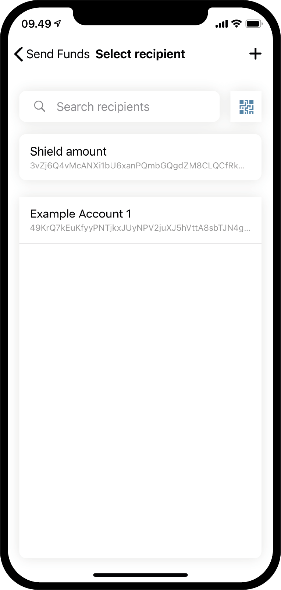
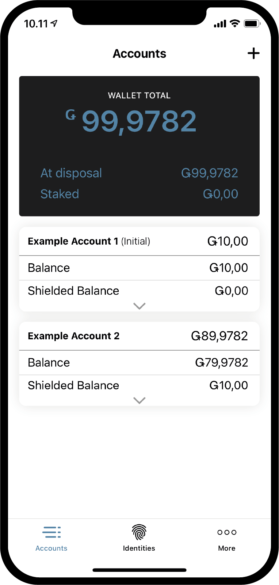
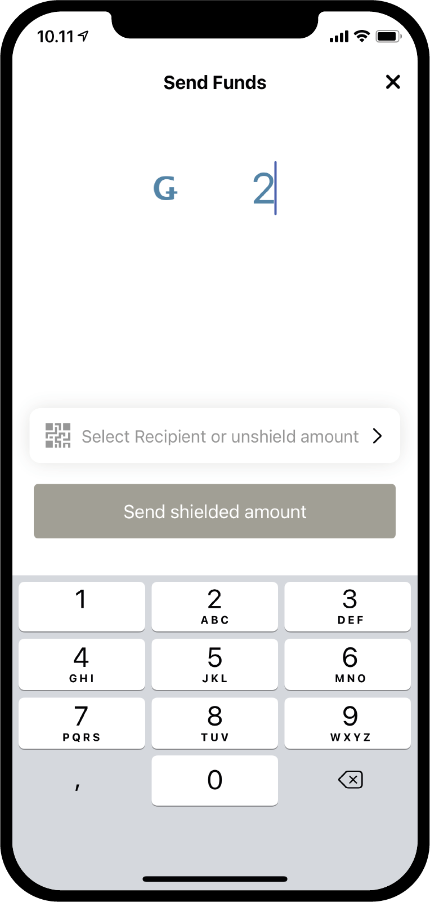
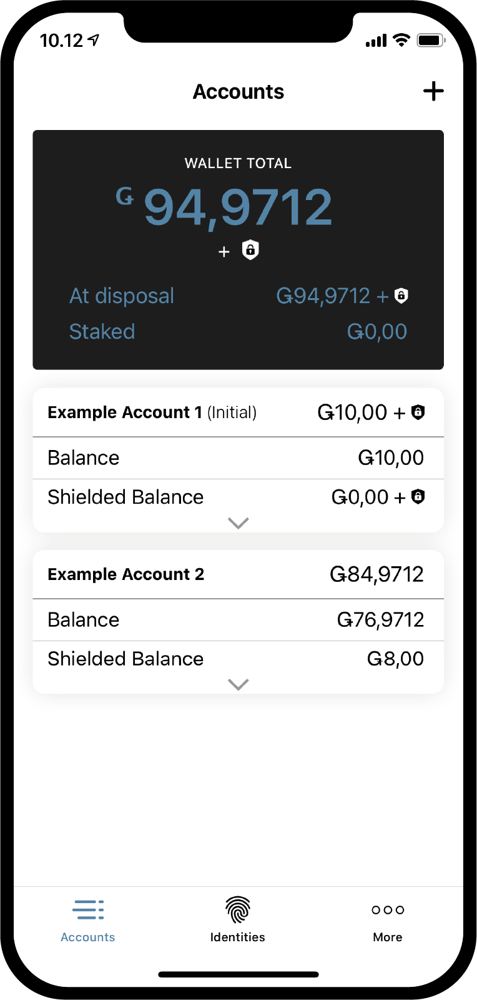
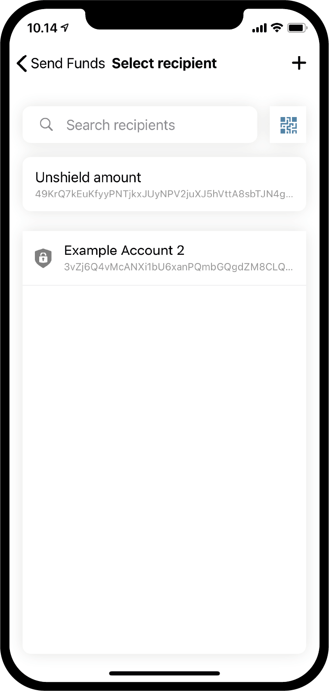

.. _Discord: https://discord.gg/xWmQ5tp

.. _guide-account-transactions-fil:

================================================================================
Concordium ID: Makapagsimula ng gumawa ng sarili mong account at mga transaksyon
================================================================================

.. contents::
   :local:
   :backlinks: none

Bago sundin ang gabay na ito dapat ay natapos mo nang mahingi ang iyong inisyal na account at pagkakakilanlan, makikita mong nakatalaga dito :ref:`the previous chapter<testnet-get-started>`.

Pag gawa ng bagong account
==========================
Bago tayo pumunta sa kung pano gumana ang mga accounts, mga balanse at mga transaksyon, gumawa muna tayo ng pangalawang account.
Magsimula tayo sa pag punta sa pahina ng *Accounts*. Sa itaas na kanang sulok makikita mo na may plus na sign. Pindutin mo ito para tumuloy.
Sa susunod na screen ay tatanungin ka na pangalanan ang iyong bagong account. Sa ehemplo na ito ay pipiliin natin ang pangalang *Example Account 2*
pero maaari ka din pumili ng kahit anong pangalan.

.. image:: images/concordium-id/acc1.png
      :width: 32%
.. image:: images/concordium-id/acc2.png
      :width: 32%

Habang pinipindot mo yung **Next**, may lalabas na screen kung saan kailangan mo mag desisyon kung ang identity
na gagamitin mo para magbukas ng bagong account. Sa ngayon ay meron kang isa, pero kung mayroon ka pang iba maari
mong piliin ang kung ano mang identity na gusto mo sa listahan. Sa pag-click sa isang identity, ikaw ay dadalhin sa susunod
na screen. Tuwing ika'y gagawa ng non-initial account, i.e. account ito na hindi ginawa sa identity creation, maari mong
ilabas ang bilang ng :ref:`glossary-attribute`. Ito ay hindi kinakailangan, at kung wala ka namang specific na rason para gawin ito,
nai-rerekomenda namin na hindi mo na ilabas ang kahit ano, dahil ang mga nailabas na attribute ay mapupunta sa on-chain at
hindi na ito matatanggal.

.. image:: images/concordium-id/acc3.png
      :width: 32%
.. image:: images/concordium-id/acc4.png
      :width: 32%

Kung pipinduting mo ang **Reveal account attributes button**, ikaw ay madadala sa susunod na pahina. Maari mong i-tick off
ang mga attribute na gusto mo palabasin, matapos nito pindutin mo ang **Submit account**. Kapag pinindot mo ang  **Submit account**
dito o sa nakaraang pahina, dadalhin ka nito sa dulong pahina ng account creation, na magbibigay sayo ng maikling overview
at makakapag sabi na naisumite mo na ang iyong account.

.. image:: images/concordium-id/acc5.png
      :width: 32%
.. image:: images/concordium-id/acc6.png
      :width: 32%

Sa pag pindot ng **Ok, thanks** sa submission overview, ikaw ay madadala pabalik sa iyong account page. Marahil makikita mo
na ang iyong bagong account ay pinoproceso pa din, dahil pwede itong umabot ng mga ilang minuto para mai-tala ito sa chain.
Kung hindi mo pa nasusubukan na gawin ito, maari mong subukan na pindutin yung arrow na nakaturo pababa na makikita mo sa mga account cards,
para makita kung ma-fofold out ang card. At ito ay maglalabas ng dalawang bagong impormasyon, *at disposal* at ang *staked*.
Ang disposal field ay makakapagsabi sayo ng kung gaano karami ang balanse ng account mo ang available na pwede mo gamitin sa kahit anong oras,
at ang staked amount naman ay mas maiintindihan mo kapag binasa mo ito dito sa pahinang to :ref:`managing accounts<managing_accounts>`

.. image:: images/concordium-id/acc7.png
      :width: 32%
.. image:: images/concordium-id/acc8.png
      :width: 32%

Pag gawa ng transaksyon
=======================

Susunod, subukan mong pinduting ang  **Balance** sa lugar ng iyong bagong gawa na account. Sa screen na ito ay makikita mo
ang iyong kasalukuyang balanse ng iyong account, at sa puntong ito, ikaw ay maaaring makapag-request ng 100 GTU na pwede mong gamitin sa Testnet.
Ang iyong request para sa 100 GTU ay feature ng Testnet, at para sa Testnet 4 ito ay makakapag transfer ng 2000 GTU sa iyong account,
kahit na ang nakalagay sa pindutan ay 100 lang. Ang GTU drop ay magiging available lang sa iyong account ng isang beses. Sa pagpindot nito,
ikaw ay makakapansin ng transaksyon na lalabas. Ito ay magiging pending ng saglit, at matapos ang ilang saglit 2000 GTU ang maidadagdag sa iyong account.

.. image:: images/concordium-id/acc9.png
      :width: 32%
.. image:: images/concordium-id/acc10.png
      :width: 32%

Ngayon na meron nang mga GTU sa iyong account, subukan nating gumawa ng tsansaksyon. Pindutin ang pindutan ng **SEND** para mangyari yun.
Sa susunod na pahina maari mong i-lagay ang dami ng GTU na gusto mo ilipat, at piliin ang makakatanggap nito. Sa halimbawang ito mag papadala tayo ng 10 GTU.

.. image:: images/concordium-id/acc11.png
      :width: 32%
.. image:: images/concordium-id/acc12.png
      :width: 32%

Kapag nakapag desisyon ka na ng kung gaano kadami ang papadala mo, maari na tayong pumili ng papadalhan. Para magawa ito,
pinduting ang pindutan na nagsasabing **Recipient or shield amount**. Sa pahinang ito makakapag search ka ng mga papadalhan mo sa iyong
*address book* o makakapag dagdag ka ng iyong papadalhan sa pamamagitan ng pag i-scan ng QR code ng account ng papadalhan mo.
Makikita mo sa screenshot na ito, na meron lang tayong isang nakasave na papadalhan,  *Example Account 1*. Sa taas nun, makikita natin na pwede mong
piliin ang *Shield an amount*, pero pwede natin pagusapan yun mamaya. Pipiliiin natin ang *Example Account 1* bilang papadalhan natin sa halimbawang ito.

.. image:: images/concordium-id/acc14.png
      :width: 32%

Kapag napili na ang amount at papadalhan, maaari mo nang pindutin ang **Send Funds** para tumuloy. Sa paggawa nito may lalabas na confirmation screen
na kung saan kailangan natin ma verify ang halaga, papadalhan at account na gagamitin pangpadala. Sa pagpindot ng **Yes, send funds**, Makakapag verify tayo sa
pag gamit ng passcode o ng biometrics, at pagkatapos noon ay maipapadala na ang transaksyon sa chain. Medyo matatagalan ng konti ang transaksyo bago ito matapos.

.. image:: images/concordium-id/acc15.png
      :width: 32%
.. image:: images/concordium-id/acc16.png
      :width: 32%

Makikita natin ngayon na ang *Transfers* log* ng *Example Account 2* ay nagpapakita ng halaga na nabawas, kasama ang *fee*. Lahat ng transaksyon ay may karampatang bayad,
at maaring magiba-iba ang bayad depende sa tipo ng transaksyon. Kapag pinindot mo ang transaksyon ito ay magpapakita sayo ng karagdagang detalye.

.. image:: images/concordium-id/acc17.png
      :width: 32%
.. image:: images/concordium-id/acc18.png
      :width: 32%

.. _move-an-amount-to-the-shielded-balance:

Pagpapadala ng halaga sa shielded na balanse
============================================
Kung babalik tayo sa screen ng *Accounts*, makikita na natin ngayon na ang 10 GTU ay nai-padala na sa  *Balance* ng *Example Account 1*.
Maari mong mapansin dati na, ang accounts ay meron ding :ref:`glossary-shielded-balance`. Sa makatuwid, ang balanse na shielded ay para sa pagtatago ng
shielded o (encrypted) na halaga ng GTU sa account. Subukan nating magdagdag ng shielded na GTU sa ating *Example Account 2*. Simulan ito sa pagpindot ng
**Shielded Balance** sa lugar ng iyong account card.

.. image:: images/concordium-id/acc19.png
      :width: 32%
.. image:: images/concordium-id/acc20.png
      :width: 32%

Susunod, pinduting ang pindutan ng **SEND** uli at ilagay ang halaga ng GTU na para ito ay ma-*shield*, Ito ay aksyong para makapagdagdag
ng mangilan-ngilang GTU sa *Shielded Balance*. Matapos mong gawin yun, Pinduting natin ang **Select Recipient or shield amount** ulit. Sa halip ng pagpili ng
papadalhan, ngayon naman ay pipindutin natin ang **Shield amount**.

.. image:: images/concordium-id/acc21.png
      :width: 32%
.. image:: images/concordium-id/acc22.png
      :width: 32%

Maaari na tayong magtuloy at mag kumpirma ng transaksyon, tulad ng ginawa natin nung nakaraan sa normal nag pagpapadala. Ang transaksyon ay maaaaring magtagal bago
ma-finalize ito sa chain.

.. image:: images/concordium-id/acc23.png
      :width: 32%
.. image:: images/concordium-id/acc24.png
      :width: 32%

Sa pagbalik natin sa pahina ng *Accounts*, makikita na natin na merong 10 GTU sa *Shielded Balance* ng *Example Account 2*. Kapag ang lugar ng
*Shielded Balance* ay napindot, makikita natin na merong *Shielded amount* na transaksyon sa shielded balance transfers log.
Ang pag gawa ng shielding transaksyon ay magkakaroon ng bayad, pero ang bayad na ito ay ibabawas sa regular na balanse ng account. Subukan mong bumalik at
tingnan ang transfers log para sa regular na *Balance*.

.. image:: images/concordium-id/acc26.png
      :width: 32%

Pag gawa ng shielded transfer
=============================

Kapag merong shielded GTU na magagamit, maaari na nating subukang gumawa ng *Shielded transfer*, ibig sabihin nito ay makakapag padala
na tayo ng halaga ng GTU na may encryption. Ang unang hakbang dito ay tingnan ang pahina ng *shielded balance* ng account na merong shielded na GTU,
kung ikaw ay hindi pa nandon. Tapos pindutin mo ang pindutan ng **SEND**. Ngayon ikaw ay maaring maglagay ng amount at makakapili ka na papadalhan.
Sa halimbawang ito pinili natin na magpadala ng 2 GTU. Sa pagpindot ng pindutan na **Select Recipient or unshield amount**, ikaw ay maaaring makapili
ng papadalhan. Pipiliin natin ang *Example Account 2* sa halimbawang ito.

.. image:: images/concordium-id/acc28.png
      :width: 32%

Kapag nailagay mo na sa lugas ang halaga at papadalhan, maari ka nang tumuloy. Tulad ng ibang transaksyon ikaw ay makakakita ng screen
kung saan ka makakapag kumpirma, at sa pagtuloy mo dito ikaw ay makakapag patunay ng iyong sarili sa pag gamit ng passcore o ng biometrics, at tapos noon
mai-susumite mo na ang shielded transaksyon sa chain. Ulitin natin, ang transaksyon ay maaring magtagal ng sandali bago ma-finalize ito sa chain.

.. image:: images/concordium-id/acc29.png
      :width: 32%
.. image:: images/concordium-id/acc30.png
      :width: 32%

Ngayon, kung babalik ka na sa screen ng  *Accounts*, maaring mo nang makita na meron maliit na kalasag na lumabas katabi ng halaga na nasa *Shielded Balance*
sa receiving account. Ito ay nag-iindika na merong mga bagong natanggap na shielded na transaksyon sa shielded na balanse.
Kapag sinubukan mong pindutin ang shielded balance, mapapansin mo na kinakailangan mong mag pasok ng passcore o gamitin ang iyong biometrics upang makapasok dito.
Ito ay nangyayari dahil kinakailangan mong i-decrypt ang natanggap mong shielded na transaksyon, bago mo makita ang halaga dito.

.. image:: images/concordium-id/acc32.png
      :width: 32%

Pag - Unshield ng amount
========================

Matapos ang pag-decrypt, Ngayon makikita mo na ang halaga sa *shielded balance* at sa account card na nasa screen ng *Accounts*
Ngayon, paano kung gustuhin nating ilipat ang ilang GTU galing sa balanseng shielded  papunta sa regular na balanse? Subukan nating maglipat ng 2 GTU papunta
sa regular na balanse gamit ang aksyon ng *Unshielding* ng halaga. Para magawa ito, pinduting natin ang pindutan ng **SEND**  sa balanse ng shielded.
Ilagay ang 2 bilang halaga, at pinduting ang **Select Recipient or unshield amount**. **Choose Unshield amount**.

.. image:: images/concordium-id/acc33.png
      :width: 32%

Ngayon tapusing ang transaksyon tulad ng ginawa mo dun sa mga nauna, at subukang i-browse ang regular na balanse ng account para makita ang unshielding.
Kung ang transaksyon ay natapos na sa chain, maari mo nang makita na ang *Unshielded amount* ay naka-tick na sa regular na balanse.
Mapapansin na hindi ito 2 GTU, kahit na ang halaga na iyong in-unshield ay 2. It ay dahil sa bayad sa pag gawa ng transaksyon, kasama ang unshielding,
ito ay ibabawa sa regular na balanse ng account na responsable sa pag gawa ng transaksyon.

.. image:: images/concordium-id/acc35.png
      :width: 32%
.. image:: images/concordium-id/acc36.png
      :width: 32%

Share your account address
==========================
If you want to share the address of your account, this can be easily done by pressing the **Address** button. This will take you to a page
where you have multiple options of sharing the account address. Try pressing the **Share** button, and share your address with someone.

.. image:: images/concordium-id/acc37.png
      :width: 32%
.. image:: images/concordium-id/acc38.png
      :width: 32%

Pag-inspecta ng schedule kung kelan ilalabas
============================================

Sa blockchain ng concordium possible na makagawa ng transaksyon na makakapag palabas ng napadalang halaga sa paglipas ng panahon. Ito ay tinatatawag na
*transfer with a schedule*. Sa ngayon hindi muna tayo pupunta sa kung paano gumawa ng ganung klaseng pagpapadala kasi hindi pa ito magagawa sa Concordium ID,
Pero tingnan natin kung paano makakapag inspect ng release schedule. Kapag nakatanggap ka ng padala na may release schedule, maaari mong pinduting ang
**burger menu** sa may dakong taas na kanang bahagi ng balance screen. Sa pag gawa nito maaari mo nang pindutin ang **Release schedule**, at sa pag gawa nito
dadalhin ka sa screen na may laman ng impormasyon na kung gaano karami ang GTU na mailalabas at kung kailan ito mailalabas. Kung nais mong may mas matutunan tunkol
sa kung paano magpadala ng may release schedule, maari mo syang makita sa pahinang :ref:`concordium_client` and :ref:`transactions`.

.. image:: images/concordium-id/rel1.png
      :width: 32%
.. image:: images/concordium-id/rel2.png
      :width: 32%
.. image:: images/concordium-id/rel3.png
      :width: 32%

Mga Suporta at mga puna
=======================

Kung sakaling maka enkwentro ka ng mga issue o kung mayroon kang mga suhestyon,
maaari mong ilagay ang iyong katanungan o puna sa `Discord`_, o ma-kontak kame sa testnet@concordium.com.
