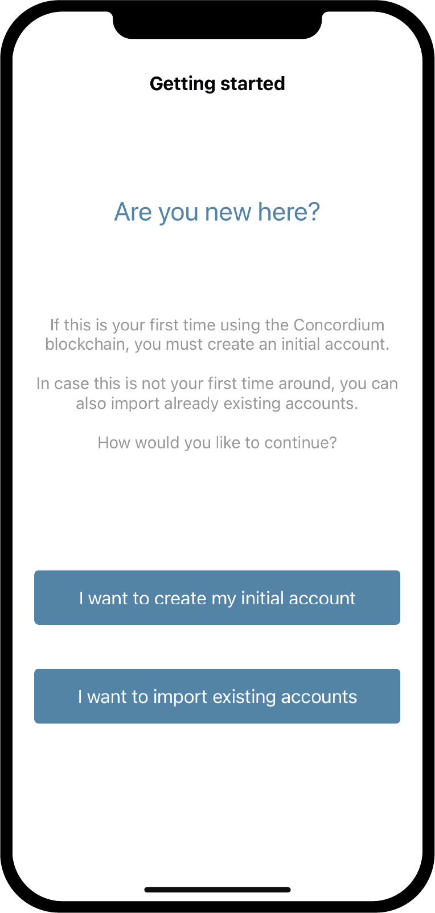
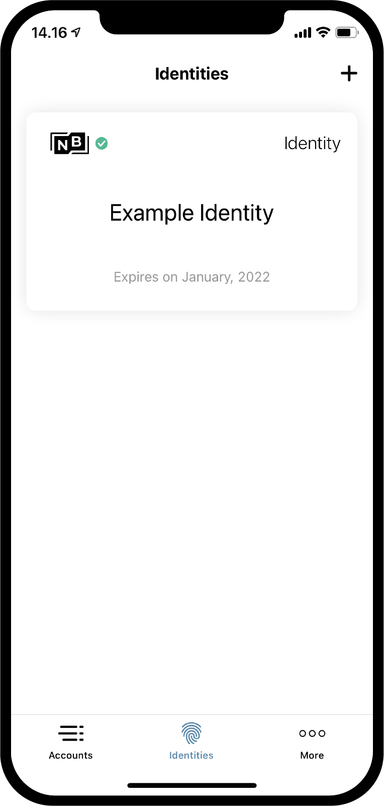

.. _Discord: https://discord.gg/xWmQ5tp

.. _testnet-get-started-fil:

================================
Concordium ID: Magsimula sa app
================================

.. contents::
   :local:
   :backlinks: none

Bago sundin ang gabay na ito dapat mo nang natapos ang pag-install ng Concordium ID, tulad ng inilarawan sa :ref:`the previous chapter<testnet-get-the-app>`.

Pag-setup ng passcode at biometrics
===================================

Kapag binuksan mo ang app ng Concordium ID sa kauna-unahang pagkakataon, sasalubungin ka ng isang daloy na makakatulong sa iyo na mag-set up ng isang passcode at pagpapatotoo ng biometric, lumikha ng isang :ref:`glossary-initial-account`,
at gagabayan ka rin nito sa pamamagitan ng pagkuha ng ng :ref:`glossary-identity`. Ang paunang account ay isang espesyal na uri ng account,
na isinumite sa chain ng :ref:`glossary-identity-provider`, sa paglikha ng isang pagkakakilanlan. Maaari mong gawin ang
ang parehong mga transaksyon mula sa isang paunang account bilang mula sa mga regular na account, ngunit ang may-ari ng paunang account ay
kilala ng tagapagbigay ng pagkakakilanlan. Matapos malikha ang iyong pagkakakilanlan magagawa mong magsumite ng mga account sa chain
ang iyong sarili, at ang mga ito ay hindi malalaman ng tagapagbigay ng pagkakakilanlan. Maaari kang matuto nang higit pa tungkol sa mga account sa :ref:`Identities and accounts<reference-id-accounts>` na pahina.

Ang unang screen na matutugunan mo kapag binubuksan ang Concordium ID ay ang isang ito. Ipapaliwanag lang nito na kailangan mong dumaan sa prosesong ito upang makapagsimula.

Kung handa ka nang magpatuloy, maaari kang pindutin **Yes, let’s go!** Hihilingin sa iyo ng susunod na screen na mag-input ng anim na digit na passcode. Kung mas gugustuhin mong gumamit ng isang buong password kabilang ang mga titik, maaari mo ring piliing gawin ito dito.

.. image:: images/concordium-id/int1.png
      :width: 32%
.. image:: images/concordium-id/int2.png
      :width: 32%

.. todo::

   Write a directive to make two or more images side-by-side centered

Ang pagpili ng alinman sa isang passcode o isang buong password, makakakuha ka ng pagpipilian upang magamit din ang biometric kung ang iyong telepono ay sinusuportahan ito, ibig sabihin, pagkilala sa mukha o fingerprint. Inirerekumenda namin ang paggamit ng biometric kung mayroon kang pagpipilian na gawin ito.

.. image:: images/concordium-id/int3.png
      :width: 32%
      :align: center

Hilingin ang iyong paunang account at pagkakakilanlan
=====================================================

Susunod, makakakuha ka ng pagpipilian sa pagitan ng paggawa ng isang bagong paunang account at pagkakakilanlan, o pag-import ng isang mayroon nang hanay.
Ipagpalagay na ito ang unang pagkakataon na gumagamit ka ng Concordium ID, maaari kang pumili **I want to create my initial account** para magpatuloy.

Sa susunod na screen makikita mo ang isang paglalarawan kung ano ang paunang account at ang tatlong mga hakbang na kailangan mong matapos upang makuha ito, kasama ang iyong pagkakakilanlan. Sa madaling salita, ang paunang account ay isang account na isinumite sa chain ng tagapagbigay ng pagkakakilanlan ng iyong pagpipilian, na nangangahulugang malalaman nila na ikaw ang may-ari ng account. Mamaya maaari kang magsumite ng mga account sa chain ng iyong sarili, na nangangahulugang ang may-ari ng mga account na ito ay makikilala mo lamang.

.. image:: images/concordium-id/int5.png
      :width: 32%
      :align: center

Ang tatlong mga hakbang na nabanggit sa itaas ay:

1. Pangalan ng iyong paunang account
2. Pangalan ng iyong pagkakakilanlan
3. Humihiling ng paunang account at pagkakakilanlan mula sa isang :ref:`glossary-identity-provider` na gusto mo

Matutugunan mo ang unang hakbang sa susunod na pahina, na mag-udyok sa iyo na magpasok ng isang pangalan para sa iyong paunang account. Ang patuloy na pagpindot ay dadalhin ka sa susunod na pahina, kung saan kailangan mong pangalanan ang iyong pagkakakilanlan. Ikaw lamang ang nakakaalam nito, pwede mo silang pangalanan ng kung ano man ang naisin mo (Mayroong ilang mga hadlang sa kung anong mga titik at simbolo na maaari mong gamitin).

Sa halimbawa sa ibaba, pinili naming tawagan ang aming paunang account *Halimbawa ng Account 1* at aming pagkakakilanlan *Halimbawa ng Pagkakakilanlan*. Katulad ng nabanggit, maaari kang pumili ng alinmang mga pangalan ang gusto mo.

.. image:: images/concordium-id/int6.png
      :width: 32%
.. image:: images/concordium-id/int7.png
      :width: 32%

Sa pagpindot ng **Continue to identity providers**, dadalhin ka sa isang pahina kung saan kailangan mong pumili sa pagitan ng *identity providers*.
Ang isang tagapagbigay ng pagkakakilanlan ay isang panlabas na nilalang na papatunayan kung sino ka, bago ibalik ang isang object ng pagkakakilanlan na gagamitin sa chain.
Sa ngayon maaari kang pumili sa pagitan ng:

* *Notabene Development* na magbibigay sa iyo ng isang pagpapatunay na ikaw ay totoong tao.
* *Notabene* na kung saan ang iyong real life identity ay mabibirepika.

.. image:: images/concordium-id/int8.png
      :width: 32%
      :align: center

Sa pamamagitan ng pagpili ng Notebene Development, bibigyan ka ng pagkakakilanlan ng direkta. Kung pipiliin mo ang Notabene dadalhin ka sa kanilang panlabas na serbisyo para sa identity verification, na gagabay sa iyo sa proseso ng pag-verify ng pagkakakilanlan iyong pagkakakilanlan.
Pagkatapos matapos ng proseso na ito, ibabalik ka sa Concordium ID.

Pagkatapos alin man sa mga identity issuance flows, matutugunan ka sa sumusunod na screen. Ipapakita nito sa iyo ang isang pangkalahatang ideya ng iyong pagkakakilanlan at ang paunang account.

.. image:: images/concordium-id/int9.png
      :width: 32%
      :align: center

Depende sa napili mong identity provider, ang layout ng identity card ay maaaring bahagyang magkakaiba. Maaari mong makita na ang
Halimbawa ng Account 1 ay hawak ng identity Halimbawa ng Pagkakakilanlan. Ang account na nilikha sa panahon ng prosesong ito ay mamarkahan ng
*(Initial)* sa app, upang malaman mo kung aling account ang paunang account na isinumite sa chain ng identity provider.

Sa pagpindot ng **Finish** ikaw ay mapupunta sa *Accounts screen*. Sa screen na ito makikita mo ang iyong bagong likhang paunang
account. Pwedeng ipakita nito ang *Pending icon*, na nangangahulugang ang identity provider ay prinoproseso pa rin sa pagsusumite at paglikha ng iyong paunang account at pagkakakilanlan. Maaari ka ring mag-navigate sa *Identities screen* sa pamamagitan ng pagpindot sa **Identities** sa ilalim ng display. Sa screen na ito maaari mong makita ang iyong bagong gawang pagkakakilanlan, na maaring pending pa rin kung di pa natatapos ang identity provider sa pagproseso nito. Ang kailangan mo na lang gawin ay maghintay na matapos sila.

.. image:: images/concordium-id/int10.png
      :width: 32%

Suporta at Katugunan
====================

Kung nagkakaroon ka ng anumang mga isyu o may mga mungkahi, i-post ang iyong katanungan o puna sa `Discord`_, o makipag-ugnay sa amin sa testnet@concordium.com.
