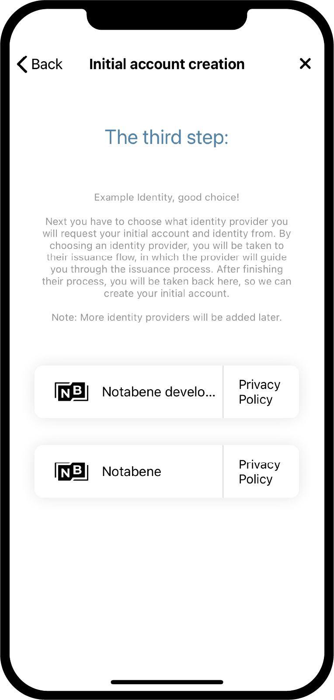
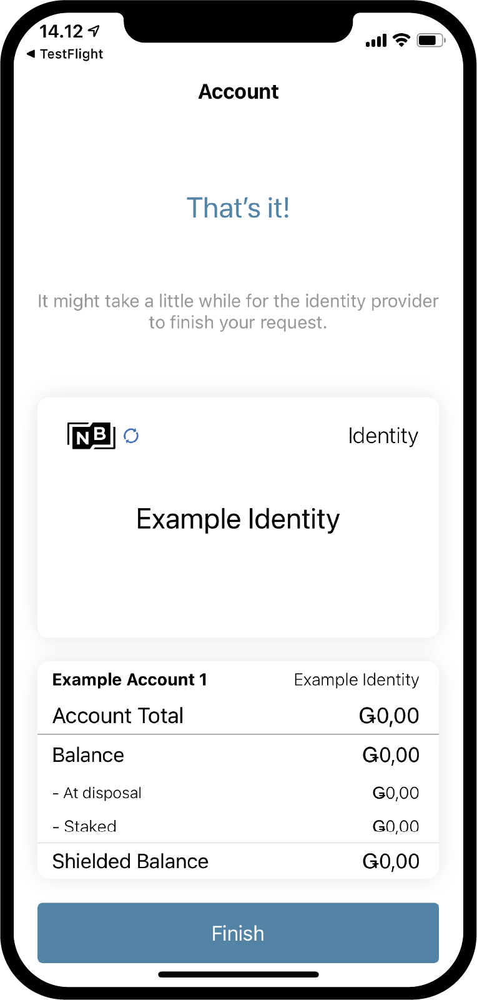

.. _Discord: https://discord.gg/xWmQ5tp

.. _testnet-get-started:

================================
Concordium ID: Magsimula sa app
================================

.. contents::
   :local:
   :backlinks: none

Bago sundin ang gabay na ito dapat mo nang natapos ang pag-install ng Concordium ID, tulad ng inilarawan sa :ref:`the previous chapter<testnet-get-the-app>`.

Pag-setup ng passcode at biometrics
===================================

Kapag binuksan mo ang app ng Concordium ID sa kauna-unahang pagkakataon, sasalubungin ka ng isang daloy na makakatulong sa iyo na mag-set up ng isang passcode at pagpapatotoo ng biometric, lumikha ng isang :ref:`glossary-initial-account`,
at gagabayan ka rin nito sa pamamagitan ng pagkuha ng ng :ref:`glossary-identity`. Ang paunang account ay isang espesyal na uri ng account,
na isinumite sa chain ng :ref:`glossary-identity-provider`, sa paglikha ng isang pagkakakilanlan. Maaari mong gawin ang
ang parehong mga transaksyon mula sa isang paunang account bilang mula sa mga regular na account, ngunit ang may-ari ng paunang account ay
kilala ng tagapagbigay ng pagkakakilanlan. Matapos malikha ang iyong pagkakakilanlan magagawa mong magsumite ng mga account sa chain
ang iyong sarili, at ang mga ito ay hindi malalaman ng tagapagbigay ng pagkakakilanlan. Maaari kang matuto nang higit pa tungkol sa mga account sa :ref:`Identities and accounts<reference-id-accounts>` na pahina.

Ang unang screen na matutugunan mo kapag binubuksan ang Concordium ID ay ang isang ito. Ipapaliwanag lang nito na kailangan mong dumaan sa prosesong ito upang makapagsimula.

Kung handa ka nang magpatuloy, maaari kang pindutin **Yes, let’s go!** Hihilingin sa iyo ng susunod na screen na mag-input ng anim na digit na passcode. Kung mas gugustuhin mong gumamit ng isang buong password kabilang ang mga titik, maaari mo ring piliing gawin ito dito.

.. image:: images/concordium-id/int1.png
      :width: 32%
.. image:: images/concordium-id/int2.png
      :width: 32%

.. todo::

   Write a directive to make two or more images side-by-side centered

Having chosen either a passcode or a full password, you will get the option to also use biometrics if your phone
supports it, i.e. facial recognition or fingerprint. We recommend using biometrics if you have the option to do so.

.. image:: images/concordium-id/int3.png
      :width: 32%
      :align: center

Request your initial account and identity
=========================================

Next up, you will get a choice between making a new initial account and identity, or importing an already existing set.
Assuming this is the first time you are using Concordium ID, you can choose **I want to create my initial account** to continue.

.. image:: images/concordium-id/int4.png
      :width: 32%
      :align: center

On the next screen you will see a description of what the initial account is and the three steps you have to finish to get it,
along with your identity. In short, the initial account is an account submitted to the chain by the identity provider of your
choice, which means they will know that you are the owner of the account. Later you will be able to submit accounts to the
chain by yourself, which means the owner of these accounts will be only known by you.

.. image:: images/concordium-id/int5.png
      :width: 32%
      :align: center

The three steps mentioned above are:

1. Naming of your initial account
2. Naming your identity
3. Requesting the initial account and identity from an :ref:`glossary-identity-provider` of your choice

You will meet the first step on the next page, which prompts you to enter a name for your initial account. Pressing continue
will take you to the next page, on which you have to name your identity. Both of these names will only be known by yourself,
so you can name them more or less whatever you want (There are a few constraints on what letters and signs you can use).

In the example below, we choose to call our initial account *Example Account 1* and our identity *Example Identity*. As
mentioned, you can choose whichever names you want.

.. image:: images/concordium-id/int6.png
      :width: 32%
.. image:: images/concordium-id/int7.png
      :width: 32%

By pressing **Continue to identity providers**, you will be taken to a page where you have to choose between *identity providers*.
An identity provider is an external entity who will verify who you are, before returning an identity object to be used on the chain.
For now you can choose between:

* *Notabene Development* which will give you a test identity without real life identity verification.
* *Notabene* via which your real life identity will be verified.

By choosing Notebene Development, you will be given a test identity without further ado. If you choose Notabene you will be taken
to their external identity issuance flow, which will guide you through the process of getting verified for an identity object.
After finishing this flow, you will be taken back to Concordium ID.

After finishing either of the identity issuance flows, you will be met with the following screen. It will show you an overview
of your identity and the initial account.

Depending on the identity provider you have chosen, the layout of the identity card might differ slightly. You can see that the
Example Account 1 is held by the identity Example Identity. The account created during this process will be marked with *(Initial)*
in the app, so you know which account is the initial account submitted to the chain by the identity provider.

By pressing **Finish** you will be taken to the *Accounts screen*. On this screen you will be able to see your newly created initial
account. It might be showing a *Pending icon*, which means the identity provider is still working on submitting and creating your
initial account and identity. You can also navigate to the *Identities screen* by clicking on **Identities** at the bottom of the
display. On this screen you can see your newly created identity, which might also still be pending in case the identity provider
has not finished it yet. All you have to do now, is wait for them to finish.

.. image:: images/concordium-id/int10.png
      :width: 32%
.. image:: images/concordium-id/int11.png
      :width: 32%

Support & Feedback
==================

If you run into any issues or have suggestions, post your question or
feedback on `Discord`_, or contact us at testnet@concordium.com.
