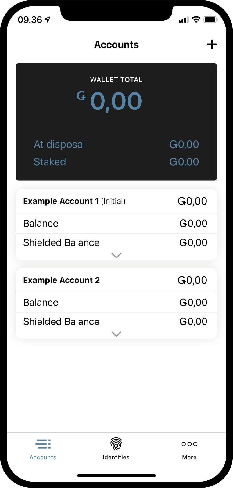

.. _Discord: https://discord.gg/xWmQ5tp

.. _panduan-transaksi-akun:

================================================
Concordium ID: Memulai dengan akun dan transaksi
================================================

.. contents::
   :local:
   :backlinks: none

Sebelum mengikuti panduan ini, Anda seharusnya sudah selesai meminta akun dan identitas awal Anda, seperti yang dijelaskan dalam :ref:`bab sebelumnya <testnet-get-started>`.

Buat akun baru
==============
Sebelum membahas cara kerja akun, saldo, dan transaksinya, mari buat akun kedua. Mulailah dengan pergi
ke halaman *Akun*. Di pojok kanan atas, Anda akan melihat **tanda tambah**. Tekan itu untuk melanjutkan. Di layar berikutnya
Anda akan diminta untuk memberi nama akun baru Anda. Dalam contoh ini kita akan memilih nama *Contoh Akun 2*, tetapi Anda bisa
pilih nama yang Anda inginkan.

.. image:: images/concordium-id/acc1.png
      :width: 32%
.. image:: images/concordium-id/acc2.png
      :width: 32%

Saat menekan **Selanjutnya**, Anda akan dihadapkan dengan layar di mana Anda harus memutuskan identitas mana yang akan digunakan untuk membuka akun baru.
Sejauh ini Anda mungkin hanya memiliki satu, tetapi jika Anda memiliki lebih banyak, Anda dapat memilih identitas mana yang Anda inginkan dari daftar. Dengan
Dengan mengklik sebuah identitas, Anda akan dibawa ke layar berikutnya. Saat membuat akun non-awal, yaitu akun
yang tidak dibuat saat pembuatan identitas, Anda dapat memilih untuk menampilkan sejumlah :ref:`glosarium-atribut`. Ini tidak perlu,
dan jika Anda tidak memiliki alasan khusus untuk melakukannya, kami sarankan untuk tidak mengungkapkannya, karena atribut yang terungkap menjadi on-chain dan tidak dapat dihapus.

.. image:: images/concordium-id/acc3.png
      :width: 32%
.. image:: images/concordium-id/acc4.png
      :width: 32%

Jika Anda menekan tombol **Buka atribut akun**, Anda akan dibawa ke halaman berikut. Anda bisa mencentang
dari atribut yang ingin Anda ungkapkan, lalu tekan **Kirim akun**. Menekan **Kirim akun** ini atau halaman
sebelumnya, akan membawa Anda ke halaman pembuatan akun terakhir, yang akan memberi Anda gambaran singkat dan memberitahu Anda bahwa akun tersebut
telah dikirimkan.

.. image:: images/concordium-id/acc5.png
      :width: 32%
.. image:: images/concordium-id/acc6.png
      :width: 32%

Dengan menekan **Oke, terima kasih** pada ringkasan pengiriman, Anda akan dibawa kembali ke halaman akun. Anda mungkin melihat bahwa akun baru
anda masih menunggu keputusan, karena perlu beberapa menit untuk menyelesaikan rantai. Jika Anda belum mencobanya, Anda bisa
mencoba menekan panah yang menghadap ke bawah di salah satu kartu akun, untuk melihat bahwa itu akan melipat kartu. Ini mengungkapkan
dua informasi baru, *siap digunakan* dan *di stake*. Bidang yang tersedia akan memberi tahu Anda berapa banyak saldo akun
yang tersedia untuk digunakan pada saat tertentu, dan jumlah yang dipertaruhkan dapat Anda baca lebih lanjut di halaman :ref:`mengelola akun <managing_accounts>`.

.. image:: images/concordium-id/acc8.png
      :width: 32%

Melakukan transaksi
===================
Selanjutnya, coba tekan area **Saldo** di akun yang baru Anda buat. di layar
ini anda dapat melihat saldo saat ini dari akun anda, dan pada saat ini, itu juga akan memungkinkan Anda meminta 100 GTU untuk digunakan
di testnet. Permintaan 100 GTU adalah fitur Testnet, dan untuk Testnet 4 sebenarnya akan mengirim 2000 GTU ke akun
meskipun tombolnya bertuliskan 100. Pemberian GTU hanya tersedia di akun satu kali. Dengan menekannya, Anda akan melihat sebuah transaksi
muncul. Ini akan tertunda sebentar, dan setelah beberapa saat 2000 GTU akan ditambahkan ke akun Anda.

.. image:: images/concordium-id/acc9.png
      :width: 32%
.. image:: images/concordium-id/acc10.png
      :width: 32%

Sekarang kita memiliki beberapa GTU di akun kita, mari kita coba melakukan transaksi. Tekan tombol **KIRIM** untuk melakukannya. Di halaman selanjutnya
Anda dapat memasukkan jumlah yang ingin Anda transfer, dan memilih penerima. Dalam contoh ini kami akan mentransfer 10 GTU.

.. image:: images/concordium-id/acc11.png
      :width: 32%
.. image:: images/concordium-id/acc12.png
      :width: 32%

Setelah memutuskan jumlahnya, sekarang kami akan memilih penerima. Untuk melakukan ini, tekan tombol Pilih **Penerima atau jumlah yang di lindungi**.
Pada halaman ini, Anda dapat mencari penerima di *buku alamat* Anda atau menambahkan penerima dengan memindai kode QR akun penerima.
Seperti yang Anda lihat di tangkapan layar, kami hanya memiliki satu penerima yang disimpan, *Contoh Akun 1*. Di atas itu, kami memiliki opsi untuk *Melindungi
jumlah*, tapi kita akan membahasnya nanti. Kami akan memilih *Contoh Akun 1* sebagai penerima kami dalam contoh ini.

.. image:: images/concordium-id/acc13.png
      :width: 32%
.. image:: images/concordium-id/acc14.png
      :width: 32%

Dengan jumlah dan penerima yang dipilih, kami dapat menekan **Kirim Dana** untuk melanjutkan. Dengan melakukan ini kita akan dihadapkan pada layar konfirmasi di
mana kita dapat memverifikasi jumlah, penerima dan akun pengirim. Dengan menekan **Ya, kirim dana**, kami akan memverifikasi diri kami menggunakan kode sandi
atau biometrik, dan kemudian transaksi diserahkan ke rantai. Mungkin perlu sedikit waktu untuk menyelesaikan transaksi.

.. image:: images/concordium-id/acc15.png
      :width: 32%
.. image:: images/concordium-id/acc16.png
      :width: 32%

Sekaran kita dapat melihat *Contoh akun 2* log *Transfer* menunjukkan bahwa jumlahnya telah dipotong, ditambah *biaya*. Semua transaksi akan
dikenakan biaya, dan tergantung pada jenis transaksinya, biayanya mungkin berbeda. Menekan transaksi akan membuat Anda melihat lebih rinci.

.. image:: images/concordium-id/acc17.png
      :width: 32%
.. image:: images/concordium-id/acc18.png
      :width: 32%

.. _move-an-amount-to-the-shielded-balance:

Pindahkan saldo ke saldo yang terlindung
========================================
Jika kita kembali ke layar *Akun*, sekarang kita dapat melihat bahwa 10 GTU telah ditransfer ke *Saldo* dari *Contoh Akun 1*. Seperti yang mungkin telah
anda perhatikan sebelumnya, akun juga memiliki :ref:`glossary-shielded-balance`. Singkatnya, saldo terlindung adalah untuk menjaga jumlah GTU yang terlindung
(terenkripsi) di akun. Mari kita coba menambahkan beberapa GTU terlindung ke *Contoh Akun 2* kami. Mulailah dengan menekan area **Shielded Balance** di kartu akun.

.. image:: images/concordium-id/acc19.png
      :width: 32%
.. image:: images/concordium-id/acc20.png
      :width: 32%

Selanjutnya, tekan lagi tombol **kirim** dan masukkan jumlah GTU untuk *dilindungi*, yang merupakan tindakan untuk menambahkan beberapa GTU ke *Shielded Balance*.
Setelah itu, tekan lagi **Pilih Penerima atau nomor pelindung**. Alih-alih memilih penerima, kali ini kami akan menekan **Jumlah perlindungan**.

.. image:: images/concordium-id/acc21.png
      :width: 32%
.. image:: images/concordium-id/acc22.png
      :width: 32%

Kami sekarang dapat melanjutkan dan mengkonfirmasi transaksi, seperti yang kami lakukan sebelumnya dengan transfer biasa. Transaksi mungkin membutuhkan waktu beberapa saat
untuk menyelesaikan rantai.

.. image:: images/concordium-id/acc23.png
      :width: 32%
.. image:: images/concordium-id/acc24.png
      :width: 32%

Dengan kembali ke halaman *Akun*, sekarang dapat dilihat bahwa terdapat 10 GTU pada *Saldo Terlindung* dari *Contoh Akun 2*. Jika *Saldo
terlindung* dari kartu akun ditekan, kita dapat melihat bahwa ada transaksi *Jumlah terlindung* di log transfer saldo terlindung.
Melakukan transaksi terlindung juga akan dikenakan biaya, tetapi biaya ini akan dipotong dari saldo reguler akun. Coba
kembali dan lihat log transfer dari *Saldo* reguler.

.. image:: images/concordium-id/acc25.png
      :width: 32%
.. image:: images/concordium-id/acc26.png
      :width: 32%

Melakukan transfer terlindung
=============================
Setelah beberapa GTU terlindung tersedia, kami sekarang dapat mencoba melakukan *Transfer terlindung*, yang berarti kami dapat melakukan transfer dengan
jumlah GTU yang dienkripsi. Langkah pertama adalah menjelajahi halaman *saldo terlindung* dari akun yang berisi GTU terlindung, jika anda belum berada
disana. Kemudian tekan tombol **KIRIM**. Sekarang Anda dapat memasukkan jumlah dan memilih penerima. Dalam contoh ini kami telah memilih untuk
mentransfer 2 GTU. Saat menekan tombol **Pilih Penerima atau jumlah unshield**, Anda akan dapat memilih penerima. Kami akan memilih
*Contoh akun 2* dalam contoh ini.

.. image:: images/concordium-id/acc27.png
      :width: 32%
.. image:: images/concordium-id/acc28.png
      :width: 32%

Dengan jumlah dan penerima di tempat, Anda sekarang dapat melanjutkan. Sama seperti transaksi lainnya, Anda sekarang akan melihat layar konfirmasi,
dan dengan melanjutkan Anda akan dapat memverifikasi diri Anda dengan kode sandi atau biometrik, dan kemudian mengirimkan transaksi terlindung
ke rantai. Sekali lagi, transaksi mungkin membutuhkan waktu beberapa saat untuk menyelesaikan rantai tersebut.

.. image:: images/concordium-id/acc29.png
      :width: 32%
.. image:: images/concordium-id/acc30.png
      :width: 32%

Sekarang, jika Anda kembali ke layar *Akun*, Anda harus dapat melihat bahwa perisai kecil telah muncul di samping jumlah di
*Saldo Terlindung* dari akun penerima. Ini menunjukkan bahwa ada transaksi terlindung yang baru diterima pada saldo terlindung.
Coba tekan saldo terlindung, dan perhatikan bahwa Anda harus memasukkan kode sandi atau menggunakan biometrik Anda untuk memasukinya.
Ini terjadi karena Anda perlu mendekripsi transaksi terlindung yang diterima, sebelum Anda dapat melihat jumlahnya.

.. image:: images/concordium-id/acc31.png
      :width: 32%
.. image:: images/concordium-id/acc32.png
      :width: 32%

Membuka perlindungan
====================
Setelah dekripsi, jumlahnya sekarang dapat dilihat di *saldo terlindung* dan di kartu akun di layar *Akun*. Sekarang, bagaimana jika kita
ingin memindahkan beberapa GTU dari saldo terlindung menjadi saldo biasa? Ayo coba pindahkan 2 GTU ke saldo biasa melalui aksi
*Membuka Perlindungan*. Untuk melakukan ini, tekan tombol **KIRIM** di saldo terlindung. Masukan 2 sebagai jumlah,dan kemudian tekan **Pilih penerima
atau buka perlindungan**. **Pilih Buka Perlindungan**.

.. image:: images/concordium-id/acc33.png
      :width: 32%
.. image:: images/concordium-id/acc34.png
      :width: 32%

Sekarang selesaikan transaksi seperti yang Anda lakukan dengan yang lain, dan coba jelajahi ke saldo reguler akun untuk melihat Pembukaan pelindung.
Jika transaksi telah diselesaikan secara berantai, Anda sekarang dapat melihat bahwa *Jumlah yang tidak dilindungi* telah masuk pada saldo reguler.
Perhatikan bagaimana ini bukan 2 GTU, meskipun jumlah yang baru saja Anda lepas adalah 2. Ini karena biaya untuk melakukan transaksi apapun termasuk
sebuah Pembukaan pelindung, akan dikurangkan dari saldo reguler akun yang bertanggung jawab atas transaksi tersebut.

.. image:: images/concordium-id/acc35.png
      :width: 32%
.. image:: images/concordium-id/acc36.png
      :width: 32%

Bagikan alamat akun Anda
==========================
Jika Anda ingin membagikan alamat akun Anda, ini dapat dengan mudah dilakukan dengan menekan tombol **Alamat**. Ini akan membawa Anda ke halaman
di mana Anda memiliki beberapa opsi untuk berbagi alamat akun. Coba tekan tombol **Bagikan**, dan bagikan alamat Anda dengan seseorang.

.. image:: images/concordium-id/acc37.png
      :width: 32%
.. image:: images/concordium-id/acc38.png
      :width: 32%

Memeriksa jadwal rilis
==========================
Di blockchain Concordium, dimungkinkan untuk membuat transaksi yang mengeluarkan jumlah yang ditransfer dari waktu ke waktu. Ini disebut dengan
*transfer dengan jadwal*. Untuk saat ini kami tidak akan membahas cara melakukan transfer seperti itu karena tidak dapat dilakukan dari ID Concordium,
tapi mari kita lihat bagaimana jadwal rilis dapat diperiksa. Jika Anda menerima transfer dengan jadwal rilis, Anda dapat menekan
**menu burger** di pojok kanan atas layar saldo. Ini akan memungkinkan Anda untuk menekan **Jadwal rilis**, dan dengan melakukan ini Anda
akan dibawa ke layar yang berisi informasi tentang berapa banyak GTU akan yang dirilis dan kapan. Jika Anda ingin mempelajari lebih lanjut tentang caranya
melakukan transfer dengan jadwal rilis, Anda dapat melihat halaman :ref:`concordium_client` dan :ref:`transaksi`.

.. image:: images/concordium-id/rel1.png
      :width: 32%
.. image:: images/concordium-id/rel2.png
      :width: 32%
.. image:: images/concordium-id/rel3.png
      :width: 32%

Dukungan & Umpan Balik
======================

Jika Anda mengalami masalah atau memiliki saran, kirim pertanyaan Anda atau
umpan balik ke `Discord`_, atau hubungi kami di testnet@concordium.com.
