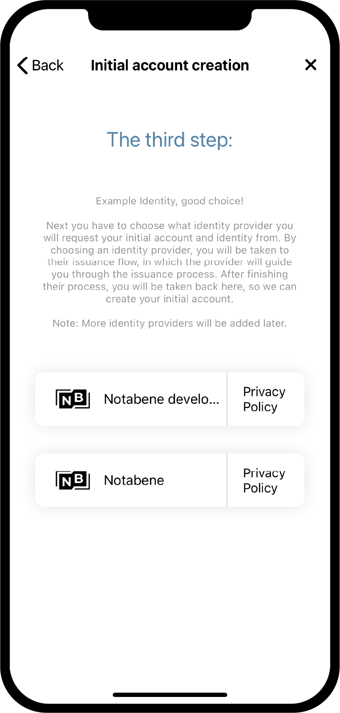

.. _Discord: https://discord.gg/xWmQ5tp

.. _testnet-get-started:

===============================
Concordium ID: Memulai aplikasi
===============================

.. contents::
   :local:
   :backlinks: none

Sebelum mengikuti panduan ini, Anda harus sudah selesai menginstal Concordium ID, seperti yang dijelaskan di :ref:`bab sebelumnya<testnet-get-the-app>`.

Siapkan kode sandi dan biometrik
================================

Ketika Anda membuka aplikasi Concordium ID untuk pertama kalinya, Anda akan disambut oleh arus
yang akan membantu Anda mengatur kode sandi dan otentikasi biometrik, buat sebuah :ref:`glossary-initial-account`,
dan ini juga akan memandu Anda mendapatkan :ref:`glossary-identity`. Akun awal adalah jenis akun khusus,
yang dikirimkan ke rantai oleh :ref:`glossary-identity-provider`, setelah pembuatan identitas. Anda bisa membuat
transaksi yang sama dari akun awal seperti dari akun reguler, tetapi pemilik akun awal akan
diketahui oleh penyedia identitas. Setelah identitas Anda dibuat, Anda akan dapat mengirimkan akun ke rantai
diri Anda sendiri, dan ini tidak akan diketahui oleh penyedia identitas. Anda dapat mempelajari lebih lanjut tentang akun di halaman :ref:`Identities
dan akun<reference-id-accounts>`.

Layar pertama yang akan Anda temui saat membuka Concordium ID adalah yang ini. Itu hanya akan menjelaskan bahwa
Anda harus melalui proses ini untuk memulai.

Jika Anda siap untuk melanjutkan, Anda dapat menekan **Ya, ayo!** Layar berikutnya akan meminta Anda untuk memasukkan
kode sandi enam digit. Jika Anda lebih suka menggunakan kata sandi lengkap termasuk huruf, Anda juga dapat memilih untuk melakukannya di sini.

.. image:: images/concordium-id/int1.png
      :width: 32%
.. image:: images/concordium-id/int2.png
      :width: 32%

.. todo::

   Tulis arahan untuk membuat dua atau lebih gambar secara berdampingan di tengah

Setelah memilih baik kode sandi atau kata sandi lengkap, Anda akan mendapatkan opsi untuk juga menggunakan biometrik jika telepon Anda
mendukungnya, yaitu pengenalan wajah atau sidik jari. Kami merekomendasikan penggunaan biometrik jika Anda memiliki opsi untuk melakukannya.

.. image:: images/concordium-id/int3.png
      :width: 32%
      :align: center

Permintaan akun dan identitas awal Anda
=======================================

Selanjutnya, Anda akan mendapatkan pilihan antara membuat akun awal dan identitas baru, atau mengimpor kumpulan yang sudah ada.
Dengan asumsi ini, ini adalah pertama kalinya Anda menggunakan Concordium ID, Anda dapat memilih **Saya ingin membuat akun awal saya** untuk melanjutkan.

.. image:: images/concordium-id/int4.png
      :width: 32%
      :align: center

Pada layar berikutnya Anda akan melihat deskripsi tentang apa itu akun awal dan tiga langkah yang harus Anda selesaikan untuk mendapatkannya,
beserta identitas Anda. ingkatnya, akun awal adalah akun yang dikirimkan ke rantai oleh penyedia identitas pilihan
anda, yang berarti mereka akan tahu bahwa Anda adalah pemilik akun tersebut. Nanti Anda akan dapat mengirimkan akun ke
ke rantai anda sendiri, yang berarti pemilik akun ini hanya akan diketahui oleh Anda.

.. image:: images/concordium-id/int5.png
      :width: 32%
      :align: center

Tiga langkah yang disebutkan di atas adalah:

1. Penamaan akun awal Anda
2. Menamai identitas Anda
3. Meminta akun dan identitas awal dari: ref:`glossary-identity-provider` pilihan Anda

Anda akan menemui langkah pertama di halaman berikutnya, yang meminta Anda memasukkan nama untuk akun awal Anda. Menekan lanjutkan
akan membawa Anda ke halaman berikutnya, di mana Anda harus menyebutkan identitas Anda. Kedua nama ini hanya akan diketahui diri anda sendiri,
sehingga Anda dapat memberi nama lebih atau kurang apa pun yang Anda inginkan (Ada beberapa batasan tentang huruf dan tanda yang dapat Anda gunakan).

Pada contoh di bawah ini, kami memilih untuk memanggil akun awal kami *Contoh Akun 1* dan identitas kami *Contoh Identitas*. Seperti
yang disebutkan, Anda dapat memilih nama yang Anda inginkan.

.. image:: images/concordium-id/int6.png
      :width: 32%
.. image:: images/concordium-id/int7.png
      :width: 32%

Dengan menekan **Lanjutkan ke penyedia identitas**, Anda akan dibawa ke halaman di mana Anda harus memilih antara *penyedia identitas*.
Penyedia identitas adalah entitas eksternal yang akan memverifikasi siapa Anda, sebelum mengembalikan objek identitas untuk digunakan di rantai.
Untuk saat ini Anda dapat memilih antara:

* *Notabene Development* yang akan memberi Anda tes identitas tanpa verifikasi identitas kehidupan nyata.
* *Notabene* yang melaluinya identitas kehidupan nyata Anda akan diverifikasi.

Dengan memilih Notebene Development, Anda akan diberi identitas tes tanpa basa-basi. Jika Anda memilih Notabene Anda akan dibawa
ke alur penerbitan identitas eksternal mereka, yang akan memandu Anda melalui proses verifikasi untuk objek identitas.
Setelah menyelesaikan alur ini, Anda akan dibawa kembali ke Concordium ID.

Setelah menyelesaikan salah satu alur penerbitan identitas, Anda akan dihadapkan pada layar berikut. Ini akan menunjukkan kepada Anda gambaran umum
identitas Anda dan akun awal.

.. image:: images/concordium-id/int9.png
      :width: 32%
      :align: center

Bergantung pada penyedia identitas yang Anda pilih, tata letak kartu identitas mungkin sedikit berbeda. Anda dapat melihat bahwa file
Contoh Akun 1 dipegang oleh identitas Contoh Identitas. Akun yang dibuat selama proses ini akan ditandai dengan *(Awal)*
di aplikasi, jadi Anda tahu akun mana yang merupakan akun awal yang dikirimkan ke rantai oleh penyedia identitas.

Dengan menekan **Selesai** Anda akan dibawa ke *layar Akun*. Pada layar ini Anda akan dapat melihat akun inisial Anda yang baru 
dibuat. Ini mungkin menampilkan *ikon Menunggu Keputusan*, yang berarti penyedia identitas masih bekerja untuk mengirimkan dan membuat file
akun dan identitas awal. Anda juga dapat menavigasi ke *layar Identitas* dengan mengklik **Identities** di bagian bawah
layar. Di layar ini Anda dapat melihat identitas yang baru Anda buat, yang mungkin juga masih menunggu keputusan penyedia identitas
belum menyelesaikannya. Yang harus Anda lakukan sekarang, adalah menunggu mereka selesai.

.. image:: images/concordium-id/int10.png
      :width: 32%
.. image:: images/concordium-id/int11.png
      :width: 32%

Dukungan & Umpan Balik
======================

Jika Anda mengalami masalah atau memiliki saran, kirim pertanyaan Anda atau
umpan balik ke `Discord`_, atau hubungi kami di testnet@concordium.com.
