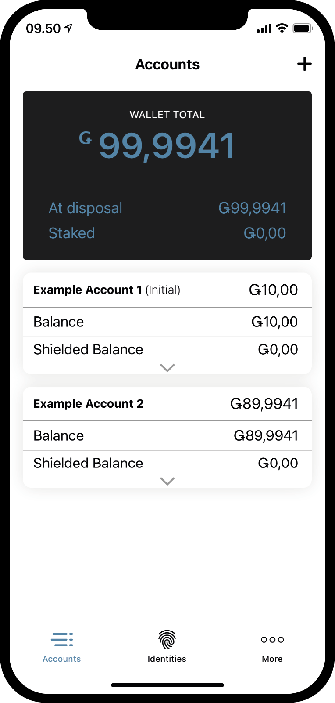
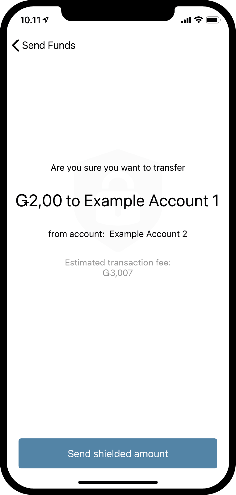
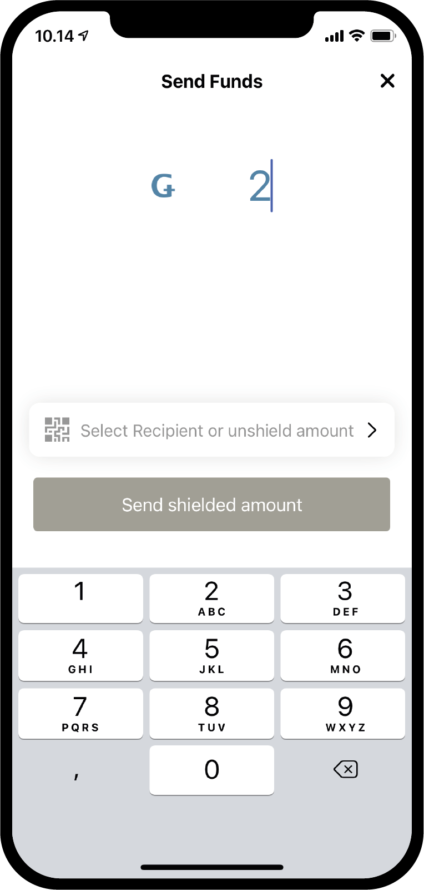
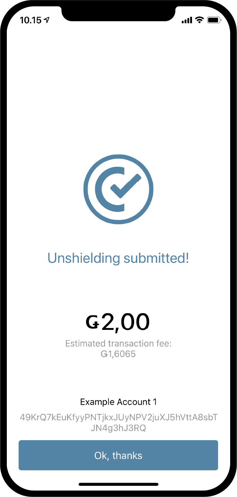
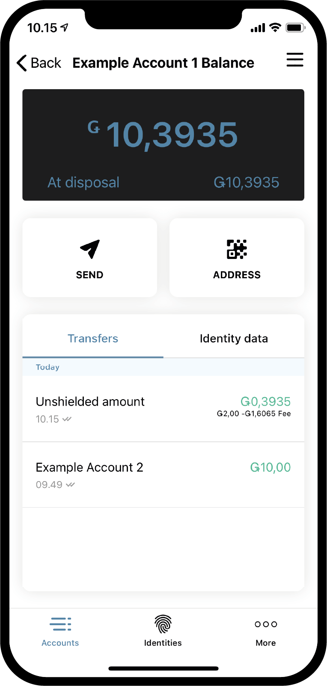
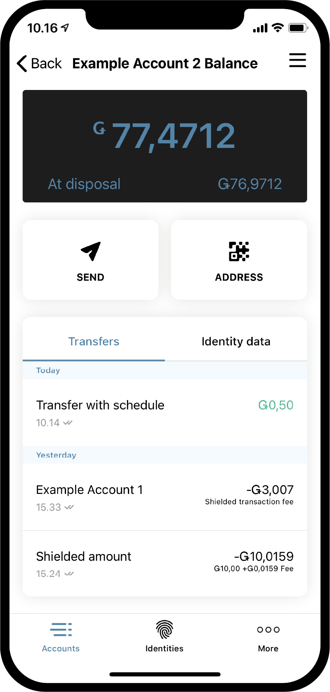

.. _Discord: https://discord.gg/xWmQ5tp

.. _guide-account-transactions-ko:

================================================
Concordium ID: 계정과 거래로 시작
================================================

.. contents::
   :local:
   :backlinks: none

이 가이드를 따르기 전에에 설명 된대로 초기 계정 및 신원 요청을 완료해야합니다. :ref:`이전 장<testnet-get-started>`.

새로운 계정을 생성
===================
계정, 잔액 및 거래가 작동하는 방식을 알아보기 전에 두 번째 계정을 만들어 보겠습니다. *계정* 페이지로 이동하여 시작하십시오.
오른쪽 상단에 **더하기 기호** 가 표시됩니다. 계속하려면 누르십시오. 다음 화면에서 새 계정의 이름을 지정하라는 메시지가 표시됩니다.
이 예에서는 *Example Account 2* 라는 이름을 선택하지만 원하는 이름을 선택할 수 있습니다.

.. image:: images/concordium-id/acc1.png
      :width: 32%
.. image:: images/concordium-id/acc2.png
      :width: 32%

**다음** 을 누르면, 당신은 당신이 새로운 계좌를 개설하는 데 사용할 정체성을 결정해야하는 화면으로 만나게 될 것이다.
지금까지 당신은 아마 하나를 가지고 있지만, 당신이있는 경우에 더 당신은 당신이 목록에서 원하는 어느 정체성 선택할 수 있습니다.
신원을 클릭하면 다음 화면으로 이동합니다. 초기 계정이 아닌 계정, 즉 ID 생성시 생성되지 않은 계정을 생성 할 때 여러 가지
:ref:`glossary-attribute` 을 표시하도록 선택할 수 있습니다. 계시 된 속성에 체인하고 삭제할 수 없습니다 때문에,
우리는 그것을 공개하지 않는 것이 좋습니다 그렇게에 대한 특정 이유가없는 경우이 필요하지 않습니다.

.. image:: images/concordium-id/acc3.png
      :width: 32%
.. image:: images/concordium-id/acc4.png
      :width: 32%

당신이 눌러을 할 경우 **공개 계정 버튼**, 다음 페이지로 이동합니다 속성. 공개하려는 속성을 선택한 다음 **계정 제출** 을 누를 수 있습니다.
이 페이지 또는 이전 페이지에서 **계정 제출** 를 누르면 최종 계정 생성 페이지로 이동하여 간략한 개요를 제공하고 계정이 제출되었음을 알려줍니다.

.. image:: images/concordium-id/acc5.png
      :width: 32%
.. image:: images/concordium-id/acc6.png
      :width: 32%

제출 개요에서 **Ok,thanks** 를 누르면 계정 페이지로 돌아갑니다. 이 체인에 완료하는 데 몇 분 정도 걸릴 수있는 당신은 새 계정이 아직 보류되는 것을 볼 수 있습니다.
당신이 그렇게 아직 할 시도하지 않은 경우, 당신은이 카드를 접을 것이라는 점을 확인하기 위해 계정 카드 중 하나에 화살표가 직면하고있는 아래를 눌러 시도 할 수 있습니다.
이것은 두 가지 새로운 정보, *처분* 과 *스테이 킹* 을 보여줍니다. 잔액이 주어진 순간에 사용할 수에 얼마나 계정의 많은 처분 필드에서 당신을 말할 것이다, 스테이 킹 금액에
대한 자세한 내용은 :ref:`계정 관리 <managing_accounts>` 페이지에서 확인할 수 있습니다.

.. image:: images/concordium-id/acc7.png
      :width: 32%
.. image:: images/concordium-id/acc8.png
      :width: 32%

트랜잭션하다
===================
다음은이 새로 만든 계정의 **밸런스** 영역을 눌러보십시오. 이 화면에서 계정의 현재 잔액을 볼 수 있으며,이 시점에서, 그것은 또한 당신이 Testnet에 사용하는 100 GTU를 요청하게됩니다.
100 GTU에 대한 요청은 Testnet 기능이며 Testnet 4의 경우 버튼이 100이라고 표시 되더라도 실제로 2000 GTU를 계정으로 전송합니다. GTU 하락은 계정에서 한 번만 사용할 수 있습니다.
그것을 누르면 거래가 표시됩니다. 이것은 조금 보류 될 것입니다, 그리고 이후 2000 GTU는 귀하의 계정에 추가됩니다있다.

.. image:: images/concordium-id/acc9.png
      :width: 32%
.. image:: images/concordium-id/acc10.png
      :width: 32%

이제 우리는 우리의 계정에서 일부 GTU을 가지고,의 트랜잭션을 해보자. 를 눌러 **보내기** 버튼은 그렇게 할 수 있습니다. 다음 페이지에서 입력하면 원하는 양을 전송하고 수신자를 선택 할 수 있습니다.
이 예에서 우리는 10 GTU를 전송합니다.

.. image:: images/concordium-id/acc11.png
      :width: 32%
.. image:: images/concordium-id/acc12.png
      :width: 32%

금액을 결정했으면 이제 수령인을 선택합니다. 이렇게하려면 **받는 사람 또는 방패 금액 선택(shield amount)** 버튼을 누릅니다.
이 페이지에서 *주소록* 에서 수신자를 검색하거나 수신 계정의 QR 코드를 스캔하여 수신자를 추가 할 수 있습니다.
스크린 샷에서 볼 수 있듯이 *예제 계정 1* 이라는 한 명의 수신자 만 저장되었습니다. 그 위에 *금액을 차폐*
할 수있는 옵션이 있지만 나중에 다시 살펴 보겠습니다. 이 예에서는 *예제 계정 1*을 수신자로 선택합니다.

.. image:: images/concordium-id/acc13.png
      :width: 32%
.. image:: images/concordium-id/acc14.png
      :width: 32%

금액과 수취인이 선택되면 **송금** 을 눌러 계속할 수 있습니다. 이렇게함으로써 우리는 우리가 양,받는 사람과 보내는 계정을 확인할 수있는 확인 화면이 충족된다.
누르면 **예, 전송 펀드는**, 우리는 암호 또는 생체 인식을 사용하여 자신을 확인합니다, 다음 트랜잭션이 체인에 제출됩니다. 거래가 완료되는 데 약간의 시간이 걸릴 수 있습니다.

.. image:: images/concordium-id/acc15.png
      :width: 32%
.. image:: images/concordium-id/acc16.png
      :width: 32%

우리는 지금 볼 수있는 *예 계정 2* *전송* 로그 금액이 공제 된 것으로 보여, 플러스 *수수료*. 모든 거래는 수수료 비용을 부담해야하고, 거래의 유형에 따라 요금이 다를 수 있습니다.
거래를 누르면 자세한 내용을 볼 수 있습니다.

.. image:: images/concordium-id/acc17.png
      :width: 32%
.. image:: images/concordium-id/acc18.png
      :width: 32%

.. _.. _move-an-amount-to-the-shielded-balance-ko:

차폐 균형에 금액을 이동
=================================================================
*계정* 화면으로 돌아 가면 이제 10 GTU가 *예시 계정 1* 의 *잔액* 으로 전송되었음을 확인할 수 있습니다. 이전에 알 수 있듯이 계정에는 ref :`glossary-shielded-balance` 도 있습니다.
요컨대, 보호 된 잔액은 계정에 보호 된 (암호화 된) 양의 GTU를 유지하기위한 것입니다. 계정 카드의 **Shielded Balance** 영역을 눌러 시작하십시오.

.. image:: images/concordium-id/acc20.png
      :width: 32%

그런 다음 **SEND** 버튼을 다시 누르고 *shield* 에 GTU 양을 입력합니다. 이는 *Shielded Balance* 에 GTU를 추가하는 작업입니다.
그 일을 한 후, **받는 사람 선택 또는 방패 금액** 다시 기자를 보자. 수신자를 선택하는 대신 이번에는 **Shield amount**를 누릅니다.

.. image:: images/concordium-id/acc22.png
      :width: 32%

우리는 지금 계속 우리가 일반 전송에 전에했던 것처럼, 트랜잭션을 확인할 수 있습니다. 거래가 체인에서 완료되는 데 시간이 걸릴 수 있습니다.

.. image:: images/concordium-id/acc23.png
      :width: 32%
.. image:: images/concordium-id/acc24.png
      :width: 32%

*계정* 페이지로 돌아 가면 *예제 계정 2* 의 *실드 잔액* 에 10GTU가 있음을 알 수 있습니다. 계좌 카드의 *Shielded Balance* 영역을 누르면 차폐 된 잔액 이체 로그에
*Shielded amount* 거래가 있음을 알 수 있습니다. 차폐 거래를 만들기도 수수료 비용을 부담해야하지만,이 수수료는 계정의 일반 잔액에서 차감됩니다. 돌아가서 정규 *Balance*의 전송 로그를보십시오.

.. image:: images/concordium-id/acc25.png
      :width: 32%
.. image:: images/concordium-id/acc26.png
      :width: 32%

차폐 이전하다 (shielded transfer)
=====================================
일부 보호 된 GTU를 사용할 수 있으므로 이제 *보호 된 전송* 을 시도 할 수 있습니다. 즉, 암호화 된 양의 GTU로 전송할 수 있습니다. 첫 번째 단계는 차폐 된 GTU가 포함 된 계정의 *차폐 된 잔액* 페이지로 이동하는 것입니다.
그런 다음 **SEND** 버튼을 누릅니다. 이제 금액을 입력하고 수신자를 선택할 수 있습니다. 이 예에서는 2 개의 GTU를 전송하도록 선택했습니다. **수취인 선택 또는 금액 해제** 버튼을 누르면 수취인을 선택할 수 있습니다.
이 예에서는 *예제 계정 2* 를 선택합니다.

.. image:: images/concordium-id/acc27.png
      :width: 32%
.. image:: images/concordium-id/acc28.png
      :width: 32%

장소에있는 금액과받는 사람으로, 당신은 지금 계속할 수 있습니다. 다른 거래와 마찬가지로 이제 확인 화면이 표시되며 계속 진행하면 암호 또는 생체 인식으로 자신을 확인한 다음 보호 된 거래를 체인에 제출할 수 있습니다. 다시 말하지만,
트랜잭션이 체인에서 완료되는 데 시간이 걸릴 수 있습니다.

.. image:: images/concordium-id/acc30.png
      :width: 32%

이제 *Accounts* 화면으로 돌아 가면받는 계정의 *Shielded Balance* 에있는 금액 옆에 작은 방패가 표시되는 것을 볼 수 있습니다. 이는 차폐 된 잔액에 새로 수신 된 차폐 된 거래가 있음을 나타냅니다.
차폐 밸런스를 눌러보십시오, 당신은 패스 코드 또는 사용 생체를 입력 할 필요를 입력하는 점에 유의. 당신이받은 보호 된 거래의 암호를 해독해야하기 때문에 당신이 얼마를 볼 수 있습니다 전에이, 발생합니다.

.. image:: images/concordium-id/acc31.png
      :width: 32%
.. image:: images/concordium-id/acc32.png
      :width: 32%

금액을 Unshield
===============================
암호 해독 후 금액은 *차폐 된 잔액* 과 *계정* 화면의 계정 카드에 표시됩니다. 이제, 우리는 일반 균형 차폐 잔액에서 일부 GTU을 이동 무엇을해야할까요? 금액 *Unshielding* 작업을 통해 2 GTU를 일반 잔액으로 이동해 보겠습니다.
이렇게하려면 차폐 저울에서 **SEND** 버튼을 누릅니다. 금액으로 2를 입력 한 다음 **수신자 선택 또는 금액 차단 해제** 를 누릅니다. **Unshield 금액을 선택합니다**.

.. image:: images/concordium-id/acc34.png
      :width: 32%

이제 당신은 다른 사람과했던 것처럼 트랜잭션을 완료하고 unshielding를 볼 수있는 계정의 일반 균형 검색을 시도합니다. 거래가 체인에서 완료되면 이제 일반 잔액에 *비 차폐 금액* 이 표시되었음을 확인할 수 있습니다.
방금 쉴드 해제 한 금액이 2 였음에도 불구하고 2GTU가 아니라는 점에 유의하십시오. 이는 쉴드 해제를 포함한 모든 거래에 대한 수수료가 거래를 담당하는 계정의 일반 잔액에서 공제되기 때문입니다.

계정 주소 공유
==========================
계정 주소를 공유하려면 **주소** 버튼을 눌러 쉽게 할 수 있습니다. 이렇게하면 계정 주소를 공유 할 수있는 여러 옵션이있는 페이지로 이동합니다. **공유** 버튼을 눌러서 다른 사람과 주소를 공유해보세요.

.. image:: images/concordium-id/acc37.png
      :width: 32%
.. image:: images/concordium-id/acc38.png
      :width: 32%

릴리스 일정을 검사
=========================================
Concordium 블록 체인에서는 시간이 지남에 따라 이체 된 금액을 해제하는 트랜잭션을 할 수 있습니다. 이를 *일정이있는 전송* 이라고합니다. 지금은 Concordium ID에서 할 수없는 이러한 전송 방법에 대해서는 다루지 않겠습니다.
하지만 릴리스 일정을 검사 할 수있는 방법을 살펴 보겠습니다. 출시 일정과 함께 이체를 받으면 잔액 화면 오른쪽 상단의 **버거 메뉴** 를 누를 수 있습니다. 이렇게하면 **릴리스 일정** 을 누를 수 있으며 이렇게하면 GTU가 언제
릴리스 될지에 대한 정보가 포함 된 화면으로 이동합니다. 출시 일정으로 이전하는 방법에 대해 자세히 알아 보려면 :ref:`concordium client` 및 :ref:`transactions` 페이지를 참조하세요.

.. image:: images/concordium-id/rel2.png
      :width: 32%
.. image:: images/concordium-id/rel3.png
      :width: 32%

지원 및 피드백
==================

문제가 발생하거나 제안 사항이 있으면 질문을 게시하거나
`Discord`_ 에 대한 피드백 또는 testnet@concordium.com 으로 문의하십시오.
