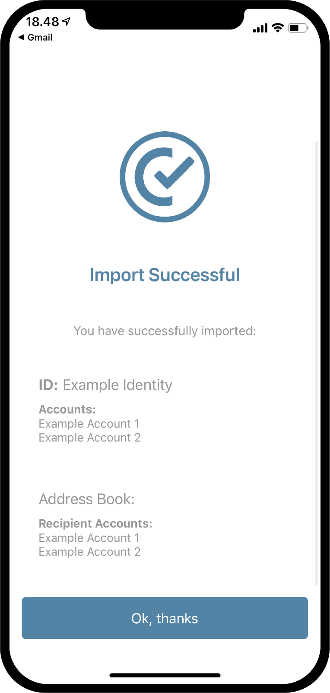
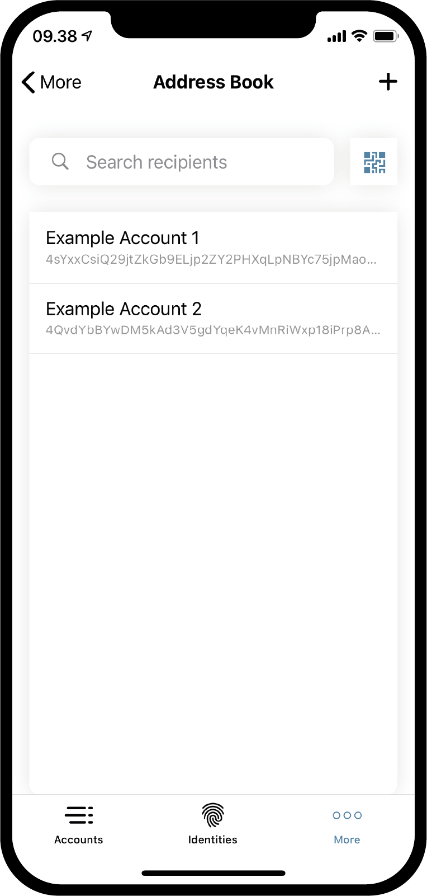

.. _Discord: https://discord.gg/xWmQ5tp

.. _testnet-explore-more-ko:

========================================
Concordium ID: *더보기* 페이지 탐색
========================================

.. contents::
   :local:
   :backlinks: none

수출
======
Concordium ID 앱을 사용하여 계정 및 ID를 내보낼 수 있습니다. 시작하려면 *더보기* 페이지로 이동하십시오.
앱의 Android 또는 iOS 버전을 사용하는지 여부에 따라 *더보기* 페이지가 약간 다르게 보입니다.
Android에서는 *주소록*, *내보내기* 및 *가져 오기* 의 세 가지 메뉴 항목이 표시됩니다. iOS에서는 *주소록* 및 *내보내기* 만 표시됩니다.
이는 가져 오기 기능이 플랫폼에 따라 두 가지 다른 방식으로 작동하기 때문이지만 다시 살펴 보겠습니다.

.. image:: images/concordium-id/exp1.png
      :width: 32%
.. image:: images/concordium-id/exp2.png
      :width: 32%

내보내기를 시작하려면 **내보내기** 옵션을 누릅니다. 그러면 내보내기가 의미하는 바를 간략하게 설명하는 새 페이지로 이동합니다.
이 내용을주의 깊게 읽는 것이 좋습니다. **계속** 을 누르면 내보내기 파일의 비밀번호를 입력하라는 페이지로 이동합니다. 두 번 입력 한 후 **계속** 할 수 있습니다.
마지막 단계로 iOS 또는 Android에서 휴대 전화 운영체제의 레이 오버를 사용하여 내 보낸 파일로 수행 할 작업을 묻는 메시지가 표시됩니다.

.. image:: images/concordium-id/exp3.png
      :width: 32%
.. image:: images/concordium-id/exp4.png
      :width: 32%

수입하다
=========
앞 절에서 언급했듯이 iOS와 Android에서는 가져오기 기능이 약간 다르게 작동합니다. Android에서 *More* 페이지의 *Import* 옵션을 누르면 가져올 파일을 찾을 수 있습니다.
전화기와 Android 버전에 따라 운영 체제마다 다르게 보일 수 있습니다. iOS에서 Concordium ID 외부에서 파일을 찾은 다음, 파일을 누르고 *Share 옵션* 을 선택해야 합니다.
이렇게 하면 파일을 처리할 앱으로 Concordium ID를 선택할 수 있습니다.

두 플랫폼 중 하나에서 파일을 열면 먼저 내보낼 때 선택한 암호를 입력하라는 메시지가 표시됩니다. **계속** 을 누른 후 앱을 설정할 때 패스코드 또는 선택한 생체 측정기를 사용하여 자신을 확인해야 합니다.
마지막으로 가져온 *계정*, *신분* 및 *주소록* 항목의 목록이 표시됩니다.

.. image:: images/concordium-id/imp1.png
      :width: 32%

주소록
============
이름에서 알 수 있듯이 *주소록* 은 계정 주소를 보관하는 곳입니다. *주소록* 을 찾아보면 사용자 계정의 주소가 이미 저장되어 있는 것을 볼 수 있습니다.
**QR 코드 기호** 를 누르거나 오른쪽 상단에 있는 **+ 기호** 를 눌러 *주소록* 에 항목을 더 추가할 수도 있습니다.
이렇게 하면 새 수취인 주소를 입력하고 *주소록* 에 별명을 지정할 수 있습니다. 물론, 전송 시 주소록의 항목을 검색할 수 있습니다.

.. image:: images/concordium-id/add2.png
      :width: 32%

지원 및 피드백을 제공합니다.
===========================

문제가 있거나 제안이 있을 경우 질문이나 의견을 'Discord' 에 게시하거나 testnet@concordium.com 으로 문의하십시오.
