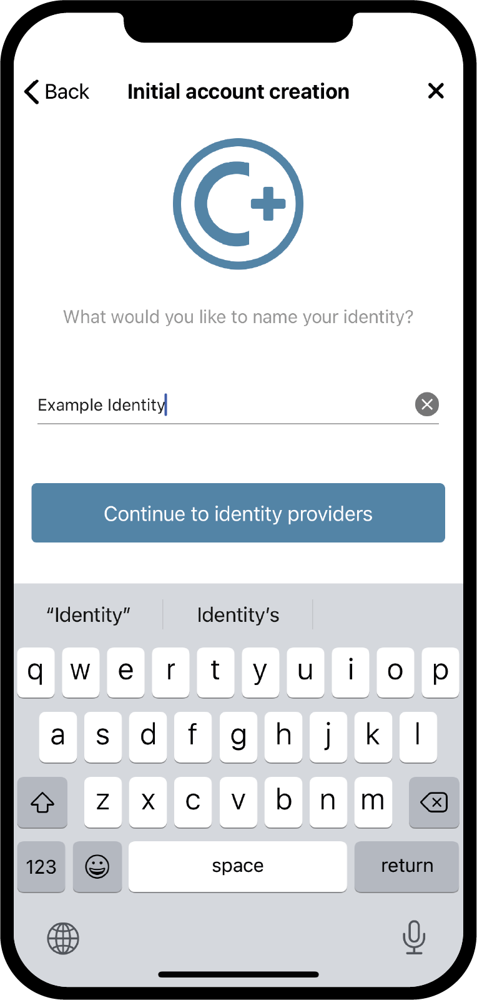
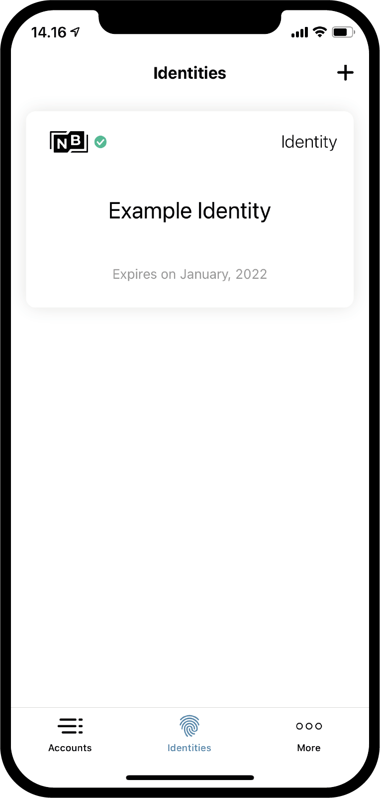

.. _Discord: https://discord.gg/xWmQ5tp

.. _testnet-get-started-ko:

=========================================
Concordium ID: 응용 프로그램을 시작합니다.
=========================================

.. contents::
   :local:
   :backlinks: none

이 가이드를 따르기 전에 :ref:`이전 장 <testnet-get-the-app-ko>` 에 설명 된대로 Concordium ID 설치를 완료해야합니다.

암호 및 생체 측정 시스템을 설정합니다.
====================================

Concordium ID 앱을 처음 열면 암호 및 생체 인증을 설정하고 :ref:`glossary-initial-account` 를 생성하는 데 도움이되는 흐름이 표시되며, :ref:`glossary-identity` 를 얻습니다.
초기 계정은 ID 생성시 :ref:`glossary-identity-provider` 에 의해 체인에 제출되는 특별한 유형의 계정입니다.
일반 계정에서와 같이 초기 계정에서 동일한 트랜잭션을 수행 할 수 있지만 초기 계정의 소유자는 ID 제공 업체에 의해 알려집니다.신원이 생성 된 후에는 체인에 계정을 직접 제출할 수 있으며, 신원 공급자는이를 알 수 없습니다
:ref:`신원 및 계정 <reference-id-accounts>` 페이지에서 계정에 대해 자세히 알아볼 수 있습니다.

Concordium ID를 열 때 가장 먼저 만나게 될 화면은 이 화면입니다. 시작하기 위해서는 이 과정을 거쳐야 한다는 것을 설명해 줄 것입니다.

계속할 준비가 되었으면 **예, 시작!을 누르십시오.** 다음 화면에서 6자리 패스코드를 입력하라는 메시지가 표시됩니다. 문자를 포함한 전체 암호를 사용하는 경우 여기서 암호를 선택할 수도 있습니다.

.. image:: images/concordium-id/int1.png
      :width: 32%
.. image:: images/concordium-id/int2.png
      :width: 32%

.. todo::

   지시문을 작성하여 두 개 이상의 이미지를 나란히 가운데로 만듭니다.

패스코드 또는 전체 비밀번호를 선택한 경우, 전화기가 얼굴 인식 또는 지문과 같은 생체 측정 시스템을 지원하는 경우에도 생체 측정 시스템을 사용할 수 있습니다.
생체인식을 사용할 수 있는 옵션이 있으면 사용하는 것이 좋습니다.

.. image:: images/concordium-id/int3.png
      :width: 32%
      :align: center

초기 계정 및 ID를 요청합니다.
=======================================

그런 다음 새 초기 계정과 ID를 만들거나 기존 세트를 가져올 수 있습니다.
Concordium ID를 처음 사용하는 경우 **초기 계정을 생성하려고 합니다** 를 선택하여 계속할 수 있습니다.

.. image:: images/concordium-id/int4.png
      :width: 32%
      :align: center

다음 화면에는 초기 계정이 무엇인지와 이를 얻기 위해 완료해야 하는 세 가지 단계에 대한 설명이 ID와 함께 표시됩니다.
즉, 초기 계정은 사용자가 선택한 ID 공급자가 체인에 제출한 계정이며, 사용자가 해당 계정의 소유자임을 알게 됩니다.
나중에 직접 체인에 계정을 제출할 수 있습니다. 즉, 이러한 계정의 소유자는 사용자만 알 수 있습니다.

.. image:: images/concordium-id/int5.png
      :width: 32%
      :align: center

위에서 언급한 세 가지 단계는 다음과 같습니다.

1. 초기 계정의 이름을 지정합니다.
2. 본인 이름을 지정합니다.
3. 초기 계정 및 ID를 원하는:ref:'창고 ID 제공자'에게 요청합니다.

다음 페이지의 첫 번째 단계에 도달하면 초기 계정의 이름을 입력하라는 메시지가 표시됩니다. 계속을 누르면 다음 페이지로 이동하여 ID 이름을 지정해야 합니다.
이 두 가지 이름은 모두 본인만 알 수 있으므로 원하는 대로 이름을 지정할 수 있습니다(사용할 수 있는 문자와 기호에 몇 가지 제약이 있습니다.

아래 예에서는 초기 계정에 *예: 계정 1* 및 ID *예:ID* 를 호출하도록 선택합니다.  언급한 대로 원하는 이름을 선택할 수 있습니다.

.. image:: images/concordium-id/int6.png
      :width: 32%

**ID 제공자로 계속** 을 누르면 *ID 제공자* 중 하나를 선택해야 하는 페이지로 이동됩니다.
ID 제공자는 체인에 사용할 ID 개체를 반환하기 전에 사용자가 누구인지 확인하는 외부 엔터티입니다.
지금은 다음 중 하나를 선택할 수 있습니다.

* *Notabene Development* 실제 신원 확인 없이 테스트 ID를 제공할 것입니다.
* *Notabene* 이를 통해 실제 신원이 확인될 것입니다.

.. image:: images/concordium-id/int8.png
      :width: 32%
      :align: center

Notabene Development를 선택하면 추가 작업 없이 테스트 ID가 부여됩니다. Notabene을 선택하면 외부 ID 발급 흐름으로 이동되어 ID 개체에 대한 확인 과정을 안내합니다.
이 흐름을 마치면 Concordium ID로 돌아갑니다.

ID 발급 흐름 중 하나를 완료하면 다음 화면이 표시됩니다. ID 및 초기 계정에 대한 개요가 표시됩니다.

.. image:: images/concordium-id/int9.png
      :width: 32%
      :align: center

선택한 ID 제공자에 따라 ID 카드의 레이아웃이 약간 다를 수 있습니다. 예제 계정 1은 ID 예제 ID로 유지된다는 것을 알 수 있습니다. 이 프로세스 중에 생성된 계정은 앱에 *(Initial)*
로 표시되므로 ID 제공자가 체인에 제출한 초기 계정인 계정을 알 수 있습니다.

**Finish** 를 누르면 *Accounts(계정) 화면* 으로 이동합니다. 이 화면에서 새로 생성된 초기 계정을 볼 수 있습니다.
*Pending(보류 중) 아이콘* 이 표시될 수 있으며, 이는 ID 공급자가 여전히 초기 계정 및 ID를 제출하고 생성하는 작업을 수행하고 있음을 의미합니다. 디스플레이 하단에 있는 **ID** 를 클릭하여 *ID 화면* 으로 이동할 수도 있습니다.
이 화면에서 새로 생성된 ID를 볼 수 있으며, ID 공급자가 아직 완료하지 않은 경우에도 이 ID가 보류 중일 수 있습니다. 이제 당신이 해야 할 일은 그들이 끝나기를 기다리는 것입니다.

.. image:: images/concordium-id/int10.png
      :width: 32%

지원 및 피드백을 제공합니다.
============================

문제가 있거나 제안이 있을 경우 질문이나 의견을 `Discord` 에 게시하거나 testnet@concordium.com으로 문의하십시오.
