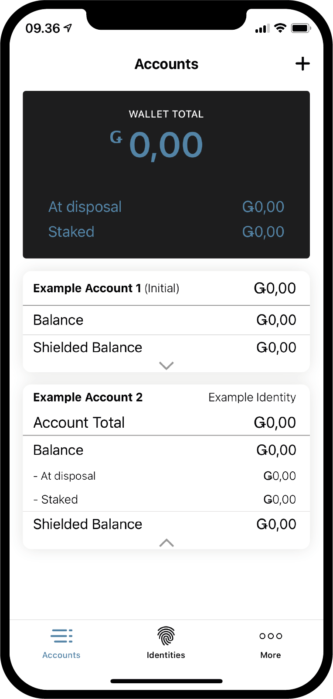
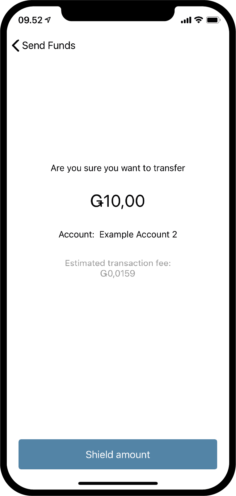
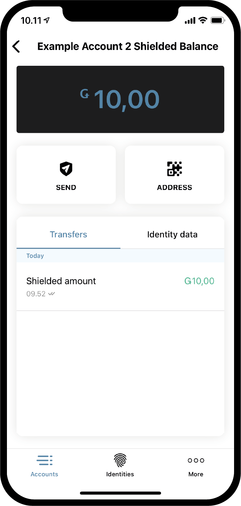
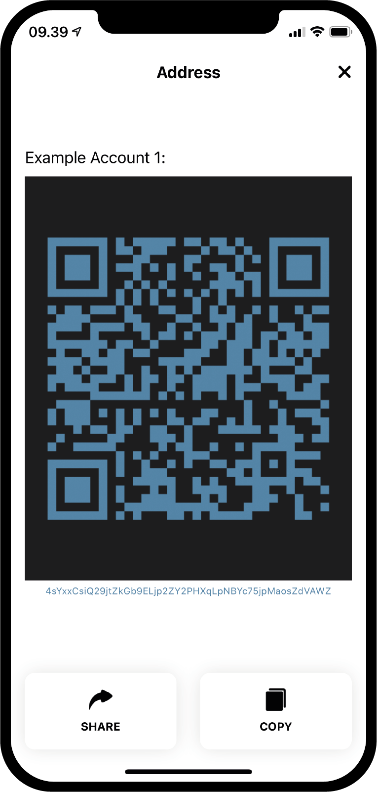

.. _Discord: https://discord.gg/xWmQ5tp

.. _guide-account-transactions:

=========================================================
Concordium ID: Start met accounts and transacties
=========================================================

.. contents::
   :local:
   :backlinks: none

Voordat je begint met deze handleiding moet je de aanvraag voor je account en identiteit hebben afgerond zoals omschreven in :ref:`het vorige hoofdstuk<testnet-get-started>`.

Maak een nieuw account
======================
Voordat we uitleggen hoe het precies werkt met accounts, balans en transacties creeën we eerst een tweede account.
We starten door eerst naar de *Accounts* pagina te gaan. Rechtsboven staat als het goed is een **plus teken**.
Druk op dit plus teken om verder te gaan. Op het volgende scherm wordt gevraagd welke naam je dit account wil geven.
In dit voorbeeld kiezen wij de naam *Example Account 2*, maar je kunt elke naam kiezen die je maar wilt.

.. image:: images/concordium-id/acc1.png
      :width: 32%
.. image:: images/concordium-id/acc2.png
      :width: 32%

Als je vervolgens op **Next** klikt zul je een scherm zien waar je moet besluiten welke 'Identity' je wil gebruiken om je nieuwe account aan te maken.
Voor nu zul je er maar eentje zien, maar als er straks meerdere staan kun je zelf besluiten welke je kiest uit de lijst.
Nadat je geklikt hebt op een 'Identity' krijg je het volgende scherm te zien. Als je een niet-initieel account aanmaakt, bijv een account
dat niet gelijk is aangemaakt als de identiteit is aangemaakt, kun je er ook voor kiezen om het nummer openbaar te maken :ref:`glossary-attribute`.
Dit is niet noodzakelijk en eigenlijk is er geen reden om dit te doen, dus we adviseren ook om dit niet openbaar te maken. Attributen die openbaar zijn
gemaakt komen op de blockchain te staan en kunnen nooit meer verwijderd worden.

.. image:: images/concordium-id/acc3.png
      :width: 32%
.. image:: images/concordium-id/acc4.png
      :width: 32%

Als je klikt op de **Reveal account attributes** button, dan wordt je omgeleid naar de volgende pagina. Je kunt hier de attributen wegklikken die je
niet openbaar wil maken. Druk vervolgens op **Submit account**. Na het kiezen van **Submit account** op deze pagina of op de vorige pagina krijg je nog
een kort overzicht te zien dat aangeeft dat de aanvraag van je account is verzonden.

.. image:: images/concordium-id/acc5.png
      :width: 32%
.. image:: images/concordium-id/acc6.png
      :width: 32%

Na het klikken op **Ok, thanks** in het laatste overzicht scherm krijg je de account pagina weer te zien. Het nieuw aangemaakt account
staat in afwachting en het kan een paar minuten duren voordat het is afgerond op de blockchain. Mocht je het nog niet geprobeerd hebben kun je
op de pijl drukken die omlaag wijst zodat de account kaarten openklappen. Dit zal vervolgens twee nieuwe stukken laten zien, namelijk
*at disposal* en *staked*. Het 'at disposal' veld laat zien wat de balans is van het account op dat moment om te gebruiken en over het 'staked'
bedrag kun je meer lezen op de :ref:`accounts beheren<managing_accounts>` pagina.

.. image:: images/concordium-id/acc7.png
      :width: 32%

Maak een transactie
====================
Klik je op het stuk waar **Balance** staat van het zojuist aangemaakte accounts. In dit scherm kun je de huidige balans
zien van je account en voor nu is het ook mogelijk 100 GTU aan te vragen om te gebruiken op het Testnet.
De aanvraag voor 100 GTU is een testnet optie en voor Testnet 4 wordt er zelfs 2000 GTU verstuud naar je account ondanks dat er 100 GRO staat.
De aanvraag voor een storting van GTU is maar eenmalig mogelijk. Nadat je erop hebt geklikt zul je zien dat er transactie verschijnt.
Het kan even duren maar na een tijdje zal er 2000 GTU worden toegevoegd aan je account.

.. image:: images/concordium-id/acc9.png
      :width: 32%
.. image:: images/concordium-id/acc10.png
      :width: 32%

Nu dat we GTU hebben gekregen op ons account kunnen we proberen om een transactie te maken.
Druk op de **SEND** knop en op de volgende pagina kun je vervolgens een bedrag opgeven wat je wil overmaken en kies je een ontvanger.
In dit voorbeeld gaan we 10 GTU overmaken.

.. image:: images/concordium-id/acc11.png
      :width: 32%
.. image:: images/concordium-id/acc12.png
      :width: 32%

Na het kiezen van een bedrag kun je een ontvanger kiezen. Om dit te doen druk je op **Recipient or shield amount** knop.
Op deze pagina kun je vervolgens ook zoeken in je *adresboek* of je voegt een ontvanger toe door de QR code te scannen van de ontvanger.
Zoals je kunt zien in de screenshot is er maar 1 ontvanger in de lijst bewaard, namelijk *Example Account 1*. Daarboven is er een optie genaamd *Shield an
amount*, maar daar vertellen we later meer over. In dit voorbeeld kiezen we als ontvanger *Example Account 1*.

.. image:: images/concordium-id/acc13.png
      :width: 32%
.. image:: images/concordium-id/acc14.png
      :width: 32%

Nu dat we een bedrag en ontvanger hebben gekozen kunnen we verder door te klikken op **Send Funds**. Door hier op de klikken krijg je nog een bevestigingsscherm
te zien waar je vanalles kunt controleren zoals bedrag, ontvanger en verzend account. Druk op **Yes, send funds** en verifieer door middel van ons eigen pincode of
andere biometrie methode waarna de transactie vervolgens naar de blockchain wordt verzonden. Het kan even duren voordat de transactie uiteindelijk is bevestigd.

.. image:: images/concordium-id/acc15.png
      :width: 32%
.. image:: images/concordium-id/acc16.png
      :width: 32%

We kunnen nu ook zien in het logboek onder *Example Account 2*’s *Transfers* dat het bedrag is afgeschreven minus een *fee*.
Alle transacties kosten namelijk een vergoeding en afhankelijk van het type transactie kan dit bedrag verschillen.
Als je op de transactie klikt wordt er iets meer informatie over weergegeven.

.. image:: images/concordium-id/acc18.png
      :width: 32%

.. _move-an-amount-to-the-shielded-balance:

Verplaats een bedrag naar 'shielded balance'
============================================
Als we terug gaan naar het *Accounts* scherm dan zien we dat de 10 GTU is verzonden naar de *Balance* of *Example Account 1*. Zoals je wellicht hebt gezien
hebben de accounts ook een :ref:`glossary-shielded-balance`. In het kort, een 'shielded balance' is om het bedrag in GTU op het account te verbergen (encrypt).
Laten we eens proberen om een verborgen bedrag te versturen naar ons *Example Account 2*. Begin door te klikken op de **Shielded Balance** kaart van het account.

.. image:: images/concordium-id/acc19.png
      :width: 32%
.. image:: images/concordium-id/acc20.png
      :width: 32%

Vervolgens klik je nogmaals op de **SEND** knop en geef je een bedrag op dat je wil verbergen door GTU toe te voegen aan *Shielded Balance*.
Nadat je dit gedaan hebt druk je opnieuw op **Select Recipient or shield amount**. In plaats van een ontvanger te kiezen, kies je dit keer voor **Shield amount**.

.. image:: images/concordium-id/acc21.png
      :width: 32%
.. image:: images/concordium-id/acc22.png
      :width: 32%

We kunnen nu door gaan en de transactie bevestigen precies zoals we dit straks ook hebben gedaan met de 'normale' transactie.
Het kan even duren voordat de transactie uiteindelijk is bevestigd.

.. image:: images/concordium-id/acc24.png
      :width: 32%

Als je terug gaat naar de *Accounts* pagina kun je zien dat 10 GTU erbij is gekomen op het *Shielded Balance* of *Example Account 2*.
Als er geklikt wordt op *Shielded Balance* dan kun je zien dat er een transactie in het log staat.
Ook aan een verborgen transactie zitten kosten, maar dit keer worden deze transactekosten in mindering gebracht op het reguliere account.
Probeer maar eens terug te gaan en het transactie logboek te bekijken van het reguliere accout onder *Balance*

.. image:: images/concordium-id/acc25.png
      :width: 32%

Maak een 'shielded' transactie
==============================
Nu dat we wat 'shielded' GTU tot onze beschikking hebben kunnen we proberen om een *Shielded transactie* uit te voeren, wat dus betekent
dat we een transactie doen met een encrypted GTU bedrag.
De eerste stap is om nar de pagina *shielded balance* te browsen naar het account waar de verborgen ('shielded') GTU staat.
Druk vervolgens op de **SEND** knop. Vervolgens kun je weer een  bedrag opgeven en een ontvanger kiezen. In dit voorbeeld hebben
we gekozen om 2 GTU te versturen. Als we vervolgens klikken op de **Select Recipient or unshield amount** knop kunnen we een ontvanger kiezen.
We kiezen nu voor *Example Account 2* in dit voorbeeld.

.. image:: images/concordium-id/acc27.png
      :width: 32%
.. image:: images/concordium-id/acc28.png
      :width: 32%

Nu dat we een bedrag en ontvanger hebben gekozen kunnen we verder gaan. Precies zoals voorgaande transacties zie je ook weer een bevestigingsscherm
en vanuit daar je weer bevestigen met je eigen pincode of biometrie zodat de 'shielded' transactie naar de blockchain wordt verzonden.
Ook hier kan het even duren voordat de transactie volledig is bevestigd op de blockchain.

.. image:: images/concordium-id/acc29.png
      :width: 32%
.. image:: images/concordium-id/acc30.png
      :width: 32%

Als je nu terug gaat naar het *Accounts* scherm kun je zien dat er een kleine afbeelding van een schild zichtbaar is geworden naast het bedrag
van het ontvangende account. Dit is een indicatie dat er een verborgen (shielded) transactie is ontvangen op de verborgen balans. Klik op
de verborgen balans en je zult merken dat er opnieuw gevraagd wordt voor een bevestiging door middel van een pincode of biometrie.
Dit gebeurd omdat het verborgen bedrag ontsleutelt moet worden voordat je het kunt inzien.

.. image:: images/concordium-id/acc31.png
      :width: 32%
.. image:: images/concordium-id/acc32.png
      :width: 32%

'Unshield' een bedrag
=====================
Nadat het bedrag is ontsleuteld (decrypted) is het bedrag zichtbaar onder *shielded balance* en is het bedrag zichtbaar onder de account
kaart in het *Accounts* scherm. Maar stel dat we nu een beetje GTU van de 'shielded' balans willen verplaatsen naar de reguliere balans?
Laten we eens 2 GTU  verplaatsen naar de reguliere balans via de actie *Unshielding* een bedrag. Om dit te doen druk je op de **SEND** knop
in de 'shielded' balans. Geef 2 op als bedrag en druk dan vervolgens op **Select Recipient or unshield amount** en kies **Choose Unshield amount**.

.. image:: images/concordium-id/acc33.png
      :width: 32%
.. image:: images/concordium-id/acc34.png
      :width: 32%

Voltooi de transactie zoals je ook gedaan hebt bij de vorige transacties en ga vervolgens naar de reguliere balans om dit 'unshielding' proces te zien.
Als de transactie is voltooid op de blockchain zul je ook zien dat het unshielded bedrag zichtbaar erbij is gekomen op het reguliere balans.
Merk ook op dat het niet 2 GTu is wat erbij is gekomen ondanks dat je wel 2 GTU unshielded hebt gemaakt. Dit komt doordat aan elke transactie, dus
ook een 'unshielding' transactie, kosten zijn verbonden, namelijk transactiekosten. Deze transactiekosten worden van de balans van het account
verantwoordelijk voor de transactie afgetrokken.

.. image:: images/concordium-id/acc35.png
      :width: 32%
.. image:: images/concordium-id/acc36.png
      :width: 32%

Deel je account adres
==========================
Als je een account adres wil delen kan dit gemakkelijk door te klikken op de **Address** knop. Vervolgens verschijnt de pagina waar je meerdere
keuzes hebt om een account adres te delen. Probeer eens de **Share** knop en deel je adres met iemand.

.. image:: images/concordium-id/acc37.png
      :width: 32%

Controleer een geplande vrijgave
================================
Op de Concordium blockchain is het mogelijk om een transactie te plannen op een bepaalde tijd in de toekomst. De transactie zal het bedrag dan pas vrijgegeven op het geplande moment.
Dit wordt *transfer with a schedule* genoemd. Voor nu zullen we hier niet op in gaan hoe dit gedaan kan worden omdat dit niet kan met een Corcordium ID, maar we
kunnen wel laten zien hoe een geplande vrijgave eruit ziet of gecontroleerd kan worden. Als je een transactie ontvangt met een geplande vrijgave kun je vervolgens klikken
op **burger menu** in de rechterboven hoek van het balans scherm. Hier kun je dan vervolgens klikken op **Release schedule** en dit zal een scherm tonen met informatie over de hoogte
van het GTU bedrag en wanneer het vrij komt. Als je meer wil weten over hoe je dit soort geplande vrijgave (*transfer with a schedule*) transacties kunt maken kun je kijken op
:ref:`concordium_client` en :ref:`transactions` pagina's.

.. image:: images/concordium-id/rel1.png
      :width: 32%
.. image:: images/concordium-id/rel2.png
      :width: 32%
.. image:: images/concordium-id/rel3.png
      :width: 32%

Hulp & Feedback
==================

Als je tegen problemen aanloopt of suggesties hebt kun je je vragen
of feedback posten in `Discord`_, of contact opnemen via testnet@concordium.com.
