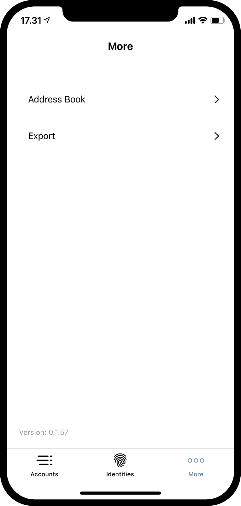
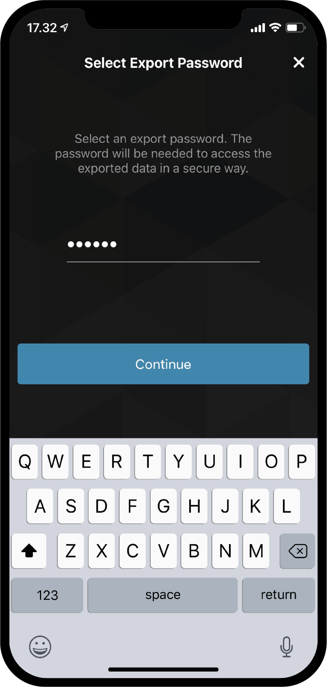

.. _Discord: https://discord.gg/xWmQ5tp

.. _testnet-explore-more:

=======================================
Concordium ID: Verken de *More* pagina
=======================================

.. contents::
   :local:
   :backlinks: none

Export
======
Als je de Concordium ID app gebruikt is het mogelijk om je identiteiten en accounts te exporteren. Om hiermee te starten browse je naar de *More* pagina.
Afhankelijk of je Android of iOS gebruik zal de *More* pagina er iets anders uit zien. Op Android zie je drie menu items:
*Address Book*, *Export* and *Import*. Op iOS zie je alleen *Address Book* and *Export*.
Dit komt doordat de export functie op twee manieren werken afhankelijk welk platform je gebruikt, maar daar komen we nog op terug.

.. image:: images/concordium-id/exp1.png
      :width: 32%

Om een export te starten klik je op de **Export** optie. Hierdoor kom je uit op een nieuwe pagina waar in het kort een uitleg wordt gegeven
wat een export betekent. We adviseren dit goed door te lezen. Druk op **Continue** zodat je naar de volgende pagina wordt gebracht waar vervolgens
gevraagd wordt om een wachtwoord te geven voor het export bestand. Nadat je het wachtwoord twee keer hebt ingegeven klik je op **Continue**. Als
laatste stap wordt gevraagd door Android zelf (en ook door iOS) wat je wil gaan doen met het geexporteerde bestand.

.. image:: images/concordium-id/exp3.png
      :width: 32%

Import
======
Zoals beschreven in de vorige sectie werkt de import iets anders tussen iOS en Android. Op Android apparaten vind je de *Import* optie onder
de *More* pagina, waar je vervolgens kunt browsen naar het bestand dat je wilt importeren. Afhankelijk van je telefoon en Android versie kan het
er net iets anders uit zien. Op iOS zul je moeten browser naar het bestand buiten de Concordium ID app om. Zoek het bestand en klik *Share* optie.
Vervolgens kun je dan het bestand delen met Concordium ID en de app zal dit dan verder afhandelen.

Nadat het bestand is geopend op één van de platformen wordt er eerst gevraagd om het gekozen wachtwoord in te voeren dat bij exporteren is gebruikt.
Na het drukken op **Continue** moet je deze stap nog verifieren door de pincode of biometric te gebruiken waarmee de app is ingesteld. Als laatste
krijg je een lijst van alle *Accounts*, *Identiteiten* en het *Adresboek* te zien dat is geimporteerd.

.. image:: images/concordium-id/imp1.png
      :width: 32%
.. image:: images/concordium-id/imp2.png
      :width: 32%

Adresboek
============
Zoals de naam het al aangeeft is het adresboek een plek waar je alle account adressen kunt bewaren. Als je in het adresboek gaat kijken
zul je zien dat je eigen accounts er al in zijn opgeslagen. Naast dat je je eigen adressen ziet kun je ook andere adressen toevoegen.
Dit kan door te klikken op het **QR code symb0ol** of door te klikken op het **plus teken** rechtsboven in het scherm. Door dit te doen
kun je een nieuw adres toe voegen en hier vervolgens een bijnaam voor geven in het adresboek. Je kunt natuurlijk ook zoeken naar adressen
in het adresboek als je een transactie gaat verrichten.

.. image:: images/concordium-id/add1.png
      :width: 32%
.. image:: images/concordium-id/add2.png
      :width: 32%

Hulp & Feedback
==================

Als je tegen problemen aanloopt of suggesties hebt kun je je vragen
of feedback posten in `Discord`_, of contact opnemen via testnet@concordium.com.
