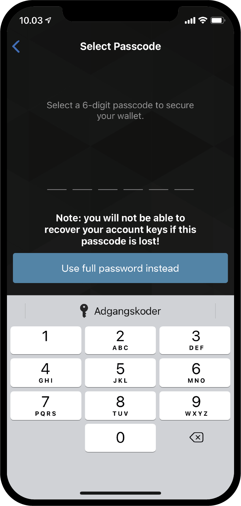

.. _Discord: https://discord.gg/xWmQ5tp

.. _testnet-get-started:

=======================================
Concordium ID: Start met de app
=======================================

.. contents::
   :local:
   :backlinks: none

Voordat je verder gaat met deze handleiding zou je klaar moeten zijn met installeren van Concordium ID
zoals omschreven in :ref:`het vorige hoofdstuk<testnet-get-the-app>`.

Een pincode of biometrie instellen
==================================

Als je de Concordium ID app opent voor de eerste keer zul je een wizard te zien krijgen die je helpt
om een pincode en/of biometrie authenticatie in te stellen. Maak een :ref:`glossary-initial-account`,
en het zal vervolgens ook laten zien hoe je een :ref:`glossary-identity` kunt instellen. Een 'initial account'
is een speciaal type account dat naar de blockchain wordt geschreven door de :ref:`glossary-identity-provider`
nadat een identiteit wordt aangemaakt.
Je kunt dezelfde transacties uitvoeren vanaf een 'inital acocunt' als van een regulier account, maar de eigenaar
van een 'initial account' zal bekend zijn bij de identity provider. Na het aanmaken van je identiteit kun je ook je
eigen accounts aanmaken en versturen naar de blockchain, deze accounts zijn vervolgens onbekend bij de identiteits provider.
Er is meer informatie over accounts te vinden op de :ref:`Identities and accounts<reference-id-accounts>` pagina.

Het eerste scherm dat je ziet na openen van Concordium ID app is het volgende. Dit geeft aan dat je de stappen moet volgen
om te starten.

Als je klaar bent om door te gaan klik je op **Yes, let’s go!** Het volgende scherm vraag om een 6-cijferige code in te voeren.
Als je wil kun je ipv een cijfer code ook hier een wachtwoord met letters ingeven.

.. image:: images/concordium-id/int1.png
      :width: 32%

Na het kiezen van een pincode of misschien een paswoord krijg je de optie om ook biometrie in te stellen als je telefoon dit ondersteund.
Bijvoorbeeld gezichtsherkenning of vingerafdruk. We adviseren indien je telefoon dit toelaat ook biometrie in te stellen.

.. image:: images/concordium-id/int3.png
      :width: 32%
      :align: center

Vraag een initieel account en indentiteit aan
=============================================

Vervolgens krijg je de keuze om een nieuwe initieel account en identiteit aan te maken of een bestaand account  te importeren.
We nemen voor het gemak aan dat dit de eerste keer is dat je de Concordium ID app gebruikt, kies dus voor **I want to create my initial account**
om verder te gaan.

.. image:: images/concordium-id/int4.png
      :width: 32%
      :align: center

Op het volgende scherm zie je wat het initiele account inhoud en de drie stappen die je moet doorlopen om het af te ronden inclusief je identiteit.
In het kort is een initieel account het account dat naar de blockchain wordt geschreven door de 'identity provider' naar keuze.
Dit betekent dat de identity provider weet wie de eigenaar van het account is. In een later stadium kun je vervolgens je eigen accounts aanmaken en naar de blockchain schrijven.
Dit betekent dat de eigenaar ook als enige het bestaan ervan kent.

.. image:: images/concordium-id/int5.png
      :width: 32%
      :align: center

De volgende drie stappen die hierboven beschreven zijn:

1. Naamgeving van je initiele account
2. Naamgeven van je identiteit
3. Aanvraag van het initiele account and identiteit door een 'identity provider' naar keuze :ref:`glossary-identity-provider`

De eerste stap die je tegenkomt op de volgende pagina is de vraag om je naam op te geven voor het initiele account. Druk op 'continue'
brengt je naar de volgende pagina waar gevraagd wordt om een naam te geven voor je identiteit. Beide van deze namen zullen alleen bij
jou bekend zijn, dus je kunt min of meer elke naam kiezen die je maar wilt. (Er zijn maar een paar beperkingen voor letters en symbolen)

In het voorbeeld hier beneden hebben we gekozen om het initiele account *Example Account 1* te noemen en onze identiteit *Example Identity*.
Zoals aangegeven kun je zelf de namen naar wens kiezen.

.. image:: images/concordium-id/int6.png
      :width: 32%
.. image:: images/concordium-id/int7.png
      :width: 32%

Na het klikken op **Continue to identity providers** krijg je de pagina te zien waar je moet kiezen voor een *identity provider*.
Een 'identity provider' is een externe entiteit die kant bevestigen wie je bent voordat je een identiteit kunt sturen en gebruiken op de blockchain.
Voor nu kun je kiezen uit:

* *Notabene Development* deze geeft een test identiteit zonder dat dit op echtheid is gebaseerd.
* *Notabene* deze zal je echte identiteit op waarheid controleren en verifieren.

.. image:: images/concordium-id/int8.png
      :width: 32%
      :align: center

Door te kiezen voor 'Notebene Development' kun je een test identiteit verkrijgen zonder verdere vragen. Als je kiest voor 'Notabene' dan wordt je doorgeleid
naar een externe partij die je door een proces leid zodat je daadwerkelijke identiteit geverifieerd kan worden.
Nadat deze stappen zijn doorlopen kom je terug op de Concordium ID.

Na het doorlopen van een gekozen identiteit controle stappen wordt je naar het volgende scherm geleid.
Dit scherm geeft een overzicht van je identiteit and je initiele account.

.. image:: images/concordium-id/int9.png
      :width: 32%
      :align: center

Afhankelijk welke identiteits provider je gekozen hebt, zal de identiteit kaart er iets anders uit zien.
Je kunt zien dat de 'Example Account 1' in bezit is van de identiteit 'Example Identity'. Het account dat is aangemaakt tijdens dit
proces zal gemarkeerd worden met *(Initial)* in de app, dus je weet dan dat dit het initiele account is wat naar de blockchain is
geschreven door de identiteits provider.

Door te klikken op **Finish** wordt je naar het *Accounts* scherm gestuurd. Op dit scherm zie je het zojuist aangemaakte account.
Soms staat er een *Pending* icoontje, wat betekent dat de identiteits provider nog bezig is met het verwerken van je initiele account en identiteit.
Je kunt ook navigeren naar het *Identity* scherm door te klikken op **Identities** onderaan in het scherm. Op dit scherm zie je vervolgens het
zojuist nieuw aangemaakte identiteit, ook deze kan nog een verwerking status geven als de identiteits provider nog bezig is met de verwerking hiervan.
Voor nu kun je alleen wachten totdat het proces klaar is.

.. image:: images/concordium-id/int10.png
      :width: 32%
.. image:: images/concordium-id/int11.png
      :width: 32%

Hulp & Feedback
==================

Als je tegen problemen aanloopt of suggesties hebt kun je je vragen
of feedback posten in `Discord`_, of contact opnemen via testnet@concordium.com.
