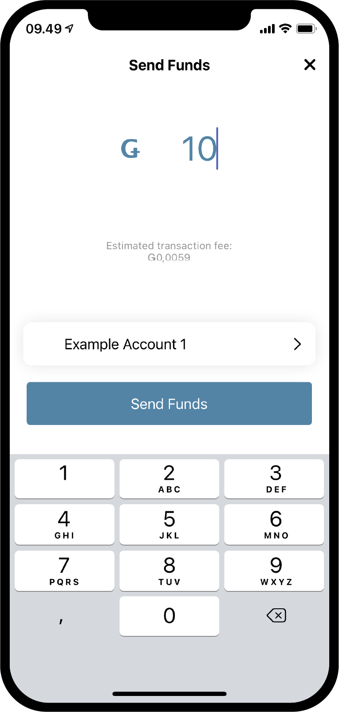
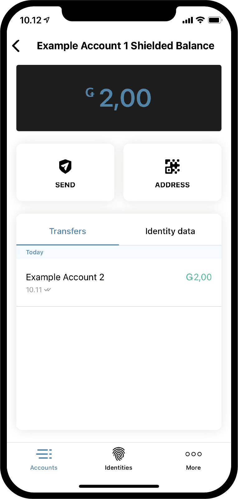

.. _Discord: https://discord.gg/xWmQ5tp

.. _guide-account-transactions:

=========================================================
Concordium ID: otrzymać zaczął od kont i transakcje
=========================================================

.. contents::
   :local:
   :backlinks: none

Przed następujący ten powinieneś był skończyć requesting Twoje początkowe konto i tożsamość, jak opisano w :ref:`w poprzednim rozdziale<testnet-Zaczynaj>`.

Stwórz nowe konto
====================
Zanim przejdziemy do kont, ich salda i transakcje działają, stwórzmy drugie konto. zacznij od przeNa następnym ekranie
zostaniesz poproszony o nazwanie swojego nowego konta.jścia na *Konta*. strona.
W prawym górnym rogu powinieneś zobaczyć **znak plus**. Naciśnij, aby kontynuować. Na następnym ekranie.
W tym przykładzie wybierzemy nazwę *Przykładowe konto 2*, ale możesz wybrać dowolną nazwę.

.. image:: images/concordium-id/acc1.png
      :width: 32%
.. image:: images/concordium-id/acc2.png
      :width: 32%

po naciśnięciu **Kolejny**, spotkasz się z ekranem o których musisz się zdecydować jakiej tożsamości użyć aby otworzyć nowe konto.
Jak dotąd prawdopodobnie masz tylko jeden, ale jeśli masz więcej, możesz wybrać z listy dowolną tożsamość. Klikając na swoją tożsamość, 
zostaniesz przeniesiony do następnego ekranu. Podczas tworzenia konta innego niż początkowe, i.e. konto
która nie jest stworzona podczas tworzenia tożsamości, Możesz wybrać aby odsłonić za Liczba na :ref:`atrybut-glosariusza`. To nie jest konieczne,
a jeśli nie masz za konkretny powód, aby to zrobić, Polecamy nie ujawniając żadnych, jako ujawnione atrybuty iść na łańcuch i nie może być oddalony.

.. image:: images/concordium-id/acc3.png
      :width: 32%
.. image:: images/concordium-id/acc4.png
      :width: 32%

Jeśli zrobisz wciśnij **Odsłonić przycisk atrybutów konta**, zostaniesz zabrany to na następnej stronie. Możesz zaznaczyć
z atrybutów, które chciałbyś ujawnić, i a następnie naciśnij **Zatwierdź konto**. pilny **Zatwierdź konto** tego aby lub poprzedni
strona,zabierze Cię do finału strona tworzenia konta, który da ci krótki przegląd i powiedzieć ci to konto
zostały przesłane.

.. image:: images/concordium-id/acc5.png
      :width: 32%
.. image:: images/concordium-id/acc6.png
      :width: 32%

Naciskając **Ok, dzięki** po złożeniu Przegląd, zostaniesz przeniesiony z powrotem na stronę konta. Możesz zobaczyć, że twój nowy
konto jest nadal w toku, jakby to mogło zająć kilka minut do sfinalizować w łańcuchu. Jeśli masz nie próbowałem aby to zrobić jeszcze, możesz
spróbuj nacisnąć strzałka skierowana w dół na jednej z kart konta, żeby to zobaczyć rozłoży się karta. To ujawnia dwie nowe informacje,
*at sprzedaż* i *postawiony*. na sprzedaż pole powiem Ciile wynosi saldo kont
dostępne do użycia na dany za chwilę, i the kwota stawki możesz przeczytać więcej o :ref:`mzarządzanie kontami<managing_accounts>` strona.

.. image:: images/concordium-id/acc7.png
      :width: 32%
.. image:: images/concordium-id/acc8.png
      :width: 32%

Dokonaj transakcji
====================
Dalej, spróbuj nacisnąć the **Saldo** obszar nowo utworzonego konta. Na to
na ekranie możesz zobaczyć aktualne saldo swojego konta, a na tym etapie pozwoli Ci również zażądać 100 GTU do wykorzystania na
Testnet. Żądanie 100 GTU jest funkcją Testnet, a dla Testnet 4 faktycznie prześle 2000 GTU na konto,
chociaż na przycisku jest napisane 100. Spadek GTU jest dostępny na koncie tylko raz. Naciskając go, zauważysz transakcję
pojawiające się. To będzie czekało przez chwilę, a po chwili 2000 GTU zostanie dodanych do twojego konta.

.. image:: images/concordium-id/acc10.png
      :width: 32%

Teraz, gdy mamy już trochę GTU na naszym koncie, spróbujmy dokonać transakcji. W tym celu naciśnij przycisk **SEND**. Na następnej stronie
możesz wpisać kwotę, którą chcesz przelać i wybrać odbiorcę. W tym przykładzie prześlemy 10 GTU.

.. image:: images/concordium-id/acc11.png
      :width: 32%
.. image:: images/concordium-id/acc12.png
      :width: 32%

Decydując się na kwotę, wybierzemy teraz odbiorcę. Aby to zrobić, naciśnij przycisk Wybierz **Odbiorcę lub kwotę shielded** przycisk.
Na tej stronie możesz wyszukać odbiorców w swojej *książce adresowej* lub dodać odbiorcę, skanując kod QR konta odbiorcy.
Jak widać na zrzucie ekranu, mamy zapisanego tylko jednego odbiorcę, *Przykładowe konto 1*. ponad to, mamy opcję *Shield kwota*,
ale wrócimy do tego później. My wybierzemy *Przykładowe konto 1* jako nasz odbiorca w tym przykładzie.

.. image:: images/concordium-id/acc13.png
      :width: 32%

Po wybraniu kwoty i odbiorcy możemy nacisnąć **Wyślij środki**, aby kontynuować. Robiąc to jesteśmy spotkani po wyświetleniu ekranu potwierdzenia
którym możemy zweryfikować kwotę, odbiorcę i konto nadawcze. Naciskając **Tak, wyślij środki**, zweryfikujemy się za pomocą passcode
lub biometria, i następnie transakcja został przesłany do łańcucha. Sfinalizowanie transakcji może chwilę potrwać.
.. image:: images/concordium-id/acc15.png
      :width: 32%
.. image:: images/concordium-id/acc16.png
      :width: 32%

Teraz widzimy, że *Konto przykładowe 2* *Przelewy* log pokazuje, że kwota została odjęta, plus *opłata*.. Wszystkie transakcje będą płatne, 
iw zależności od rodzaju transakcji opłata może się różnić. Naciśnięcie transakcji pozwoli Ci zobaczyć więcej szczegółów.

.. image:: images/concordium-id/acc17.png
      :width: 32%
.. image:: images/concordium-id/acc18.png
      :width: 32%

.. _move-an-amount-to-the-shielded-balance:

Przelej kwotę do shielded saldo
========================================
Jeśli wrócimy do ekranu *Konta*, zobaczymy, że 10 GTU zostało przeniesione na *Saldo* *Przykładowego Konta 1*. jak możesz
zauważyłem wcześniej, konta mają również :ref:`glosariusz-shielded-saldo`. W skrócie, the shielded saldo jest o konserwacja shielded (zaszyfrowane) kwota.
z GTU na koncie. Spróbujmy trochę dodać shielded GTU do naszego *Przykładowe konto 2*. SZacznij od naciśnięcia the **Shielded Saldo** obszar z the karty konta.

.. image:: images/concordium-id/acc19.png
      :width: 32%
.. image:: images/concordium-id/acc20.png
      :width: 32%

Kolejny, naciśnij ponownie przycisk **SEND** i wprowadź kwota GTU aby *shield*, co jest akcją dodawania GTU aby the *Shielded Saldo*.
Po wykonaniu tej czynności, naciśnijmy **Wybierz odbiorcę lub shield kwota** jeszcze raz. Zamiast wybierać odbiorcę, tym razem będziemy naciśnij **Shield kwota**.

.. image:: images/concordium-id/acc21.png
      :width: 32%
.. image:: images/concordium-id/acc22.png
      :width: 32%

Możemy teraz kontynuować i potwierdzić transakcję, tak jak robiliśmy wcześniej ze zwykłym przelewem. Transakcja może chwilę potrwać
zakończyć w łańcuchu.

.. image:: images/concordium-id/acc23.png
      :width: 32%
.. image:: images/concordium-id/acc24.png
      :width: 32%

Wracając na stronę *Konta*, teraz widać, że tam jest 10 GTU na *Shielded saldo* z *Przykładowe konto 2*. Jeśli the *Shielded
Saldo* obszar karty konta jest wciśnięty, widzimy to jest *Shielded saldo* transakcja w the shielded saldo transfery log.
zrobienie za shielding transakcja będzie również kosztować opłatę, ale ta opłata zostanie potrącona ze zwykłego salda konta. Spróbuj iść z powrotem 
i spójrz na dziennik transferów zwykłego *Salda*.

.. image:: images/concordium-id/acc25.png
      :width: 32%
.. image:: images/concordium-id/acc26.png
      :width: 32%

zrobić shielded transfer
========================
Mając trochę shielded GTU dostępny, możemy teraz spróbować wykonać *Shielded transfer*, co oznacza, że możemy wykonać przelew z zaszyfrowany kwota GTU.
Pierwszym krokiem jest przeglądanie do *shielded saldo* strona konta zawierający shielded GTU, jeśli jeszcze nie jesteś tam.
Następnie naciśnij the **WYSŁAĆ** przycisk. Będziesz mógł teraz wprowadzić kwotę i wybrać odbiorcę. W tym przykładzie zdecydowaliśmy się
transfer 2 GTU. gdy naciskając the **Wybierz odbiorcę lub unshield kwota** przycisk,będziesz mógł wybrać odbiorcę. My wybierzemy
*Przykładowe konto 2* w tym przykładzie.

.. image:: images/concordium-id/acc27.png
      :width: 32%
.. image:: images/concordium-id/acc28.png
      :width: 32%

Z the kwotę i odbiorcę w miejscu, możesz teraz kontynuować. Podobnie jak w przypadku innych transakcji, zobaczysz teraz ekran potwierdzenia,
i kontynuując od tego będziesz mógł się zweryfikować z passcode lub biometria, i a następnie prześlij the shielded transakcja
do łańcucha. Jeszcze raz, sfinalizowanie transakcji w łańcuchu może chwilę potrwać.

.. image:: images/concordium-id/acc29.png
      :width: 32%
.. image:: images/concordium-id/acc30.png
      :width: 32%

Teraz, jeśli wrócisz do *Konta* ekran, powinieneś to trochę zobaczyć shield ma appeared oprócz the kwota na
*Shielded Saldo* z konto odbiorcze. Oznacza to, że są nowo otrzymane shielded transakcje na shielded saldo.
Próbować naciskając the shielded saldo, i zauważ że musisz wprowadzić passcode lub wykorzystaj swoje biometryczne aby do niego wejść.
Dzieje się tak, ponieważ musisz odszyfrować otrzymane shielded transakcje, zanim zobaczysz kwotę.

.. image:: images/concordium-id/acc31.png
      :width: 32%

Unshield od kwota
==================
Po odszyfrowaniu, kwota jest teraz widoczna w the *shielded saldo* i na karcie konta na the *Konta* ekran. Teraz, co jeśli my
chcę przenieść trochę GTU od shielded saldo do regularna równowaga? Spróbujmy przesunąć 2 GTU do regularna równowaga przez the działanie z
*Unshielding* od kwota. Aby to zrobić, wciśnij the **WYSŁAĆ** przycisk w the shielded saldo. Wchodzić 2 jako kwota, a następnie naciśnij **Wybierz Odbiorca
lub unshield kwota**. **Wybierać Unshield kwota**.

.. image:: images/concordium-id/acc33.png
      :width: 32%
.. image:: images/concordium-id/acc34.png
      :width: 32%

Teraz zakończ transakcję, tak jak w przypadku pozostałych, i spróbuj przeglądać do regularnej równowagi z the konto, aby zobaczyć the unshielding.
Jeśli transakcja została sfinalizowana w łańcuchu, powinieneś być teraz w stanie zobaczyć, że plik *Unshielded kwota* ma zaznaczone the regularna równowaga.
zwracać uwagę jak to nie 2 GTU, nawet jeśli kwota, którą po prostu unshielded był 2. Dzieje się tak, ponieważ opłata za dokonanie jakiejkolwiek transakcji, włącznie z
na unshielding, zostanie odjęta od zwykłego salda konta odpowiedzialnego za transakcję.

.. image:: images/concordium-id/acc35.png
      :width: 32%
.. image:: images/concordium-id/acc36.png
      :width: 32%

Udostępnij adres swojego konta
==========================
Jeśli chcesz udostępnić adres swojego konta, można to łatwo zrobić, naciskając **Adres** przycisk. To przeniesie Cię do strony
gdzie masz wiele opcji udostępniania adresu konta. Spróbuj nacisnąć **Dzielić**przycisk, i udostępnij komuś swój adres.

.. image:: images/concordium-id/acc37.png
      :width: 32%
.. image:: images/concordium-id/acc38.png
      :width: 32%

Sprawdzać harmonogram wydań
==========================
Na the Concordium blockchain to jest możliwe aby dokonać transakcji że wydaniathe przekazana kwota w czasie. Nazywa się to
*transfer z harmonogramem*. Na razie nie będziemy się zastanawiać, jak wykonać taki przelew, ponieważ nie można tego zrobić z Concordium ID,
ale zobaczmy, jak można sprawdzić harmonogram wydań. Jeśli otrzymasz przelew z harmonogramem wydań, możesz nacisnąć
**menu burgera** w prawym górnym rogu z the ekran równowagi. Umożliwi to naciśnięcie **Harmonogram wydania**, i robiąc to 
ty zostanie przeniesione do ekranu zawierającego informacje o tym, ile GTU zostanie wydanych i kiedy. Jeśli chcesz dowiedzieć się więcej o tym, jak to zrobić
wykonać przelew z harmonogramem wydań, możesz rzucić okiem the :ref:`concordium_client` i :ref:`transakcje` stron.

.. image:: images/concordium-id/rel1.png
      :width: 32%
.. image:: images/concordium-id/rel2.png
      :width: 32%
.. image:: images/concordium-id/rel3.png
      :width: 32%

Wsparcie i opinie
==================

Jeśli napotkasz żadnych problemów lub mieć sugestie, opublikuj swoje pytanie lub informacje zwrotne na Discord, lub Skontaktuj się z nami na testnet@concordium.com.
