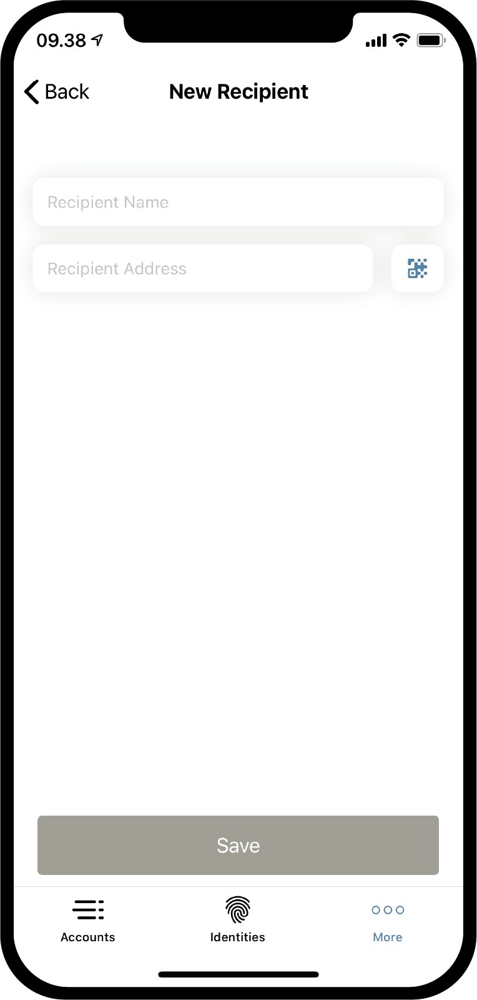

.. _Discord: https://discord.gg/xWmQ5tp

.. _testnet-explore-more:

=======================================
Concordium ID: badać the *więcej* strona
=======================================

.. contents::
   :local:
   :backlinks: none

Eksport
======
Korzystanie z aplikacji Concordium ID to jest możliwe aby wyeksportować swoje konta i tożsamości. zaczynać, Przeglądaj aby the *więcej* strona.
W zależności od tego, czy korzystasz z wersji aplikacji na Androida czy iOS, the *więcej* strona będzie wyglądać nieco inaczej.
W systemie Android zobaczysz trzy pozycje menu: *Książka adresowa*, *Eksport* and *przywóz*. Na iOS zobaczysz tylko *Książka adresowa* i *Eksport*.
Dzieje się tak, ponieważ funkcja importu działa na dwa różne sposoby w zależności od platformy, ale wrócimy do tego.

.. image:: images/concordium-id/exp1.png
      :width: 32%
.. image:: images/concordium-id/exp2.png
      :width: 32%

Aby rozpocząć eksport, wciśnij the **Eksport** opcja. W ten sposób przejdziesz na nową stronę, To pokrótce wyjaśnia, co oznacza eksport.
Zalecamy uważne przeczytanie tego. naciskając go **Kontyntynuj** przeniesie Cię na stronę u które ty będzie zapytany aby wprowadź hasło
do pliku eksportu. Po wejściu do niego dwa razy, możesz **Kontyntynuj**. Tak jak ostatni krok, będziesz być podpowiedział na zarówno iOS lub Android na czym
chcesz robić z wyeksportowanym plikiem, za pomocą the postój z systemu operacyjnego telefonu.

.. image:: images/concordium-id/exp3.png
      :width: 32%
.. image:: images/concordium-id/exp4.png
      :width: 32%

Import
======
Jak wspomniano w poprzedniej sekcji, funkcja importu działa nieco inaczej na iOS i Androidzie. Na Androidzie naciskasz the
*Import* opcja na the *więcej* strona, co pozwoli ci przejść do pliku, który chcesz zaimportować. W zależności na Twoim telefonie 
i Wersja na Androida, to może Popatrz różne konkretny do systemu operacyjnego. Na iOS musisz przeglądać do pliku z zewnątrz
Concordium ID, i następnie naciśnij go i wybierać the *Opcja Podziel się*. To pozwoli ci wybrać Concordium ID jako aplikacja do obsługi pliku.

mający otworzył plik na zarówno Platforma, najpierw zostaniesz zapytany aby wprowadzić hasło wybrany u eksport. Po naciśnięciu **Kontyntynuj**
będziesz musiał się zweryfikować z the passcode lub the biometria wybrany, podczas konfigurowania aplikacji. Wreszcie otrzymasz listę
z the *Konta*, *Tożsamości* i the *Książka adresowa* wpisy, które zaimportowałeś.

.. image:: images/concordium-id/imp1.png
      :width: 32%
.. image:: images/concordium-id/imp2.png
      :width: 32%

Książka adresowa
============
Jak sama nazwa wskazuje, the *Książka adresowa* to miejsce do przechowywania adresów kont. Jeśli przejdziesz do *Książki adresowej*, zobaczysz to
adresy twoich własnych kont są już tam zapisane. Oprócz widząc własne adresy, możesz także dodać więcej wpisów do
*Książka adresowa*, zarówno przez naciskając the **Symbol kodu QR**, lub naciskając **znak plus** w prawym górnym rogu. Robiąc to 
możesz wprowadzić nowy adres odbiorcy i nadaj mu pseudonim w swojej *książce adresowej*. Oczywiście wpisy w książce adresowej mogą być
przeszukiwane, kiedy wykonujesz przelew.

.. image:: images/concordium-id/add1.png
      :width: 32%

Wsparcie i opinie
==================

Jeśli napotkasz żadnych problemów lub mieć sugestie, opublikuj swoje pytanie lub informacje zwrotne na Discord, lub Skontaktuj się z nami na testnet@concordium.com.
