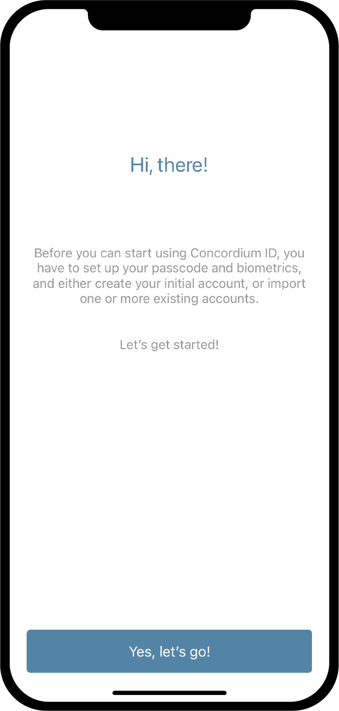
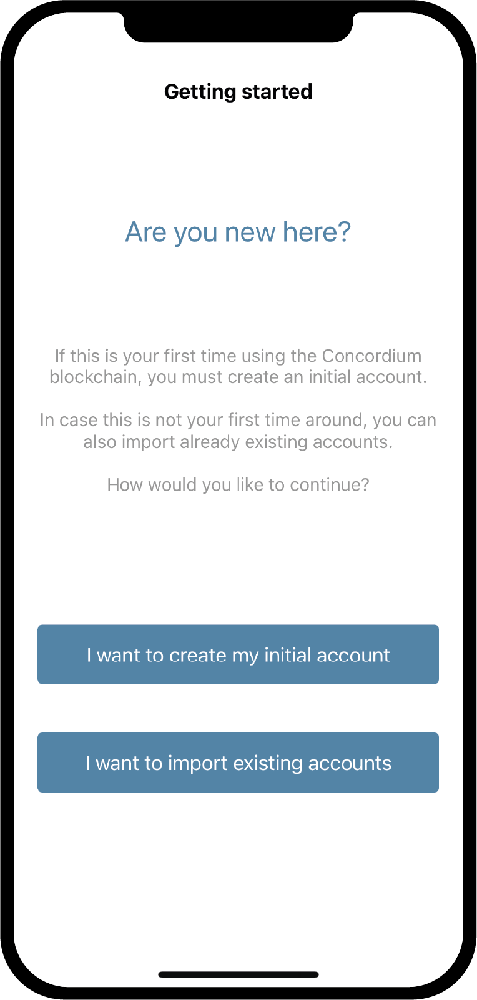

.. _Discord: https://discord.gg/xWmQ5tp

.. _testnet-get-started:

=======================================
Concordium ID: Zaczynaj z aplikacją
=======================================

.. contents::
   :local:
   :backlinks: none

Przed wykonaniem tego przewodnika powinieneś był skończyć instalacja Concordium ID, tak jak opisane w :ref:`the poprzedni rozdział<testnet-get-the-app>`.

Skonfiguruj passcode i dane biometryczne
================================

Kiedy otwierasz the Concordium ID app po raz pierwszy, zostaniesz powitany przez przepływ
że pomoże Ci ustawić hasło i uwierzytelnienie biometryczne, stworzyć :ref:`glosariusz-początkowe-konto`,
i to będzie poprowadzi Cię przez to uzyskiwanie :ref:`glosariusz-tożsamość`. The konto początkowe to specjalny rodzaj konta,
że jest przedłożony the łańcuch przez :ref:`dostawca-tożsamości-glosariusza`, na kreacja z an tożsamość. Możesz robić
to samo transakcje od na konto początkowe jak ze zwykłych kont, ale właściciel początkowego konta będzie znany
przez dostawcę tożsamości. Po twoja tożsamość jest tworzona będziesz mógł Zatwierdź rachunki do łańcucha
siebie, i te będą nieznane przez dostawcę tożsamości. Możesz dowiedzieć się więcej o kontach na :ref:`Tożsamości
i rachunki<odniesienie-id-rachunki>`strona.

Pierwszy ekran Spotkacie się podczas otwierania Concordium ID jest ten. To będzie po prostu wyjaśnij że
aby rozpocząć, musisz przejść przez ten proces.

Jeśli chcesz kontynuować, możesz nacisnąć **Tak, chodźmy!** następny ekran poprosi Cię o wejście
sześciocyfrowy passcode. Jeśli wolisz używać pełnego hasła zawierającego litery, również możesz zdecyduj się to zrobić tutaj.

.. image:: images/concordium-id/int2.png
      :width: 32%

.. todo::

   Write a directive to make two or more images side-by-side centered

Wybierając zarówno za passcode lub pełne hasło, będziesz mógł również korzystać z biometrii jeśli twój telefon
wspiera to, i.e. rozpoznawanie twarzy lub odcisk palca. Zalecamy użycie biometria jeśli masz taką możliwość it to.

.. image:: images/concordium-id/int3.png
      :width: 32%
      :align: center

Poproś o początkowe konto i tożsamość
=========================================

Dalej, będziesz miał wybór pomiędzy utworzeniem nowego konta początkowego a tożsamością, lub importowanie już istniejącego zestawu.
Zakładając, że to pierwszy raz używasz Concordium ID, możesz wybrać **Chcę utworzyć moje początkowe konto** kontyntynuj.

Na następnym ekranie zobaczysz opis tego, czym jest początkowe konto i trzy kroki, które musisz wykonać, aby to osiągnąć,
wraz z twoją tożsamością. proste słowa, the początkowe konto to konto przesłane do łańcucha przez dostawcę tożsamości z twojego
wybór, co znaczy Oni się dowiedzą że jesteś the właściciel konta. Później będziesz mógł wysłać konto do
łańcuch samodzielnie, co oznacza, że właściciel tych kont będzie znany tylko Tobie.

.. image:: images/concordium-id/int5.png
      :width: 32%
      :align: center

Trzy kroki wymienione powyżej to:

1. Nazwa twojego początkowego konta
2. Nazwanie swojej tożsamości
3. Żądanie the początkowe konto i tożsamość z :ref:`dostawca-tożsamości-glosariusza` do wyboru

Spotkacie się pierwszy krok na następnej stronie, który podpowiada ty do wprowadzić nazwę dla twojego początkowego konta. naciskając Kontynuuj
przeniesie Cię na następną stronę, na którym musisz nazwać swoją tożsamość. Obie te nazwy będą tylko znane samodzielnie,
więc możesz je nazwać mniej więcej cokolwiek chcesz (Istnieje kilka ograniczeń dotyczących liter i znaków, których możesz używać).

W poniższym przykładzie, decydujemy się zadzwonić nasze początkowe konto *przykładowe konto 1* i naszą tożsamość *przykładowa tożsamość*. Tak jak
wzmiankowany, możesz wybrać którykolwiek nazwy, które chcesz.

.. image:: images/concordium-id/int6.png
      :width: 32%
.. image:: images/concordium-id/int7.png
      :width: 32%

Naciskając **kontyntynuj dostawcy tożsamości**, zostaniesz przeniesiony na stronę gdzie musisz wybierać pomiędzy *dostawca tożsamości*.
Dostawca tożsamości to zewnętrzny podmiot, który zweryfikuje, kim jesteś, przed zwróceniem obiektu tożsamości, który ma być użyty w łańcuchu.
Na razie możesz wybierać między:

* *Notabene Rozwój* co da ci tożsamość testową bez prawdziwej weryfikacji tożsamości.
* *Notabene* przez w którym zweryfikowana zostanie Twoja prawdziwa tożsamość.

.. image:: images/concordium-id/int8.png
      :width: 32%
      :align: center

Przez wybór Notebene Rozwój, będziesz otrzymali testową tożsamość bez dalszych ceregieli. Jeśli wybierzesz Notabene zostaniesz przeniesiony 
do ich zewnętrznej tożsamości wydanie pływ,, który poprowadzi Cię przez proces weryfikacji obiektu tożsamości.
Po zakończeniu tego przepływu zostaniesz zabrany z powrotem do Concordium ID.

Po wykończeniowy też na przepływy wydawania tożsamości, pojawi się następujący ekran. It will show you an overview
z twojej tożsamości i początkowego konta.

.. image:: images/concordium-id/int9.png
      :width: 32%
      :align: center

W zależności od dostawcy tożsamości wybrałeś, układ dowodu osobistego może się nieznacznie różnić. Możesz zobaczyć że
Przykładowe konto 1 jest przechowywane przez tożsamość Przykładowa tożsamość. Konto utworzone podczas tego procesu zostanie oznaczone * (początkowe) *
w aplikacji, więc wiesz, które konto to początkowe konto wysłane do łańcucha przez dostawcę tożsamości.

Naciskając **kończyć** zostaniesz przeniesiony do * ekranu Konta *. Na tym ekranie będziesz mógł zobaczyć nowo utworzony inicjał
konto. To może być widoczne za *Oczekująca ikona*, co oznacza, że dostawca tożsamości jest nadal aktywny pracujący za przedkładający oraz tworzenie początkowego konta i tożsamości. Możesz także nawigować do ekranu * Tożsamości * klikając ** Tożsamości ** u dołu wyświetlacza.
Na tym ekranie możesz zobaczyć swoją nowo utworzoną tożsamość, którymoże również nadal czekać na dostawcę tożsamości
który jeszcze tego nie skończył. Wszystko co musisz teraz zrobić, to czekać, aż skończą.

.. image:: images/concordium-id/int10.png
      :width: 32%
.. image:: images/concordium-id/int11.png
      :width: 32%

Wsparcie i opinie
==================

Jeśli napotkasz żadnych problemów lub mieć sugestie, opublikuj swoje pytanie lub informacje zwrotne na Discord, lub Skontaktuj się z nami na testnet@concordium.com.
