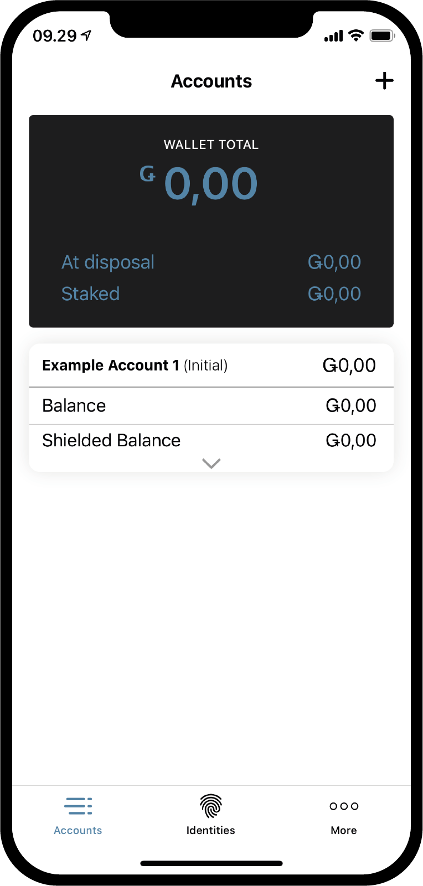
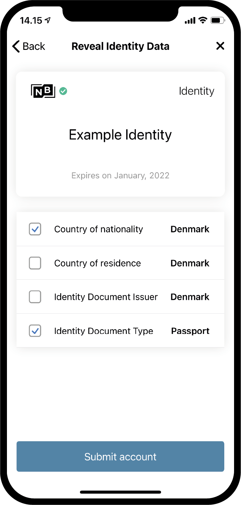
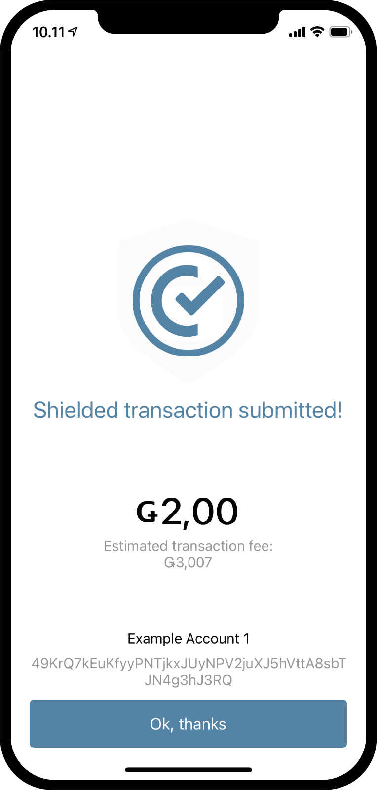

.. _Discord: https://discord.gg/xWmQ5tp

.. _guide-account-transactions:

=========================================================
Concordium ID: Ныачинаем работу со счетами и транзакциями
=========================================================

.. contents::
   :local:
   :backlinks: none

Прежде чем следовать приведенной инструкции вы должны завершить создание вашего счета и персонального идентификатора, как это описано в :ref:`the previous chapter<testnet-get-started>`.

Создание нового счета
====================
Прежде чем мы разберемся с тем, как работать со счетами, их балансом и транзакциями, давайте создадим второй счет. Для этого
начните со вкладки *Счета*. В верхнем правом углу вы увидите **значок плюса**. Нажмите на него, чтобы продолжить. На следующей вкладке
вам предложат ввести имя для вашего нового счета. В нашем примере мы выбрали название *Example Account 2*, но вы можете выбрать любой понравившийся вам вариант.

.. image:: images/concordium-id/acc2.png
      :width: 32%

После нажатия **Next** вы попадете на вкладку, где вам предложат выбрать персональный идентификатор для создания нового счета.
Вероятно, у вас уже есть один, но если у вас их будет несколько, вы сможете выбрать из списка любой понравившийся идентификатор. После нажатия
на соответствующий идентификатор вы перейдете на следующую вкладку. При создании последующих счетов, т.е. счетов, которые не предполагают
персональной идентификации, вы можете заполнить о себе ряд данных :ref:`glossary-attribute`. Это не обязательно, и если у вас нет
какой-либо причины это сделать, мы рекомендуем ничего не раскрывать, так как данные о введенных параметрах сохраняются в сети и не могут
быть удалены.

.. image:: images/concordium-id/acc3.png
      :width: 32%
.. image:: images/concordium-id/acc4.png
      :width: 32%

Если вы все же нажмете на кнопку **Reveal account attributes** вы попадете на следующую вкладку. Здесь вы можете выбрать те параметры,
которые хотите заполнить, и далее нажать **Submit account**. После нажатия кнопки **Submit account** на этой или предыдущей странице вы
окажетесь на завершающей создание счета вкладке. Здесь вам доступен краткий обзор счета и информация о том, что он создан.

.. image:: images/concordium-id/acc6.png
      :width: 32%

После нажатия **Ok, thanks** на финальной при создании счета вкладке, вы будете перенаправлены назад на страницу счета. Здесь вы можете
увидеть значок ожидания, поскольку процесс создания может занять несколько минут. Вы можете нажать на указывающую вниз стрелку на карточке
одного из ваших счетов, если вы еще не пробовали так сделать. Так вы развернете карточку с информацией о счете. На карточке вы сможете увидеть
два поля, *at disposal* и *staked*. Поле *disposal* показывает какая часть баланса счета доступна для использования в данный момент. Поле
*staked* показывает размер ставки, более подробную информацию о которых вы можете получить на
странице :ref:`managing accounts<managing_accounts>` .

.. image:: images/concordium-id/acc7.png
      :width: 32%
.. image:: images/concordium-id/acc8.png
      :width: 32%

Совершение транзакции
====================
Далее попробуйте нажать **Balance** в вашем новом созданном счете. На этой вкладке вы сможете увидеть текущий баланс вашего счета.
Здесь же вам предложат пополнить его на 100 GTU, которые вы можете использовать в Тестовой сети (Testnet). Предложение пополнить счет на
100 GTU — это особенность нашей тестовой сети. В Тестовой сети 4 ваш счет будет пополнен на 2000 GTU, несмотря на то, что на кнопке указано
100. Такое автоматическое пополнение счета происходит только один раз. Нажав на соответствующую кнопку, вы увидите, как это произойдет. Это
может занять некоторое время, но в конечном итоге ваш счет будет пополнен на 2000 GTU.

.. image:: images/concordium-id/acc9.png
      :width: 32%
.. image:: images/concordium-id/acc10.png
      :width: 32%

Теперь, когда на вашем счете есть GTU, давайте попробуем осуществить первую транзакцию. Чтобы это сделать, нажмите кнопку **SEND**. На
следующей вкладке вы сможете ввести сумму, которую хотите перевести, и выбрать получателя. В следующем примере мы будем переводить 10 GTU.

.. image:: images/concordium-id/acc11.png
      :width: 32%
.. image:: images/concordium-id/acc12.png
      :width: 32%

Определившись с суммой, мы приступаем к вводу данных получателя. Чтобы это сделать, нажмите кнопку **Select Recipient or shield amount**(Выбрать
получателя или защитить сумму). На этой вкладке доступен поиск получателя в вашей Книге контактов или добавление получателя путем
сканирования QR-кода его счета. Как вы видите на скриншоте, у нас есть только один сохраненный получатель, *Example Account 1*. Помимо
этого у нас есть опция *Shield an amount*(защитить сумму), но к ней мы вернемся чуть позже. В нашем примере мы выберем *Example Account 1*
в качестве получателя нашего перевода.

.. image:: images/concordium-id/acc13.png
      :width: 32%
.. image:: images/concordium-id/acc14.png
      :width: 32%

После выбора суммы переводимых средств и получателя следует нажать **Send Funds**(отправить средства). На следующей вкладке вам будет
необходимо подтвердить выбранную сумму, получателя и счет списания средств. После нажатия **Yes, send funds**(да, перевести средства) вам
будет необходимо идентифицировать себя путем введения пароля или используя биометрическую идентификацию. Далее транзакция поступает на
обработку в сеть. Это может занять некоторое время.

.. image:: images/concordium-id/acc16.png
      :width: 32%

В данных о *переводах* аккаунта *Example Account 2*’s мы видим, что сумма на счету была уменьшена, в т.ч. с учетом сбора. Все транзакции
облагаются сбором. В зависимости от типа транзакции величина сбора может варьироваться. Нажав на транзакцию, вы получаете возможность узнать
о ней подробнее.

.. image:: images/concordium-id/acc17.png
      :width: 32%
.. image:: images/concordium-id/acc18.png
      :width: 32%

.. _move-an-amount-to-the-shielded-balance:

Перемещение средств на защищенный баланс
========================================
Если мы вернемся на вкладку *Счета*, мы увидим, что 10 GTU были переведены на *баланс* счета *Example Account 1*. Как вы должно быть уже
заметили, счета также имеют :ref:`glossary-shielded-balance`. В кратце, защищенный баланс предназначен для того, чтобы хранить на вашем счете
некоторое защищенное (зашифрованное) количество GTU. Давайте попробуем добавить немного защищенных GTU на ваш *Example Account 2*. Для начала
нажмите на **Shielded Balance**(защищенный баланс) на вашей карточке счета.

.. image:: images/concordium-id/acc19.png
      :width: 32%
.. image:: images/concordium-id/acc20.png
      :width: 32%

Далее снова нажмите кнопку **SEND**(отправить) и введите сумму GTU, которую вы хотите *защитить*. Таким образом вы указываете, какую сумму
GTU собираетесь перевести на *Защищенный баланс*. После этого необходимо снова нажать на кнопку **Select Recipient or shield amount**(выбрать
получателя или защитить сумму). Вместо выбора получателя сейчас мы нажмем на кнопку **Shield amount**(защитить сумму).

.. image:: images/concordium-id/acc21.png
      :width: 32%
.. image:: images/concordium-id/acc22.png
      :width: 32%

Далее необходимо подтвердить транзакцию так же, как мы это делали в предыдущем примере с обычным переводом. Может потребоваться
некоторое время, пока транзакция отобразится в сети.

.. image:: images/concordium-id/acc23.png
      :width: 32%
.. image:: images/concordium-id/acc24.png
      :width: 32%

Если сейчас вы вернетесь на вкладку *Счета*, то увидите, что на *Защищенном счете* аккаунта *Example Account 2* находится 10 GTU.
Если вы нажмете на поле *Защищенный баланс* карточки счета, то увидите запись о совершении *Защищенной транзакции* в журнале переводов
защищенного баланса. Осуществление защищенной транзакции также облагается дополнительным сбором. Но этот сбор списывается с обычного
баланса вашего счета. Давайте вернемся назад и посмотрим на информацию о переводах вашего обычного *баланса*.

.. image:: images/concordium-id/acc25.png
      :width: 32%
.. image:: images/concordium-id/acc26.png
      :width: 32%

Осуществляем зашифрованный перевод
========================
Теперь, когда на нашем счете есть некоторое количество защищенных GTU, мы можем попробовать осуществить *зашифрованный
перевод*, т.е. перевод некоторого количества зашифрованных GTU. Для этого сначала необходимо перейти на вкладку *защищенного
баланса* того счета, на котором есть зашифрованные GTU, если вы еще не там. Затем нужно нажать на кнопку **SEND**(отправить).
Далее нужно ввести сумму и выбрать получателя. В следующем примере мы будем переводить 2 GTU. После нажатия кнопки **Select
Recipient or unshield amount**(выбрать получателя или снять защиту с суммы) вы сможете выбрать получателя средств. В нашем
случае это *Example Account 2*.

.. image:: images/concordium-id/acc27.png
      :width: 32%
.. image:: images/concordium-id/acc28.png
      :width: 32%

Заполнив данные о получателе и размере переводимых средств, вы можете продолжить. Также как и в случае с остальными переводами вы попадете
на экран с подтверждением выбранного действия, далее вводите пароль или проходите биометрическую идентификацию, и отправляете данные о
совершенной транзакции в сеть. Опять же для завершения действия может потребоваться некоторое время.

.. image:: images/concordium-id/acc29.png
      :width: 32%

Теперь, если вы вернетесь на вкладку *Счета*, то увидите, что рядом с отображением *Защищенного баланса* счета-получателя появился небольшой
значок в форме щита. Это свидетельствует о получении новых защищенных транзакций на *защищенный баланс*. Попробуйте нажать на защищенный баланс
и вы увидите, что для доступа к этим данным вам понадобится ввести пароль или пройти биометрическую идентификацию. Это происходит потому, что
вам необходимо расшифровать защищенные транзакции, прежде чем вы увидите количество переведенных средств.

.. image:: images/concordium-id/acc31.png
      :width: 32%
.. image:: images/concordium-id/acc32.png
      :width: 32%

Снятие защиты со средств
==================
После расшифровки сумма перевода отобразится в *Защищенном балансе*, а также в карточке счета на вкладке *Счета*. А если теперь мы захотим
перевести некоторую сумму GTU с защищенного баланса на обычный баланс? Давайте попробуем перевести 2 GTU на обычный баланс с помощью функции
*Снятие защиты*. Чтобы это сделать, нажмите кнопку **SEND**(отправить) на вкладке защищенного баланса. Введите 2 в поле размера перевода.
Далее нажмите кнопку **Select Recipient or unshield amount**(выбрать получателя или снять защиту с суммы). Выберите
**Unshield amount**(снять защиту с суммы).

.. image:: images/concordium-id/acc33.png
      :width: 32%
.. image:: images/concordium-id/acc34.png
      :width: 32%

Теперь завершите транзакцию, как вы это делали в предыдущих случаях и перейдите на вкладку обычного баланса счета, чтобы увидеть
расшифрованную сумму. Если транзакция в сети уже завершена, то вы сможете увидеть, что *Расшифрованная сумма* средств теперь поступила на
обычный баланс. Однако обратите внимание, что это не 2 GTU, хотя при расшифровке вы указали именно эту сумму. Так происходит потому, что
комиссия с каждой транзакции, в том числе и с расшифровки средств, будет списана с обычного баланса счета,
который осуществляет транзакцию.

.. image:: images/concordium-id/acc35.png
      :width: 32%
.. image:: images/concordium-id/acc36.png
      :width: 32%

Как поделиться адресом вашего счета
==========================
Если вы хотите поделиться адресом вашего счета, это легко сделать, нажав на кнопку **Address**(адрес). Откроется вкладка, где вам
предложат множество способов поделиться вашим адресом. Попробуйте нажать кнопку **Share**(поделиться) для того, чтобы поделиться вашим
адресом с кем-нибудь.

.. image:: images/concordium-id/acc37.png
      :width: 32%
.. image:: images/concordium-id/acc38.png
      :width: 32%

Inspect a release schedule
==========================
В блокчейне Concordium существует возможность осуществить транзакцию, которая высвобождает переведенную сумму спустя определенное
время. Это называется *перевод с расписанием*. Сейчас мы не будем вдаваться в подробности как осуществлять такой перевод, так как он не может
быть осуществлен с помощью Concordium ID. Но давайте проверим, как это расписание можно изучить. Если вы получили перевод с расписанием,
нажмите **бургер-меню** в верхнем правом углу экрана на вкладке баланса. Далее выберите и нажмите **Release schedule**(график выпуска).
На следующей вкладке вы сможете увидеть информацию о том, сколько GTU будет выпущено и когда. Если вы хотите узнать больше о том, как сделать
перевод с графиком выпуска, обратитесь к разделам :ref:`concordium_client` и :ref:`transactions`.

.. image:: images/concordium-id/rel1.png
      :width: 32%
.. image:: images/concordium-id/rel2.png
      :width: 32%
.. image:: images/concordium-id/rel3.png
      :width: 32%

Служба поддержки и обратная связь
==================

Если у вас возникли какие-либо проблемы или появились предложения, присылайте
ваши вопросы и комментарии в `Discord`_ или свяжитесь с нами через `testnet@concordium.com`_.

.. _Discord: https://discord.gg/xWmQ5tp
.. _`testnet@concordium.com`: mailto:testnet@concordium.com

