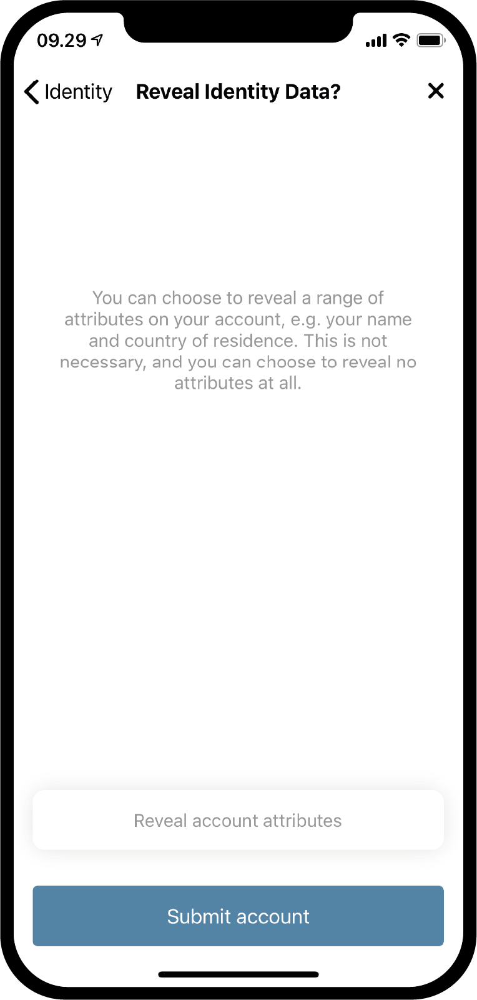
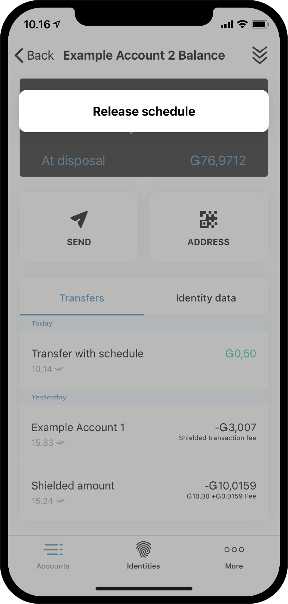

.. _Discord: https://discord.gg/xWmQ5tp

.. _guide-account-transactions-ru:

===================================================
Concordium ID: Начало работы: аккаунты и транзакции
===================================================

.. contents::
   :local:
   :backlinks: none

Прежде чем приступить к этому руководству, вы должны создать свой начальный счёт и идентификатор (удостоверение), как описано в :ref:`предыдущей части<testnet-get-started>`.

Создание нового счёта
=====================
Прежде чем приступить к изучению работы со счетами, балансами и транзакциями, давайте создадим второй счёт. Перейдите на вкладку
*Accounts*. В верхнем правом углу вы увидите **плюсик**, нажмите его. На следущем экране вам преждложат ввести имя нового счёта.
В этом примере мы назовём его *Example Account 2*, но вы можете назвать его как угодно.

.. image:: images/concordium-id/acc1.png
      :width: 32%
.. image:: images/concordium-id/acc2.png
      :width: 32%

После того как вы нажали **Next**, вам будет предложено выбрать идентификатор к которому будет привязан новый счёт.
На данный момент у вас, скорее всего, уже есть один, но даже если у вас их несколько, можете выбрать любой из списка.
После выбора идентификатора, вы перейдёте к следующему экрану. Если вы выбрали не вашпервый идентификатор, т.е. счёт который
не был создан с начальным идентификатором, вы можете выбрать некоторые свойства для показа ref:`glossary-attribute`. Это не обязательно,
и если у вас нет для этого особой причины, мы рекомендуем пропустить этот шаг и не показывать их, так как они будут вписаны в цепочку и не могут быть удалены.

.. image:: images/concordium-id/acc3.png
      :width: 32%

Если вы нажали кнопку **Reveal account attributes**, откроется экран, где вы можете отключить атрибуты которые хотите показывать, затем нажать **Submit account**.
После нажатия на кнопку **Submit account**  на этой или на предыдущей странице, вы будете перенаправлены на финальную страницу создания аккаунта, на которой будет краткая
обобщающая информация и подтверждение что счёт был создан.

.. image:: images/concordium-id/acc5.png
      :width: 32%
.. image:: images/concordium-id/acc6.png
      :width: 32%

После нажатия на кнопку **Ok, thanks** на этом экране, вы вернётесь на экран со списком счетов. Вы можете увидеть, что ваш новый
счёт все еще в обработке, так как для для этого может потребоваться несколько минут. Если вы еще не пробовали это сделать,
вы можете нажать *стрелку вниз*, на одной из карточек счетов, чтобы увидеть детали. Там содержатся два новых
раздела информации: *at disposal* и *staked*. Рядом будет указан доступный остаток на соответствующей части счёта.
Больше деталей вы можете найти на странице :ref:`управление счетами<managing_accounts>`

.. image:: images/concordium-id/acc7.png
      :width: 32%
.. image:: images/concordium-id/acc8.png
      :width: 32%

Создание транзакции
===================
Далее, попробуйте нажать на раздел **Balance** на карточке, только что созданного счёта. На этом экране вы увидите текущий баланас,
также здесь вы сможете запросить 100 GTU для использования в рамках тестнета. Запрос 100 GTU - опция доступная для тестнетов и
в частности для тестнета 4 на счёт будет перечислено 2000 GTU, не смотря на то что на кнопке написано 100.
Такой перевод доступен лишь один раз. После нажатия на кнопку запроса вы увидите появившееся уведомление о транзакции,
после чего, спустя некоторе время, 2000 GTU будут добавлены на ваш счёт.

.. image:: images/concordium-id/acc9.png
      :width: 32%
.. image:: images/concordium-id/acc10.png
      :width: 32%

Теперь у нас есть немного токенов GTU на нашем счету давайте приступим к транзакцям. Для этого нажмите на кнопку **SEND**.
На следующем экране вам будет предложено ввести количество токенов, которое вы хотите отправить. В этом примере мы отправим 10 GTU.

.. image:: images/concordium-id/acc11.png
      :width: 32%
.. image:: images/concordium-id/acc12.png
      :width: 32%

Определившись с суммой, мы должны выбрать получателя. Для этого намжите кнопку **Recipient or shield amount**.
На этом экране вы можете выполнить поиск получателя в вашей *адресной книге* либо сканировать QR код получателя.
Как вы видите на скришоте, у нас есть лишь один сохранённый получатель - *Example Account 1*. Также здесь есть опция
*Shield an amount*, к ней мы вернёмся позже. Выберем получателя *Example Account 1* для примера.

.. image:: images/concordium-id/acc13.png
      :width: 32%
.. image:: images/concordium-id/acc14.png
      :width: 32%

Когда сумма и получатель выбраны, нажимаем **Send Funds**, после чего увидим экран подтверждения операции
с суммой, адресом счёта получателя и отправителя. После нажатия на кнопку *Yes, send funds**, необходимо будет подтвердить свою личность
паролем или биометрической идентификацией, после чего транзакция будет сохранена в цепочку. Завершение транзакции может потребовать
нескольких минут.

.. image:: images/concordium-id/acc15.png
      :width: 32%
.. image:: images/concordium-id/acc16.png
      :width: 32%

Теперь мы можем видеть в списке *Transfers* счёта *Example Account 2* что была снята сумма и комиссия. Все транзакции облагаются
комиссией, которая зависит от типа транзации. Нажав на транзакцию вы увидите дополнительную информацию.

.. image:: images/concordium-id/acc17.png
      :width: 32%
.. image:: images/concordium-id/acc18.png
      :width: 32%

.. _move-an-amount-to-the-shielded-balance:

Перемещение средств на защищённый баланс
========================================
Если мы вернёмся назад, на экран *Accounts* (список счетов), мы увидим что 10 GTU были перечислены на *баланс* счёта *Example Account 1*.
Как вы могли заметить ранее, каждый счёт содержит :ref:`glossary-shielded-balance`. Если кратко, защищённый баланс служит для хранения зашифрованного
остатка GTU на балансе счёта. Давайте попробуем *защитить* некоторую сумму GTU на наш счёт *Example Account 2*. Для этого нажмём на область
**Shielded Balance** карточки счёта.

.. image:: images/concordium-id/acc19.png
      :width: 32%
.. image:: images/concordium-id/acc20.png
      :width: 32%

Далее, нажимаем на кнопку **SEND** снова и вводим сумму GTU для для добавления этих токенов на *Защищённый баланс*.
После чего жмём на **Select Recipient or shield amount**. Вместо выбора получателя, на этот раз жмём **Shield amount**.

.. image:: images/concordium-id/acc21.png
      :width: 32%
.. image:: images/concordium-id/acc22.png
      :width: 32%

Транзакция должна быть подтверждена так же, как мы делали это ранее для обычного перевода. Выполнение транзакции может потребовать
некоторого времени.

.. image:: images/concordium-id/acc23.png
      :width: 32%
.. image:: images/concordium-id/acc24.png
      :width: 32%

Вернёмся назад на экран *Accounts*, где теперь видим что 10 GTU находятся на *Защищённом балансе* *Example Account 2*. Если нажать на область
*Защищённый баланс* карточки счёта, вы можете увидеть что появилась тразакция *Shielded amount* в списке логов переводов.
Создание защищающей транзакции также облагается комиссией, но эта комиссия будет снята с обычного баланса счёта. Давайте попробуем
вернуться назад и взглянуть на список переводов обычного *Баланса*.

.. image:: images/concordium-id/acc25.png
      :width: 32%
.. image:: images/concordium-id/acc26.png
      :width: 32%

Создание защищённого перевода
=============================
Имея защищённые GTU, мы теперь можем попробовать выполнить *Защищённый перевод* (*Shielded transfer*), что подразумевает перевод защищённых GTU.
Для начала перейдите на экран *защищённого баланса* счёта, который содержит защищённые GTU. Затем нажмите кнопку **SEND**. Теперь вы
можете ввести количество и выбрать получателя. В данном примере мы выбрали 2 GTU. После нажатия **Select Recipient or unshield amount**,
вы можете выбрать получателя. Для примера выберем *Example Account 2*.

.. image:: images/concordium-id/acc27.png
      :width: 32%
.. image:: images/concordium-id/acc28.png
      :width: 32%

После того как сумма и получатель выбраны, можно продолжать. Так же как и в других транзакциях, вы увидите окно подтверждения, после чего
должны будете подтвердить свою личность пинкодом или биометрическими данными, после чего отправить защищённую транзакцию в цепочку.
Опять же, завершение транзакции может потребовать некоторого времени.

.. image:: images/concordium-id/acc29.png
      :width: 32%
.. image:: images/concordium-id/acc30.png
      :width: 32%

Теперь, если вы вернётесь на экран счетов (*Accounts*), вы увидите небольшую иконку щита, возле суммы *Защищённый баланс* счёта получателя.
Это означает что была получена защищённая транзакция. Попробуйте нажать на защищённый баланс и убедитесь,
что для того чтобы войти вам необходимо использовать пинкод или биометрию. Это происходит потому что вы должны расшифровать полученную
защищённую транзакцию, чтобы увидеть сумму.

.. image:: images/concordium-id/acc31.png
      :width: 32%
.. image:: images/concordium-id/acc32.png
      :width: 32%

Снятие защиты с баланса
=======================
После расшифровки, сумма станет видимой в *защищённом балансе* карточки счёта на экране счетов (*Accounts*). Теперь, что если мы хотим
переместить GTU с защищённого баланса на обычный? Давайте попробуем переместить 2 GTU на обычный баланс посредством функции снятия защиты с суммы.
Для этого, нажмите на кнопку **SEND** в защищённом балансе, введите сумму, затем нажмите *Select Recipient or unshield amount**, после чего
выберите **Unshield amount**.

.. image:: images/concordium-id/acc33.png
      :width: 32%
.. image:: images/concordium-id/acc34.png
      :width: 32%

Теперь завершите транзакцию так же, как вы делали в предыдущих примерах и посмотрите на обычный балас счёта, чтобы убедиться что защита была снята.
Если транзакция к этому времени была выполнена, вы должны увидеть что сумма перечислилась на обычный баланс. Обратите внимание, что это не 2 GTU,
несмотря на то что ранее мы выбрали эту сумму для снятия защиты. Все дело в комиссии, которая вычитается, в том числе, за снятие защиты и списание
происходит с основного счёта, отвечающего за транзакцию.

.. image:: images/concordium-id/acc35.png
      :width: 32%
.. image:: images/concordium-id/acc36.png
      :width: 32%

Поделиться адресом счёта
========================
Если хотите поделиться адресом вашего счёта, нажмите на кнопку **Address**. Откроется страница, где будут различные опции.
Нажав кнопку **Share** вы сможете поделиться с кем-нибудь своим адресом.

.. image:: images/concordium-id/acc37.png
      :width: 32%
.. image:: images/concordium-id/acc38.png
      :width: 32%

Перевод по расписанию
=====================
В блокчейне Concordium есть возможность осуществлять транзакции через определённые промежутки времени, это назвается *перевод по расписанию*.
Сейчас мы не будем углубляться в подробности создания подобного перевода, посколько это не может быть выполнено в приложении Concordium ID,
однако, в приложнии мы можем проверить расписание. Если у вас настроен подобный перевод по расписанию, можете нажать на кнопку **меню** в верхнем правом углу
экрана с балансом. После чего отобразится пункт **Release schedule** (расписание переводов), нажав на который вы перейдёте на экран, который содержит информацию о том,
сколько GTU будет отправлено и когда. Если хотите узнать больше о переводах по расписанию, можете найти это на страницах :ref:`concordium_client`
и :ref:`transactions`.

.. image:: images/concordium-id/rel1.png
      :width: 32%

Поддержка и обратная связь
==========================

Если вы столкнулись с проблемами или у вас возникли вопросы, свяжитесь с нами в `Discord`_,
или по электронной почте testnet@concordium.com.
