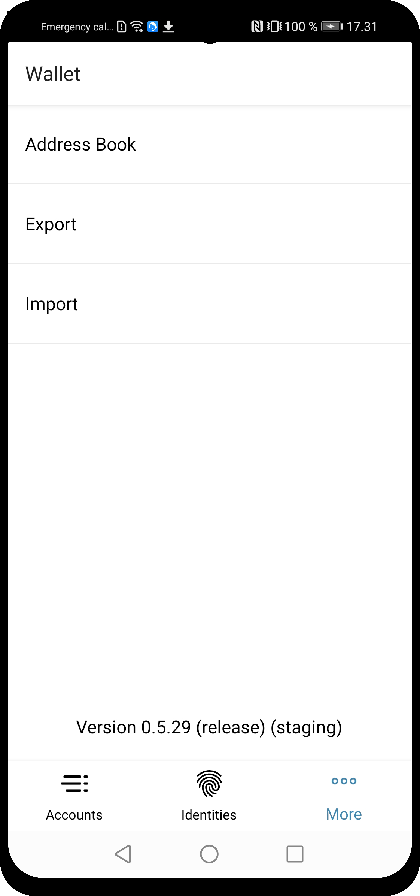
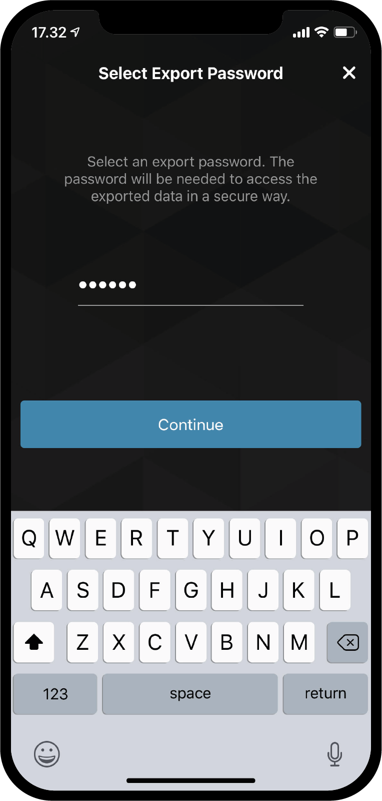
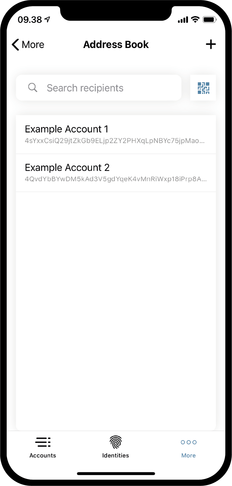

.. _Discord: https://discord.gg/xWmQ5tp

.. _testnet-explore-more:

=======================================
Concordium ID: Изучаем страницу *More*
=======================================

.. contents::
   :local:
   :backlinks: none

Экспорт
=======
У вас есть возможность экспортировать ваши счета и идентификаторы. Для начала, откройте страницу *More*.
В зависимости от того, какую версию приложения вы используете (Android или iOS), страница *More* может немного отличаться.
На Android вы увидите 3 пункта меню *Address Book* (*Адресная книга*), *Export* (*Экспорт*) и *Import* (*Импорт*).
На iOS будут доступны только *Address Book* и *Export*. Это связано с тем, что функция *Импорт* работает по-разному,
в зависимости от платформы, но мы вернёмся к этому позже.

.. image:: images/concordium-id/exp2.png
      :width: 32%

Чтобы начать экспорт, нажмите опцию **Export**. Вы попадете на новую страницу, на которой кратко объясняется, что означает эта функция.
Мы рекомендуем внимательно её прочитать. Нажав **Continue**, вы попадете на страницу, на которой вам будет предложено ввести пароль для
экспортируемого файл. Введя его дважды, нажимаем **Continue**. В качестве последнего шага iOS или Android спросит у вас, что
вы хотите сделать с экспортированным файлом, используя диалог операционной системы телефона.

.. image:: images/concordium-id/exp3.png
      :width: 32%

Импорт
======
Как упоминалось в предыдущем разделе, функция импорта работает немного по-разному на iOS и Android. На Android вы выбираете
пункт меню *Import* на странице *More*, который позволит вам перейти к файлу, который вы хотите импортировать. В зависимости от вашего
телефона и версии Android, этот шаг может немного отличаться. На iOS вам нужно перейти к файлу вне Concordium ID,
затем нажмите на него и выберите опцию *Поделиться* (*Share*). Это позволит вам выбрать Concordium ID в качестве приложения для обработки файла.

Открыв файл на любой из платформ, вам сначала будет предложено ввести пароль, выбранный при экспорте. После нажатия **Continue**
вам нужно будет подтвердить себя с помощью пароля или выбранных биометрических данных при настройке приложения. В итоге вы получите список
импортированных вами записей *Accounts* (*Счета*), *Identities* (*Идентификаторы*) и *Address Book* (*Адресная книга*).

.. image:: images/concordium-id/imp1.png
      :width: 32%
.. image:: images/concordium-id/imp2.png
      :width: 32%

Адресная книга
==============
Как следует из названия, *Адресная книга* - это место для хранения адресов учетных записей (счетов). Если вы перейдете к *Адресной книге*,
вы увидите, что адреса ваших счетов уже хранятся там. Помимо просмотра собственных адресов, вы также можете добавить больше записей в
*Адресную книгу*, нажав на **символ QR-кода** или на **плюсик** в правом верхнем углу. Сделав это, вы можете ввести новый адрес
получателя и присвоить ему псевдоним в своей *адресной книге*. Записи в вашей адресной книге, конечно, будут доступны для поиска
и выбора во время выполнения перевода.

.. image:: images/concordium-id/add2.png
      :width: 32%

Поддержка и обратная связь
==========================

Если вы столкнулись с проблемами или у вас возникли вопросы, свяжитесь с нами в `Discord`_,
или по электронной почте testnet@concordium.com.
