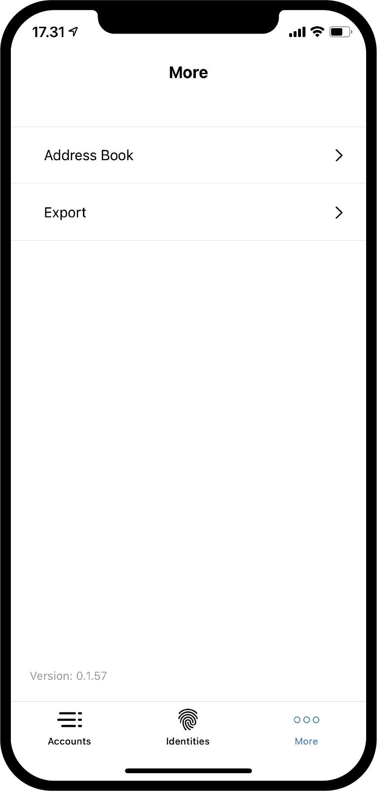
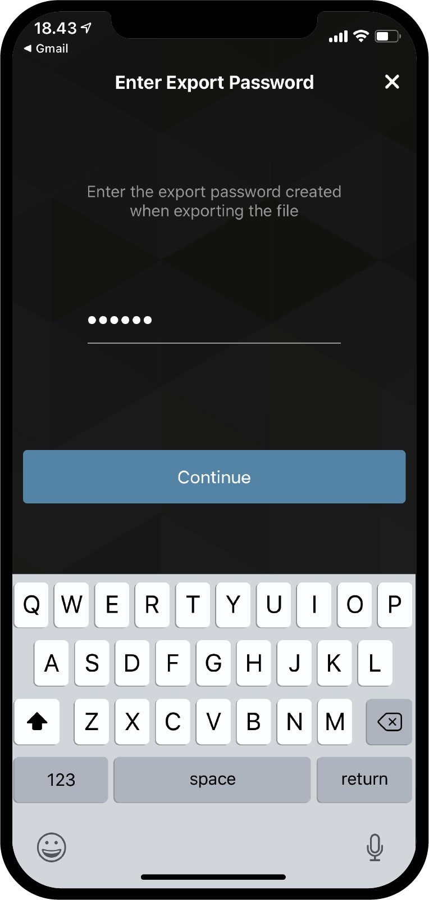

.. _Discord: https://discord.gg/xWmQ5tp

.. _testnet-explore-more:

=======================================
Concordium ID: Изучаем вкладку *More*(еще)
=======================================

.. contents::
   :local:
   :backlinks: none

Экспорт
======
Используя приложение Concordium ID, вы можете экспортировать свои счета и идентификаторы. Для того, чтобы сделать это, перейдите на вкладку
*More*(еще). В зависимости от того, какой версией приложения вы пользуетесь, для операционной системы Android или iOS, вкладка *More* будет
выглядеть немного по-разному. На Android вы увидите три пункта меню: Адресная книга, Экспорт и Импорт. На iOS вы увидите только Адресную книгу
и Экспорт. Это связано с тем, что функция Импорта реализуется двумя разными способами в зависимости от платформы, но к этому мы вернемся позднее.

.. image:: images/concordium-id/exp1.png
      :width: 32%

Чтобы начать экспорт, выберите **Export**(экспорт) в меню. После этого вы попадете на вкладку, где кратко объясняется, что такое экспорт.
Рекомендуем внимательно ознакомиться с этой информацией. После нажатия кнопки **Continue**(продолжить) вы перейдете на вкладку, где будет
необходимо ввести пароль для вашего файла экспорта. После того, как вы сделаете это дважды, вы можете **Продолжить**. На последнем этапекак iOS,
так и Android предложат вам уточнить, что вы хотите сделать с вашим экспортированным файлом, используя возможности операционной системы телефона.

.. image:: images/concordium-id/exp3.png
      :width: 32%
.. image:: images/concordium-id/exp4.png
      :width: 32%

Импорт
======
Как было упомянуто в предыдущем разделе, функция импорта реализована немного по-разному на платформе Android и на iOS. На Android вам
необходимо выбрать поле *Импорт* в меню *Еще*, что позволит вам указать файла, который вы хотите импортировать. В
зависимости от модели вашего телефона и версии Android, это может выглядеть по-разному в разных операционных системах. На iOS вам необходимо
перейти к файлу, который находится вне Concordium ID, а потом нажать на него и выбрать поле *Поделиться*. Здесь вы сможете выбрать приложение
Concordium ID для обработки файла.

При открытии файла на любой из платформ, вам предложат ввести пароль, выбранный при экспорте. После того как вы нажмете **Continue**
(продолжить), вам будет необходимо верифицировать себя путем введения пароля или биометричеких данных, как во время настройки приложения.
В конечном итоге вы получите список из Счетов, Идентификаторов и записей Адресной книги, которые вы импортировали.

.. image:: images/concordium-id/imp2.png
      :width: 32%

Адресная книга
============
Как следует из названия, *Адресная книга* — это место, в котором хранятся адреса счетов. Если вы перейдете к *Адресной книге*, то увидите, что
адреса ваших собственных счетов уже хранятся там. Помимо ваших собственных адресов вы также можете добавить в свою *Адресную книгу* больше
записей. Это можно сделать путем нажатия на значок **QR-кода** или **значок плюса** в верхнем правом углу. Таким образом вы можете добавить
адреса новых получателей и придумать им собственные псевдонимы в своей *Адресной книге*. Эти записи можно будет искать, когда вы делаете
переводы.

.. image:: images/concordium-id/add1.png
      :width: 32%
.. image:: images/concordium-id/add2.png
      :width: 32%

Служба поддержки и обратная связь
==================

Если у вас возникли какие-либо проблемы или появились предложения, присылайте
ваши вопросы и комментарии в `Discord`_ или свяжитесь с нами через `testnet@concordium.com`_.

.. _Discord: https://discord.gg/xWmQ5tp
.. _`testnet@concordium.com`: mailto:testnet@concordium.com
