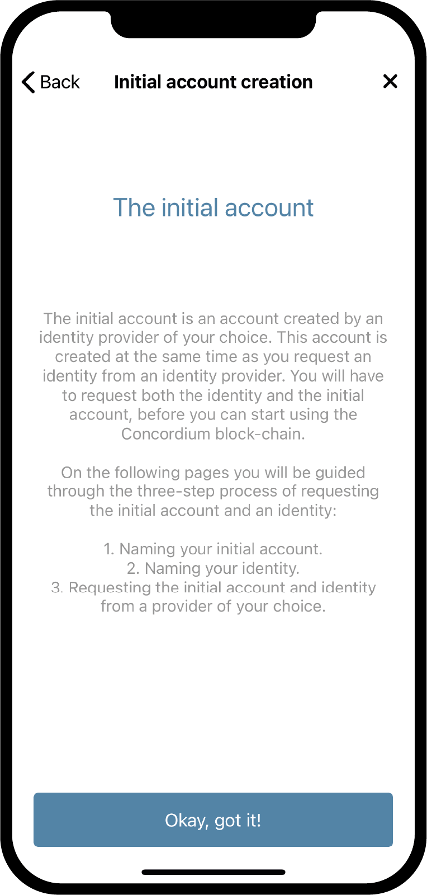

.. _Discord: https://discord.gg/xWmQ5tp

.. _testnet-get-started:

=======================================
Concordium ID: Как начать работу с приложением
=======================================

.. contents::
   :local:
   :backlinks: none

Прежде чем следовать этой инструкции, вы должны завершить установку Concordium ID, как это описано в предыдущем разделе (по ссылке :ref:`предыдущий раздел<testnet-get-the-app>`).

Установка кода доступа и биометрических данных
================================

Когда вы впервые откроете приложение Concordium ID, вам будет дан ряд последовательных
рекомендаций, которые помогут установить пароль и настроить биометрическую аутентификацию, создать
:ref:`glossary-initial-account`, а также  разобраться с получением :ref:`glossary-identity`.
Исходный счет — это особый тип счета, который верифицируется в сети посредством :ref:`glossary-identity-provider`
при создании идентификатора вашей личности. С первоначального счета вы можете осуществлять те же транзакции как и
с любого другого счета, с тем отличием, что информация о владельце первоначального счета будет известна поставщику
удостоверений. После того, как создан ваш идентификатор, вы сможете самостоятельно отправлять счета в сеть и они
не будут известны поставщику удостоверений. Вы можете узнать больше о счетах на странице
по ссылке :ref:`Идентификатор и счета<reference-id-accounts>`.

Первый экран, который вы увидите при входе в Concordium ID, будет таким. Он содержит
информацию о том, что вам нужно будет сделать, чтобы начать пользоваться приложением.

Если вы готовы продолжить, нажмите **Yes, let’s go!**(да, приступим!) Далее вас попросят ввести шестизначный код доступа.
Если вы предпочитаете использовать полноценный пароль, включающий буквы, вы также можете настроить его здесь.

.. image:: images/concordium-id/int1.png
      :width: 32%
.. image:: images/concordium-id/int2.png
      :width: 32%

.. todo::

   Write a directive to make two or more images side-by-side centered

После выбора цифрового или буквенного кода доступа, вам также будет предложена возможность использовать свои
биометрические данные, если ваш телефон поддерживает эту функцию, а именно распознавание лица или отпечатка пальца.
Мы рекомендуем использовать дополнительную защиту с помощью ваших биометрических данных, если у вас есть такая возможность.

.. image:: images/concordium-id/int3.png
      :width: 32%
      :align: center

Создание вашего первоначального счета и идентификация личности
=========================================

Далее вам предложат создать свой исходный счет и персональный идентификатор или импортировать уже существующую пару.
Исходя из того, что вы используете Concordium ID впервые, выберите **I want to create my initial account**(я хочу создать
свой персональный счет), чтобы продолжить.

.. image:: images/concordium-id/int4.png
      :width: 32%
      :align: center

На следующем экране вы увидите описание того, что такое исходный счет и какие три шага необходимо сделать, чтобы создать
его и свой персональный идентификатор. Коротко говоря, исходный счет —  это такой счет, который был отправлен в сеть выбранным вами
поставщиком идентификационных услуг. Это означает, что данный поставщик будет обладать информацией о том, что именно вы являетесь
владельцем этого счета. Впоследствии вы сможете создавать счета в сети самостоятельно, что означает, что информация о владельце таких
счетов будет доступна только вам.

Три шага, указанных выше, включают:

1. Выбор названия для вашего первоначального счета.
2. Выбор названия для вашего идентификатора.
3. Запрос на создание первоначального счета и верификацию личности у  :ref:`glossary-identity-provider` по вашему выбору.

На следующем экране вас ждет первый шаг, на котором вам предложат ввести название для вашего первоначального счета. Нажав продолжить,
вы окажетесь на следующей странице, на которой вам будет необходимо ввести название вашего идентификатор. Оба этих имени будут известны
только вам, поэтому вы можете назвать их, в пределах приличия, в принципе как угодно (Существуют некоторые ограничения того, какие
буквы и символы вы можете использовать).

В приведенном ниже примере мы назвали наш исходный счет *Example Account 1*, а наш идентификатор *Example Identity*.
Как уже было указано выше, вы можете выбрать любые названия для этих полей.

.. image:: images/concordium-id/int6.png
      :width: 32%
.. image:: images/concordium-id/int7.png
      :width: 32%

Нажимая **Continue to identity providers**(перейти к поставщикам идентификационных услуг), вы будете перенаправлены на страницу,
где вам будет необходимо выбрать одного из поставщиков идентификационных услуг. Поставщик идентификационных услуг — это внешний объект,
который будет подтверждать вашу личность перед тем, как предоставить вам доступ в сеть. На данный момент вы можете выбрать один из
следующих вариантов:

* *Notabene Development*, предоставит вам тестовую идентификацию без необходимости верификации ваших реальных персональных данных.
* *Notabene*, осуществит верификацию вашей личности на основе реальных персональных данных.

.. image:: images/concordium-id/int8.png
      :width: 32%
      :align: center

Если вы выберите Notabene Development, вам сразу же будет предоставлен тестовый идентификатор. Если вы выберите Notabene,
то будете перенаправлены на их внешнюю страницу выдачи идентификатора, где вы получите все необходимые указания для осуществления
процесса верификации. После завершения процедуры вы будете перенаправлены назад в Concordium ID.

После завершения любой из процедур верификации вы окажетесь на следующем экране. Он представляет собой обзор вашего
первоначального счета и идентификатора.

.. image:: images/concordium-id/int9.png
      :width: 32%
      :align: center

В зависимости от того, какого поставщика идентификационных услуг вы выберите, отображение карточки идентификатора может несколько
отличаться. Вы можете видеть, что Example Account 1 находится внутри идентификатора Example Identity. Счет, созданный подобным образом,
будет отмечен значком *(Initial)* в приложении, таким образом вы сможете понять, какие счета являются первоначальными и
верифицированы поставщиками идентификационных услуг.

Нажимая **Finish**(завершить), вы окажетесь на вкладке счетов. На этом экране вы сможете увидеть ваш только что созданный исходный счет.
Рядом с ним может отображаться *Значок ожидания*, что означает, что поставщик идентификационных услуг все еще обрабатывает ваш запрос
по созданию счета и верификации ваших данных. Вы также можете в любое время перейти на вкладку *Identities* нажав кнопку **Identities**
(идентификаторы) внизу экрана. На этой вкладке вы также сможете увидеть ваш только что созданный идентификатор, который также может
отображаться со значком ожидания. Все, что вам необходимо будет сделать, — дождаться пока все процессы будут завершены.

.. image:: images/concordium-id/int10.png
      :width: 32%
.. image:: images/concordium-id/int11.png
      :width: 32%

Служба поддержки и обратная связь
==================

Если у вас возникли какие-либо проблемы или появились предложения, присылайте
ваши вопросы и комментарии в `Discord`_ или свяжитесь с нами через `testnet@concordium.com`_.

.. _Discord: https://discord.gg/xWmQ5tp
.. _`testnet@concordium.com`: mailto:testnet@concordium.com
