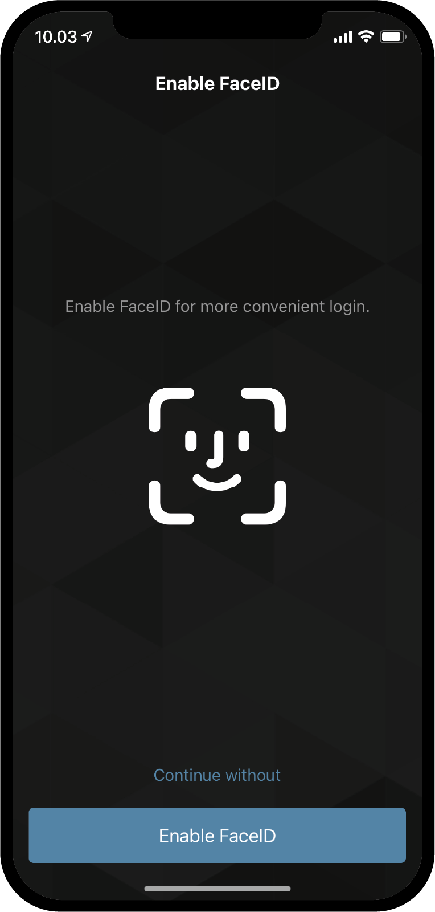

.. _Discord: https://discord.gg/xWmQ5tp

.. _testnet-get-started:

==========================================
Concordium ID: Начало работы с приложением
==========================================

.. contents::
   :local:
   :backlinks: none

Перед тем, как приступить к этому руководству, вы должны завершить установку Concordium ID, как описано в :ref:`предыдущей части<testnet-get-the-app>`.

Установка пароля и биометрии
============================

Когда вы впервые откроете приложение Concordium ID, вас встретит помощник, который поможет вам настроить пароль и
биометрическую аутентификацию, создать :ref:`glossary-initial-account`, также поможет вам получить :ref:`glossary-identity`
Начальный счёт - это особый тип счёта, который передается в цепочку :ref:`glossary-identity` при создании идентификатора.
Вы можете выполнять те же транзакции с начальным счётом, что и с обычными счетами, но владелец исходного счёта будет
известен поставщику удостоверений. После того, как ваш идентификатор будет создана, вы сможете добавлять счета в вашу цепочку
и поставщик удостоверений не узнает об этом. Можете узнать больше про счета на странице ref:`Счета и идентификаторы<reference-id-accounts>`

Это первый экран, который вы увидите при открытии Concordium ID. Он объясняет как выполнить начальную настройку,
чтобы начать работу.

Если вы готовы продолжить, просто нажмите **Yes, let’s go!**. На следующем экране вам будет предложено ввести
6-значный пинкод. Если вы предпочитаете использовать более надёжный пароль, включающий символы, такая опция также доступна.

.. image:: images/concordium-id/int1.png
      :width: 32%
.. image:: images/concordium-id/int2.png
      :width: 32%

.. todo::

   Write a directive to make two or more images side-by-side centered

Выбрав пинкод или надёжный пароль, вы также имеете возможность привязать биометрические данные, если ваш телефон поддерживает
работу с ними. Это может быть распознавание лица или отпечатков пальцев. Мы рекомендуем использовать биометрические данные,
если у вас есть такая возможность.

Запрос начального счёта и идентификатора
========================================

Далее у вас будет выбор между созданием нового начального счёта и идентификатора или импортом уже существующего набора.
Если вы впервые используете Concordium ID, выбирайте **I want to create my initial account** (**Я хочу создать свой начальный счёт**),
чтобы продолжить.

.. image:: images/concordium-id/int4.png
      :width: 32%
      :align: center

На следующем экране вы увидите описание того, что такое начальный счёт, и три простых шага, которые вы должны выполнить, чтобы получить его
и идентификатор. Начальный счёт - это учетная запись, сохранённая в цепочку поставщиком удостоверений, которого
вы выбрали. Это означает, что поставщик будет знать, что вы являетесь владельцем этого счёта. Позже вы сможете добавлять счета в
цепочку самостоятельно, а значит владелец этих счетов будет известен только вам.

.. image:: images/concordium-id/int5.png
      :width: 32%
      :align: center

Три шага, упомянутые выше, это:

1. Создание имени начального счёта
2. Создание имени идентификатора
3. Запрос начального счёта и идентификатора у поставщика удостоверений (:ref:`glossary-identity-provider`), которого вы выбрали.

Первый шаг вы увидите на следующей странице - вам будет предложено ввести имя для вашего начального счёта. После чего
вы попадёте на следующую страницу, на которой вы должны придумать себе идентификатор. Оба эти значения будут известны только вам,
так что вы можете называть как хотите (однако есть некоторые ограничения на то, какие буквы и символы вы можете использовать).

В примере ниже мы выбрали имя счёта *Example Account 1* и идентификатор *Example Identity*. Как было упомянуто, вы можете
выбрать любое значение, какое хотите.

.. image:: images/concordium-id/int6.png
      :width: 32%
.. image:: images/concordium-id/int7.png
      :width: 32%

Нажав **Continue to identity providers** (**Перейти к поставщикам удостоверений**), вы попадете на страницу, где вам нужно будет выбрать
*поставщика удостоверений*. Поставщик удостоверений - это внешняя служба, которая проверяет, кто вы, перед тем,
как вернуть объект удостоверения, который будет использоваться в цепочке. На данный момент вы можете выбрать один из:

* *Notabene Development* который даст вам тестовый идентификатор без реальной проверки личности.
* *Notabene* с помощью которого будет проверена ваша настоящая личность.

.. image:: images/concordium-id/int8.png
      :width: 32%
      :align: center

Выбрав Notebene Development, вы без лишних слов получите тестовый идентификатор. Если вы выберете Notabene, вы инициируете
внешнюю процедуру проверки, которая проведет вас через весь процесс получения удостоверения.
После завершения этого процесса вы вернетесь в Concordium ID.

После завершения любого из процессов выдачи удостоверений вы увидите следующий экран. На нём вы увидите информацию о
вашем идентификаторе личности и начальном счёте.

.. image:: images/concordium-id/int9.png
      :width: 32%
      :align: center

В зависимости от выбранного вами поставщика удостоверений внешний вид удостоверения личности может незначительно отличаться.
Вы можете видеть, что *Example Account 1* принадлежит идентификатору *Example Identity*. Счёт, созданный во время этого процесса,
будет отмечен в приложении как *(Initial)*, чтобы вы видели, какой счёт является начальным, отправленным в цепочку поставщиком удостоверений.

Нажав **Finish**, вы попадете на экран *Accounts* (*Счета*). На этом экране вы сможете увидеть недавно созданный, начальный счёт.
Также может отображаться значок *Pending*, что означает, что поставщик удостоверений все еще работает над созданием вашего
начального счёта и идентификатора. Прейдите к экрану *Идентификаторы*, нажав **Identities** в нижней части экрана.
На этом экране вы увидите только что созданный идентификатор, который также может быть в состоянии обработки, если
поставщик удостоверений еще не закончил процесс создания. Все что вам остаётся, это дождаться его завершения.

.. image:: images/concordium-id/int10.png
      :width: 32%
.. image:: images/concordium-id/int11.png
      :width: 32%

Поддержка и обратная связь
==========================

Если вы столкнулись с проблемами или у вас возникли вопросы, свяжитесь с нами в `Discord`_,
или по электронной почте testnet@concordium.com.
