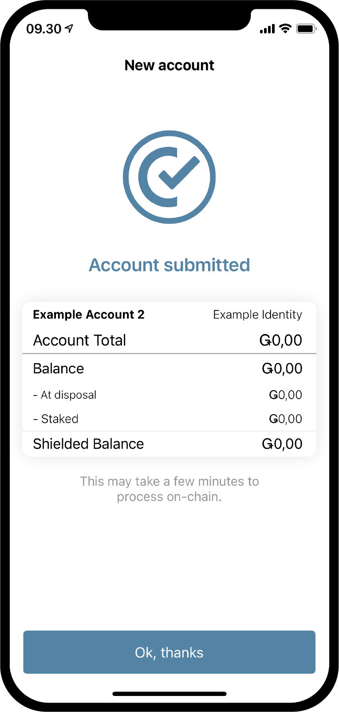
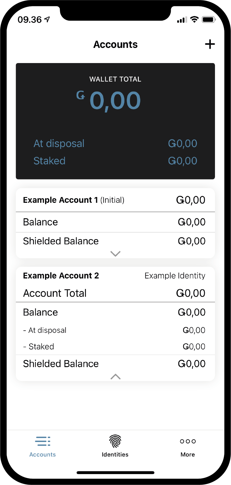
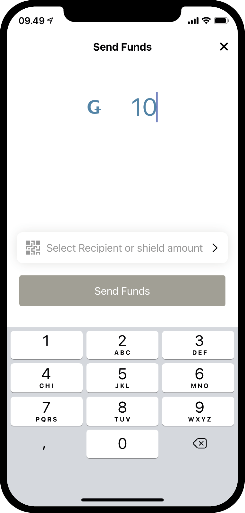
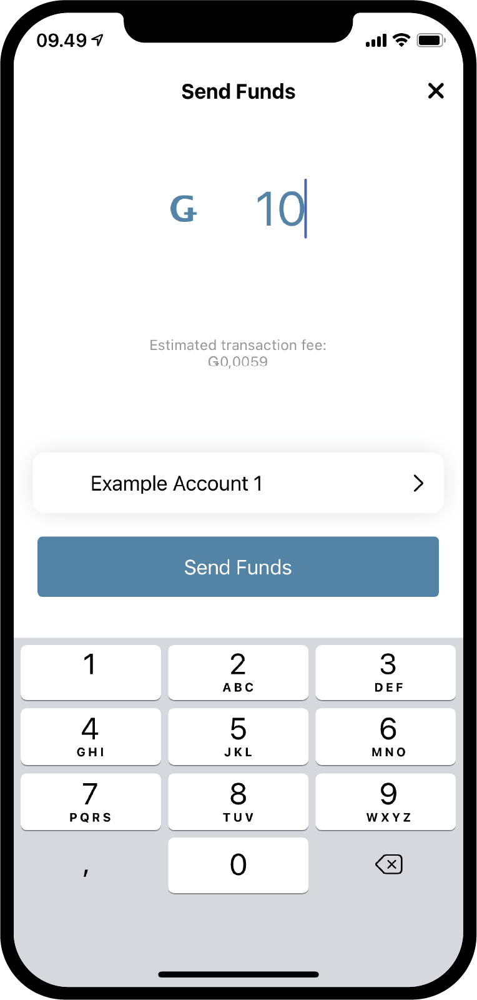
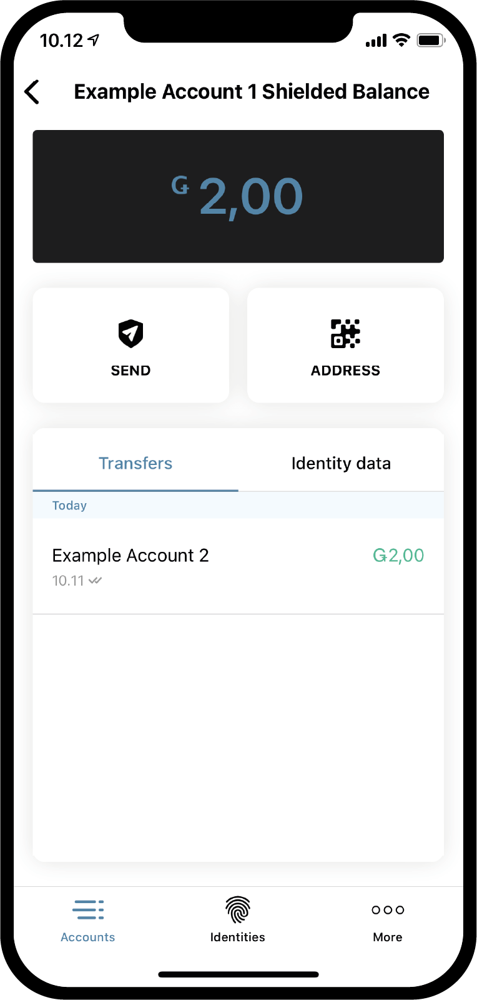
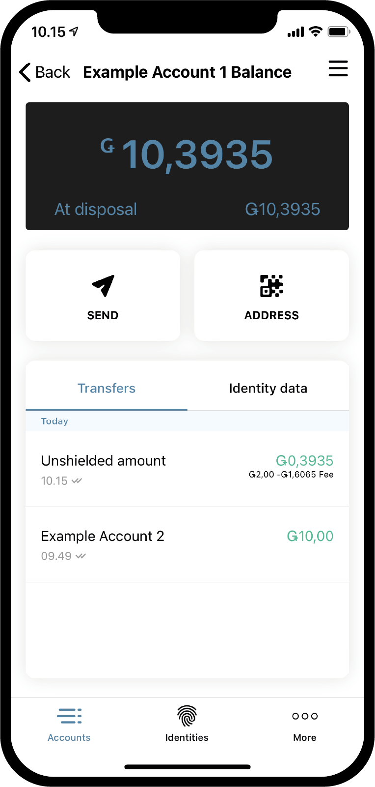
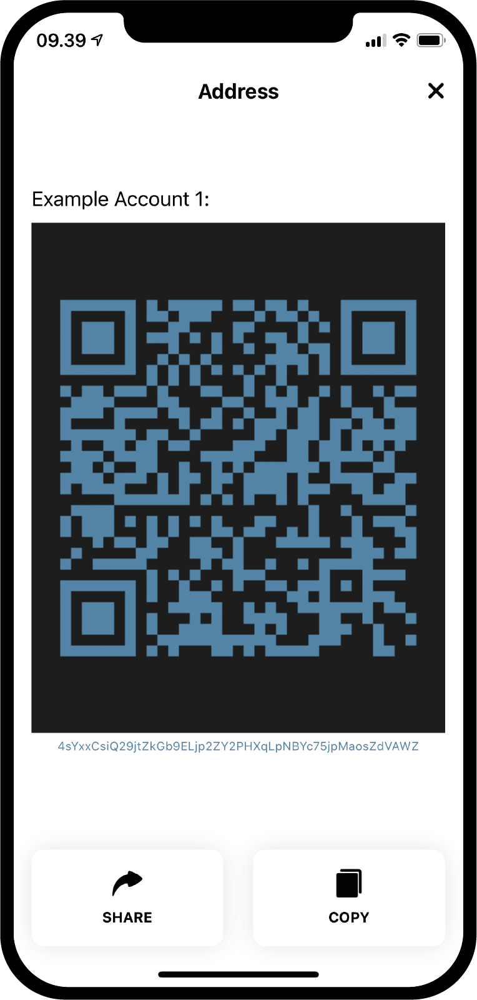

.. _Discord: https://discord.gg/xWmQ5tp

================================================================
Concordium ID: Начало работы с учетными записями и транзакциями
================================================================

.. contents::
   :local:
   :backlinks: none

Вы можете идти дальше по данному руководству, если уже выполнили запрос на создание  вашей первичной учетной записи и идентификационных данных, как описано в разделе
:ref:`the previous chapter<testnet-get-started>`.

Создание новой учетной записи
==============================
Прежде чем перейти к информации о том, как работают учетные записи, баланс на них и транзакции, давайте создадим вторую учетную запись. Начнем с перехода на страницу
*Accounts* page. В правом верхнем углу вы должны увидеть **знак плюс**. Нажмите эту кнопку, чтобы продолжить. На следующем экране вам будет предложено дать название своей новой учетной записи. В этом примере мы выберем имя
*Example Account 2*, но вы можете выбрать любое имя, которое хотите.

.. image:: images/concordium-id/acc1.png
      :width: 32%
      :align: center
.. image:: images/concordium-id/acc2.png
      :width: 32%
      :align: center

При нажатии кнопки **Next**, вам откроется экран, на котором вы должны решить, какие идентификационные данные использовать для открытия новой учетной записи. К данному моменту, вероятно, у вас есть только одни данные, но если у вас их уже несколько, вы можете выбрать любые из списка. Нажав на идентификационные данные, вы перейдете на следующий экран. При создании не первичной учетной записи, то есть учетной записи, которая создается не при создании идентификационных данных, вы можете выбрать, какое количество
:ref:`glossary-attribute` раскрыть. Это не обязательно, и если у вас нет конкретной причины, мы рекомендуем не раскрывать их, так как раскрытые атрибуты пройдут по цепочке и далее не могут быть удалены.

.. image:: images/concordium-id/acc3.png
      :width: 32%
      :align: center
.. image:: images/concordium-id/acc4.png
      :width: 32%
      :align: center

Если вы нажмете кнопку **Reveal account attributes button**, то попадете на следующую страницу. Вы можете отметить галочкой атрибуты, которые хотите раскрыть, а затем нажать кнопку
**Submit account**. Нажав кнопку **Submit account** на этой или предыдущей странице, вы перейдете на последнюю страницу создания учетной записи, на которой будет представлена краткая информация и сообщено, что заявка на создание учетной записи была создана.

.. image:: images/concordium-id/acc5.png
      :width: 32%
      :align: center

Нажав кнопку **Ok, thanks** в кратком обзоре, вы вернетесь на страницу учетной записи. Вы можете видеть, что ваша новая учетная запись все еще находится в обработке, так как, чтобы завершить работу в цепочке, может потребоваться несколько минут. Если вы еще не пробовали делать так раньше, то можете нажать стрелочку на одной из карт учетной записи, чтобы увидеть вкладку карты. Это откроет информацию о двух значениях,
*at disposal* and *staked*. Поле доступно покажет вам, какая часть баланса учетной записи доступна для использования в данный момент, а также сумму доли владения, о которой вы можете прочитать подробнее на странице
:ref:`managing accounts<managing_accounts>`.

.. image:: images/concordium-id/acc7.png
      :width: 32%
      :align: center

Совершение транзакции
=======================
Затем попробуйте нажать на **Balance** вашей новой учетной записи. На этом экране вы можете увидеть текущий баланс вашей учетной записи, а также запросить 100 GTU для использования в Testnet. Запрос 100 GTU это функция Testnet, в Testnet 4,  вам фактически поступит перевод 2000 GTU в вашу учетную запись, даже если на кнопке написано 100. Поступление GTU в вашу учетную запись доступно только один раз. Нажав на кнопку, вы увидите транзакцию. Некоторое время она будет в обработке, затем 2000 GTU будут добавлены в вашу учетную запись.

.. image:: images/concordium-id/acc9.png
      :width: 32%
      :align: center
.. image:: images/concordium-id/acc10.png
      :width: 32%
      :align: center

Теперь, когда в вашей учетной записи есть GTU, давайте попробуем совершить транзакцию. Для этого нажмите кнопку **SEND**
На следующей странице вы можете ввести сумму, которую хотите перевести, и выбрать получателя. В этом примере мы переведем 10 GTU.

.. image:: images/concordium-id/acc11.png
      :width: 32%
      :align: center

Определившись с суммой, выберем получателя. Для этого нажмите кнопку **Recipient or shield amount**.
На этой странице вы можете искать получателей в своей *address book*
или добавить нового получателя, отсканировав QR-код его учетной записи. Как вы видите на скриншоте, у нас сохранен только один получатель,
*Example Account 1*. Кроме того, у нас есть возможность *Shield an amount*,
но мы вернемся к этому позже. В этом примере мы выберем в качестве получателя *Example Account 1*.

.. image:: images/concordium-id/acc13.png
      :width: 32%
      :align: center

Определившись с суммой и получателем, мы можем нажать **Send Funds** . При этом мы видим экран подтверждения, на котором мы можем проверить сумму, получателя и учетную запись для списания. Нажав
**Yes, send funds**, мы подтвердим личность с помощью пароля или биометрии, а затем транзакция будет передана в цепочку. Для завершения сделки может потребоваться некоторое время.

.. image:: images/concordium-id/acc15.png
      :width: 32%
      :align: center
.. image:: images/concordium-id/acc16.png
      :width: 32%
      :align: center

Теперь мы видим, что журнал *Example Account 2*’s *Transfers* показывает списанную сумму и *fee*. Все транзакции будут иметь комиссию, и в зависимости от типа транзакции, она может отличаться. Нажатие на транзакцию позволит вам увидеть более подробную информацию.

.. image:: images/concordium-id/acc17.png
      :width: 32%
      :align: center
.. image:: images/concordium-id/acc18.png
      :width: 32%
      :align: center

Перенос суммы на защищенный баланс
========================================
Если мы вернемся к экрану *Accounts* , то теперь увидим, что 10 GTU были переведены на *Balance Example Account 1*. Как вы, возможно, уже заметили, счета также имеют
:ref:`glossary-shielded-balance`. Вкратце, защищенный баланс предназначен для хранения защищенных (зашифрованных) сумм GTU на счете. Давайте попробуем добавить несколько защищенных GTU к нашему
*Example Account 2*. Начнем с нажатия на **Shielded Balance** карты учетной записи.

.. image:: images/concordium-id/acc19.png
      :width: 32%
      :align: center
.. image:: images/concordium-id/acc20.png
      :width: 32%
      :align: center

Затем снова нажмите кнопку **SEND** и введите количество GTU для *shield* - то есть добавления GTU на *Shielded Balance*.
После этого снова нажмем **Select Recipient or shield amount** .
Вместо того чтобы выбирать получателя, на этот раз мы нажмем **Shield amount**.

.. image:: images/concordium-id/acc21.png
      :width: 32%
      :align: center
.. image:: images/concordium-id/acc22.png
      :width: 32%
      :align: center

Теперь мы можем продолжить и подтвердить транзакцию, как и ранее, при обычном переводе. Для обработки в цепочке транзакции может понадобиться некоторое время.

.. image:: images/concordium-id/acc23.png
      :width: 32%
      :align: center
.. image:: images/concordium-id/acc24.png
      :width: 32%
      :align: center

Вернувшись на страницу *Accounts*, вы можете увидеть, что на *Shielded Balance Example Account 2* имеется 10 GTU.
Если нажать на *Shielded Balance* карты учетной записи, то мы увидим, что в логах защищенного баланса имеется транзакция *Shielded amount*.
Совершение защищенной транзакции также будет иметь комиссию, но эта комиссия будет вычтена из текущего баланса учетной записи. Попробуйте вернуться назад и взглянуть на журнал списаний текущего *Balance*.

.. image:: images/concordium-id/acc25.png
      :width: 32%
      :align: center
.. image:: images/concordium-id/acc26.png
      :width: 32%
      :align: center

Проведение защищенного перевода
=================================
Имея в наличии некоторую сумму защищенных GTU, мы можем попробовать выполнить *Shielded transfer*,
то есть совершить перевод некоторого количества зашифрованных GTU. Первый шаг - это переход на страницу
*shielded balance* учетной записи, содержащей защищенные GTU, если вы еще не находитесь на ней. Затем нажмите кнопку **SEND**.
Теперь вы сможете ввести сумму и выбрать получателя. В этом примере мы выбрали передачу 2 GTU. При нажатии кнопки **Select Recipient or unshield amount**,
вы сможете выбрать получателя. В этом примере мы выберем
*Example Account 2*.

.. image:: images/concordium-id/acc27.png
      :width: 32%
      :align: center
.. image:: images/concordium-id/acc28.png
      :width: 32%
      :align: center

Сумма и получатель выбраны, можно продолжить. Как и при других транзакциях, далее вы увидите экран подтверждения, где вы сможете подтвердить личность с помощью пароля или биометрии, а затем отправить защищенную транзакцию в цепочку. Опять же, транзакции для завершения может потребоваться некоторое время.

.. image:: images/concordium-id/acc29.png
      :width: 32%
      :align: center
.. image:: images/concordium-id/acc30.png
      :width: 32%
      :align: center

Теперь, если вы вернетесь к экрану *Accounts*, вы должны увидеть, что рядом с суммой в
*Shielded Balance* принимающего счета появился небольшой щит. Это указывает на то, что на защищенный баланс поступила недавно совершенная защищенная транзакция. Попробуйте нажать на Shielded balance и обратите внимание, что вам нужно ввести пароль или использовать свои биометрические данные для входа. Это необходимо потому, что вам нужно расшифровать полученные защищенные транзакции, прежде чем вы сможете увидеть сумму.

.. image:: images/concordium-id/acc31.png
      :width: 32%
      :align: center

Снятие защиты с суммы
=======================
После расшифровки сумма будет видна в *shielded balance* и в карточке учетной записи на экране *Accounts*.
А что если мы хотим перевести GTU с защищенного баланса на текущий? Давайте попробуем перевести 2 GTU на текущий баланс с помощью действия
*Unshielding* с суммы. Для этого нажмите кнопку **SEND** в shielded balance.
Введите 2 в качестве суммы, а затем нажмите **Select Recipientor unshield amount**.
**Выберите Unshield amount**.

.. image:: images/concordium-id/acc33.png
      :width: 32%
      :align: center
.. image:: images/concordium-id/acc34.png
      :width: 32%
      :align: center

Теперь завершите транзакцию, как раньше, и перейдите к текущему балансу счета, чтобы увидеть снятие защиты. Если транзакция в цепочке завершилась, то вы должны видеть, что
*Unshielded amount* перешла на текущий баланс. Обратите внимание, что сумма не равна 2 GTU, хотя вы списали именно 2. Это связано с тем, что комиссия за совершение любой транзакции, включая снятие защиты, будет вычтена из текущего баланса счета, ответственного за эту транзакцию.

.. image:: images/concordium-id/acc35.png
      :width: 32%
      :align: center

Передача адреса учетной записи
================================
Если вы хотите поделиться адресом учетной записи, это можно легко сделать, нажав кнопку **Address** .
Вас переведет на страницу, где у вас есть несколько способов поделиться адресом учетной записи. Попробуйте нажать кнопку
**Share** и поделиться с кем-нибудь своим адресом.

.. image:: images/concordium-id/acc37.png
      :width: 32%
      :align: center

Проверка графика вывода
==========================
В блокчейне Concordium можно совершить транзакцию, которая будет переводит запрошенную сумму поэтапно. Это называется
*transfer with a schedule*.
Пока не будем вдаваться в то, как выполнить такой перевод, поскольку это невозможно сделать с помощью Concordium ID, но давайте проверим, как можно проверить график вывода. Если вы получаете перевод с графиком вывода, вы можете нажать на значок
**burger menu** в правом верхнем углу экрана. Что позволит вам нажать **Release schedule**.
Сделав это, вы попадете на экран, содержащий информацию о том, сколько GTU будет выведено и когда именно. Если вы хотите узнать больше о том, как провести перевод с графиком вывода, вы можете заглянуть на страницы
:ref:`concordium_client` и :ref:`transactions`.

.. image:: images/concordium-id/rel1.png
      :width: 32%
.. image:: images/concordium-id/rel2.png
      :width: 32%
.. image:: images/concordium-id/rel3.png
      :width: 32%

Поддержка и обратная связь
===========================

Если у вас возникнут какие-либо проблемы или у вас есть предложения, оставьте свой вопрос или отзыв на `Discord`_,
или свяжитесь с нами по адресу testnet@concordium.com.
