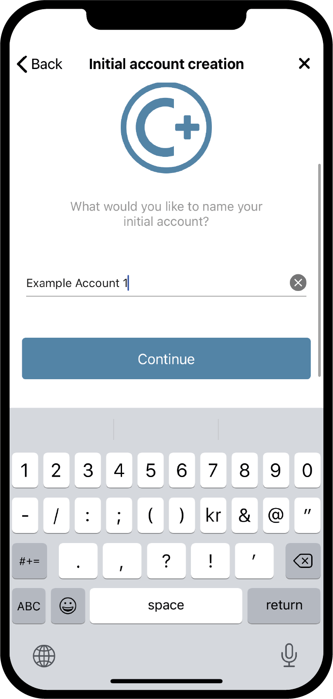

.. _Discord: https://discord.gg/xWmQ5tp

.. _testnet-get-started:

===========================================
Concordium ID: Начало работы с приложением
===========================================

.. contents::
   :local:
   :backlinks: none

Прежде чем следовать данному руководству, вы должны завершить установку Concordium ID, как описано в :ref:`предыдущей главе<testnet-get-the-app>`.

Установка пароля и биометрии
================================

Когда вы первый раз откроете приложение Concordium ID, вам будет представлен гайд,
который поможет настроить пароль и биометрическую аутентификацию, создать :ref:`glossary-initial-account`,
а также получить :ref:`glossary-identity`. Первичная учетная запись - это особый тип учетной записи, который передается в цепочку
:ref:`glossary-identity-provider`, при создании идентификатора. С первичной учетной записи вы можете совершать те же транзакции, что и с обычной учетной записью, но владелец первичной учетной записи будет известен провайдеру идентификационных данных. После того, как ваши идентификационные данные будут созданы, вы сможете самостоятельно отправлять учетные записи в цепочку, а провайдер идентификационных данных не будет об этом знать. Вы можете узнать об учетных записях больше на странице :ref:`Identities
and accounts<reference-id-accounts>`.

Вот первый экран, который вы увидите при открытии Concordium ID Он расскажет вам о том, что необходимо для старта.

Если вы готовы продолжить, вы можете нажать **Yes, let’s go!** На следующем экране вас попросят ввести шестизначный код доступа.
Если вы хотите пользоваться полным паролем, включая буквы, вы можете настроить это здесь.

.. image:: images/concordium-id/int1.png
      :width: 35%
      :align: center
.. image:: images/concordium-id/int2.png
      :width: 35%
      :align: center

.. todo::

   Write a directive to make two or more images side-by-side centered

Выбрав код доступа или Use full password instead, вы получите возможность использовать биометрические данные, если ваш телефон поддерживает данную функцию, например, распознавание лица или отпечатка пальца. Мы рекомендуем использовать биометрические данные, если такая возможность имеется.

.. image:: images/concordium-id/int3.png
      :width: 32%
      :align: center

Запрос первичной учетной записи и идентификационных данных
===========================================================

Далее у вас будет выбор между созданием новой первичной учетной записи и идентификатора или импортом уже существующих. Исходя из того, что вы впервые используете Concordium ID, вы можете выбрать
**I want to create my initial account** , чтобы продолжить.

.. image:: images/concordium-id/int4.png
      :width: 32%
      :align: center

На следующем экране вы увидите описание назначения первичной учетной записи и три шага, которые вам нужно выполнить, чтобы создать ее, а также ваши идентификационные данные. Коротко говоря, первичная учетная запись - это учетная запись, отправленная в цепочку выбранным вами провайдером идентификационных данных, что в свою очередь означает, что они будут знать, что вы являетесь владельцем учетной записи. Позже вы сможете самостоятельно добавлять учетные записи в цепочку, что будет означать, что владелец этих учетных записей будет известен только вам.

.. image:: images/concordium-id/int5.png
      :width: 32%
      :align: center

Три упомянутых выше шага:

1. Название вашей первичной учетной записи
2. Название ваших идентификационных данных
3. Запрос первичной учетной записи и идентификационных данных у выбранного вами :ref:`glossary-identity-provider`

Вы встретитесь с первым шагом на следующей странице, где вам будет предложено ввести имя для вашей первичной учетной записи. Нажав Continue, вы перейдете на следующую страницу, на которой вам нужно будет назвать свои идентификационные данные. Оба этих имени будут известны только вам, поэтому вы можете называть их практически как угодно (есть несколько ограничений на то, какие буквы и знаки вы можете использовать).

В приведенном ниже примере мы, к примеру, назовем нашу первичную учетную запись *Example Account 1* а наши идентификационные данные
*Example Identity*. Как уже упоминалось, вы можете выбрать любые имена, которые захотите.

.. image:: images/concordium-id/int7.png
      :width: 32%
      :align: center

Нажав **Continue to identity providers**, вы попадете на страницу, на которой вам нужно будет выбрать провайдера *identity*.
Провайдер идентификационных данных - это сторонняя организация, которая осуществляет вашу верификацию, перед тем, как вернуть объект идентификационных данных, который будет использоваться в цепочке.
На данный момент вы можете выбирать между:

* *Notabene Development* которая предоставит вам тестовую идентификацию без реальной проверки личности.
* *Notabene* с помощью которой будет подтверждена ваша настоящая личность.

.. image:: images/concordium-id/int8.png
      :width: 32%
      :align: center

Выбрав Notebene Development, вы получите тестовые идентификационные данные без лишних телодвижений. Если вы выберете Notabene, вы перейдете во внешний сервис выдачи идентификационных данных, который проведет процесс верификации. После завершения процесса вы вернетесь в Concordium ID.

После завершения любого из процессов идентификационной верификации, вы увидите следующий экран. Он покажет ваши идентификационные данные и информацию о первичной учетной записи.

.. image:: images/concordium-id/int9.png
      :width: 32%
      :align: center

В зависимости от выбранного вами провайдера идентификационных данных, внешний вид идентификационной карты может незначительно отличаться. Вы можете видеть, что Example Account 1 принадлежит идентификационным данным Example Identity. Учетная запись, созданная во время этого процесса, будет помечена в приложении значком
*(Initial)* чтобы вы знали, какая учетная запись является первичной учетной записью, отправленной в цепочку провайдером идентификационных данных.

Нажав **Finish** вы попадете на *Экран информации об Accounts*.
На этом экране вы сможете увидеть свою только что созданную первичную учетную запись. Тут может отображаться значок
*Обработка*, что означает, что провайдер идентификационных данных все еще работает над подтверждением и созданием вашей первичной учетной записи и идентификационных данных. Вы также можете перейти к
*экрану Identities* щелкнув **Identities**  в нижней части экрана. На этом экране вы можете увидеть свои недавно созданные идентификационные данные, которые также могут быть в обработке, если провайдер идентификационных данных еще не завершил ее. Все,
что вам нужно сделать сейчас, это дождаться завершения процесса.

.. image:: images/concordium-id/int10.png
      :width: 32%
      :align: center
.. image:: images/concordium-id/int11.png
      :width: 32%
      :align: center

Поддержка и обратная связь
===========================

Если у вас возникнут какие-либо проблемы или у вас есть предложения, оставьте свой вопрос или отзыв на `Discord`_,
или свяжитесь с нами по адресу testnet@concordium.com.
