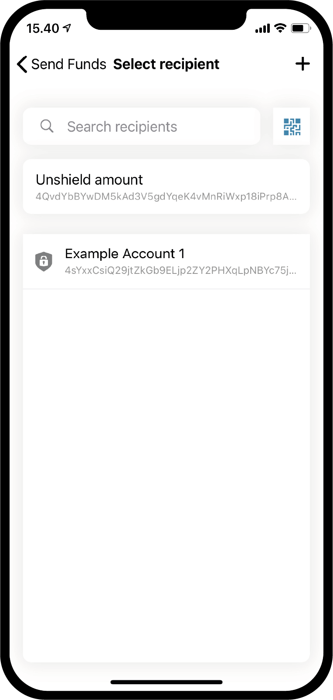

.. _Discord: https://discord.gg/xWmQ5tp

.. _guide-account-transactions:

===========================================
Concordium ID:Hesaplar ve İşlemler Hakkında
===========================================

.. contents::
   :local:
   :backlinks: none

Rehberin bu bölümüne devam etmeden önce hesap ve kimlik talep etme adımlarını tamamlamış olmanız gerekmektedir. Eğer henüz tamamlamadıysanız  :ref:`ilgili bölüme giderek<testnet-get-started>` önce bu adımları tamamlayınız.

Yeni hesap yaratmak
===================
Hesapların, hesap bakiyelerinin ve işlemlerin nasıl çalıştığına geçmeden önce ikinci bir hesap oluşturalım. *Accounts* (*Hesaplar*) sayfasına gidin. Sağ üst köşede bir **artı işareti (+)** göreceksiniz. Devam etmek için bu **artı işarati (+)**'ne basın. Bir sonraki ekranda yeni hesabınızı adlandırmanız istenecektir. Bu örnekte *Example Account 2* adını seçtiğimizi göreceksiniz ancak siz istediğiniz adı seçebilirsiniz.

.. image:: images/concordium-id/acc1.png
      :width: 32%
.. image:: images/concordium-id/acc2.png
      :width: 32%

**Next** (İleri) 'ye bastığınızda, yeni hesabı açmak için hangi kimliği kullanacağınızı seçmeniz gereken bir ekranla karşılaşacaksınız. Bu adıma kadar muhtemelen sadece bir tane oluşturdunuz, ancak daha fazlasına sahipseniz listeden istediğiniz kimliği seçebilirsiniz. Bir kimliğe tıkladığınızda bir sonraki ekrana yönlendirileceksiniz. Başka bir hesap oluştururken, yani kimlik oluşturulma adiminda oluşturduğunuz bir hesaptan
farklı bir hesap oluştururken, bir :ref:`glossary-attribute` göstermeyi seçebilirsiniz. Bu zorunlu bir adım değildir ve özel bir nedeniniz yoksa,
bunu yapmamanızı öneririz. çünkü yaratmış olduğunuz hesaplar zincirden silinemeyecektir.

.. image:: images/concordium-id/acc3.png
      :width: 32%
.. image:: images/concordium-id/acc4.png
      :width: 32%

**Reveal account attributes düğmesine** (*Hesap özniteliklerini göster*)  basarsanız, sonraki sayfaya yönlendirileceksiniz. Açıklamak istediğiniz öznitelikleri işaretleyebilir
ve ardından **Submit account** (*Hesabı gönder*) seçeneğine basabilirsiniz. Bu veya önceki sayfada **Submit account** (*Hesabı gönder*) seçeneğine basmanız sizi son hesap oluşturma sayfasına götürür, ve size bir kontrol ekrani sunar ve hesabın gönderildiğini söyler.

.. image:: images/concordium-id/acc5.png
      :width: 32%
.. image:: images/concordium-id/acc6.png
      :width: 32%

**Ok, thanks** (*Tamam, teşekkürler*) düğmesine basarak hesap sayfasına geri dönersiniz. Zincir üzerinde tamamlanması birkaç dakika sürebileceğinden,
yeni hesabınızın hala beklemede olduğunu görebilirsiniz. Hesap kartlarından birinin üzerindeki aşağı bakan oka basarak kartı açıp açmayacağını
görebilirsiniz. Bu, *Staked* (Hisseli) ve *at disposal* (emir dışı) olmak üzere iki yeni bilgi parçasını ortaya çıkarır. Emir dışı alanı, size
belirli bir anda hesap bakiyesinin ne kadarının kullanılabileceğini ve hisse edilen miktarı göstermektedir. Bu konuda daha fazla bilgi edinmek
icin :ref:`managing accounts<managing_accounts>` sayfasını ziyaret edebilirsiniz.

.. image:: images/concordium-id/acc7.png
      :width: 32%
.. image:: images/concordium-id/acc8.png
      :width: 32%

İşlem yapma
===========
Şimdi, yeni oluşturulan hesabınızın **Balance** (*Bakiye*) alanına basmayı deneyin. Bu ekranda hesabınızın cari bakiyesini görebilirsiniz ve
ayrıca Testnet'te kullanmak için 100 GTU talep etmenize de izin verecektir. 100 GTU talebi bir Testnet özelliğidir ve Testnet 4 için, 100 GTU yazsa
bile, 2000 GTU hesaba aktarılacaktır. GTU talebi bir hesapta yalnızca bir kez kullanılabilir. Talep ettikten sonra, bir işlem yapıldığını fark
edeceksiniz ve bir süre sonra 2000 GTU hesabınıza eklenecektir.

.. image:: images/concordium-id/acc9.png
      :width: 32%
.. image:: images/concordium-id/acc10.png
      :width: 32%

Artık hesabımızda GTU olduğuna göre, bir işlem yapmayı deneyelim. Bunu yapmak için **SEND** (*GÖNDER*) düğmesine basın. Sonraki sayfada transfer
etmek istediğiniz miktarı girebilir ve bir alıcı seçebilirsiniz. Bu örnekte 10 GTU transfer edeceğiz.

.. image:: images/concordium-id/acc11.png
      :width: 32%
.. image:: images/concordium-id/acc12.png
      :width: 32%

Bir miktara karar verdikten sonra, şimdi alıcıyı seçeceğiz. Bunu yapmak için Seç **Recipient or shield amount** (*Alıcı veya koruma altina alma*)
düğmesine basın. Bu sayfada, *adres defterinizdeki* alıcıları arayabilir veya alıcı hesabın QR kodunu tarayarak alıcınızı ekleyebilirsiniz.
Ekran görüntüsünde görebileceğiniz gibi, kaydedilmiş yalnızca bir alıcımız var, *Example Account 1* (*Örnek Hesap 1*). Bunun da ötesinde, *Bir miktarı koruma*
seçeneğimiz var, ancak bu konuyu daha sonra açıklayacağız. Bu örnekte alıcımız olarak *Example Account 1* 'i (*Örnek Hesap 1*) seçeceğiz.

.. image:: images/concordium-id/acc13.png
      :width: 32%
.. image:: images/concordium-id/acc14.png
      :width: 32%

Tutar ve alıcı seçildikten sonra devam etmek için **Send Funds** (*Para Gönder*) düğmesine basabilirsiniz. Bunu yaparak, bir onay ekranı ile karşılaşacaksınız.
Miktarı, alıcıyı ve gönderen hesabı doğrulayabiliriz. **Yes, send funds** (*Evet, parayı gönder*) seçeneğine basarak, bir şifre veya biyometrik
kullanarak kendimizi doğrulayacağız ve ardından işlem zincire gönderilecek. İşlemin sonuçlanması zincirin yoğunluğuna bağlı olarak biraz zaman alabilir.

.. image:: images/concordium-id/acc15.png
      :width: 32%
.. image:: images/concordium-id/acc16.png
      :width: 32%

Şimdi *Example Account 2* (*Örnek Hesap 2*) ’in *Transferler* günlüğünde, gönderilen tutarın ve bir *gönderim ücretinin* bakiyenizden düşüldüğünü görebiliriz. Tüm işlemler bir
ücrete tabi olacaktır ve işlemin türüne bağlı olarak ücretler farklılık gösterebilir. İşleme basarak daha fazla ayrıntı görülebilir.

.. image:: images/concordium-id/acc17.png
      :width: 32%
.. image:: images/concordium-id/acc18.png
      :width: 32%

.. _move-an-amount-to-the-shielded-balance:

Bakiyeyi koruma altındaki bakiyeye taşıma
=========================================
*Accounts* (*Hesaplar*) ekranına geri dönersek, şimdi 10 GTU'nun *Example Account 1* *Bakiyesine* aktarıldığını görebiliriz. Daha önce fark etmiş
olabileceğiniz gibi, hesaplarda ayrıca bir :ref:`glossary-shielded-balance` vardır. Kısacası, korumalı bakiye, hesapta korumalı (şifreli) GTU miktarlarını
tutmak içindir. Şimdi *Example Account 2*'ye korumalı GTU eklemeyi deneyelim. Hesap kartının **Shielded Balance** (Korumalı Bakiye) alanına basarak
başlayın.

.. image:: images/concordium-id/acc19.png
      :width: 32%
.. image:: images/concordium-id/acc20.png
      :width: 32%

Ardından, **SEND** (GÖNDER) düğmesine tekrar basın ve *Shielded Balance* (*Korumalı Bakiye*)'a biraz GTU eklemek için GTU miktarı girin.
Bunu yaptıktan sonra tekrar **Select Recipient or shield amount** (Alıcı veya koruma altina alma) seçeneğine basalım.
Bir alıcı seçmek yerine bu sefer **Shield amount** (Koruma miktarı) seçeneğine basacağız.

.. image:: images/concordium-id/acc21.png
      :width: 32%
.. image:: images/concordium-id/acc22.png
      :width: 32%

Daha önce normal havale ile yaptığımız gibi artık işleme devam edebilir ve onaylayabiliriz. İşlemin zincirde tamamlanması zincirin yoğunluğuna bağlı olarak biraz zaman alabilir.

.. image:: images/concordium-id/acc23.png
      :width: 32%
.. image:: images/concordium-id/acc24.png
      :width: 32%

"Accounts" (Hesaplar) sayfasına geri döndüğümüzde, artık *Example Account 2* (*Örnek Hesap 2*)'nin *Shielded Balance* 'ında (*Korumalı Bakiye*) 10 GTU olduğu görülebilir. Hesap kartının *Shielded Balance* (*Korumalı Bakiye*) alanına bakılırsa, koroumalı aktarım günlüğünde bir *Shielded amount* (*Korumalı bakiye*) işlemi olduğunu görebiliriz. Korunan bir işlem yapmakta bir ücrete tabi olacaktır ve bu ücret hesabın normal (korumalı olnayan) bakiyesinden düşülecektir. Şimdi hesabın *Balance* (*bakiye*) transfer günlüğüne bir göz atın.

.. image:: images/concordium-id/acc25.png
      :width: 32%
.. image:: images/concordium-id/acc26.png
      :width: 32%

Korumalı (Shielded) Bir Transfer Yapma
======================================
Korumalı GTU'lara sahip olduktan sonra artık *Shielded transfer* (*Korumalı aktarım*) yapmayı deneyebiliriz. Bu da şifrelenmiş GTU ile aktarım
yapabileceğimiz anlamına gelir. Bunun için ilk adım, henüz o sayfa da değilseniz korumalı GTU içeren hesabın *shielded balance*(*korumalı bakiye*) sayfasına göz atmak olacaktır. Ardından **SEND** (*GÖNDER*) düğmesine basın. Artık bir miktar girebilecek
ve bir alıcı seçebileceksiniz. Aşağıda göreceğiniz örnekte biz 2 GTU transfer etmeyi seçtik. **Select Recipient or shield amount** (*Alıcı veya koruma altina alma*)
düğmesine bastığınızda, bir alıcı seçebileceksiniz. Bu örnekte  *Example Account 2* (*Örnek Hesap 2*) 'yi seçeceğiz.

.. image:: images/concordium-id/acc27.png
      :width: 32%

Alıcı ve transfer edilecek tutarı seçildikten sonra devam edebilirsiniz. Diğer işlemlerde olduğu gibi bu işlemde de bir onay ekranı göreceksiniz ve devam ettiğinizde kendinizi şifre veya biyometri ile doğrulamanız gerekir. Doğrulama işlemini yaptıktan sonra korumalı transfer işlemini (Shielded amount transfer) zincire gönderebilirsiniz. Diğer işlemlerde olduğu gibi, işlemin tamamlanması zincirin yoğunluğuna bağlı olarak biraz zaman alabilir.

.. image:: images/concordium-id/acc29.png
      :width: 32%
.. image:: images/concordium-id/acc30.png
      :width: 32%

Şimdi *Account" (*Hesaplar*) ekranına geri dönerseniz, alıcı hesaba ait olan tutarın yanında küçük bir kalkan işaretinin belirdiğini göreceksiniz. Bu alıcı hesabın *Shielded Balance" (*korumalı bakiye*) kısmında yeni bir işlem korumalı bakiye işlemi yapıldığını göstermektedir. Şimdi *shielded balance* (korumalı bakiye) kısmına tıklamayı deneyin. Bunu yaptığınızda sizden şifre girmenizi veya biyometri kullanmanız isteneceğine dikkat edin. Bunun nedeni, tutarı görebilmeniz için alınmış işlem bilgisindeki işlem şifresinin çözülmesinin gerekmesidir. Şifre çözüldükten sonra tutarı görebilirsiniz.

.. image:: images/concordium-id/acc31.png
      :width: 32%
.. image:: images/concordium-id/acc32.png
      :width: 32%

Bir tutarın korumasının kaldırılması
====================================
Şifre çözme işlemi yapıldıktan sonra, ilgili tutar artık Account'a ait *shielded balance* kısmında görünür hale gelecektir. Eğer şifre korumalı tutarları standart tutarlara çevirmek istersek ne yapmalıyız? Bu kez 2 GTU'yu korumalı bakiyeden *Standart* bakiyeye transfer etmek için koruma kaldırma işlemini yapalım. Bunu yapmak için korumalı bakiye alanına tıkladıktan sonra **SEND** tuşuna tuşuna bssın. Tutar bölümüne **2** yazın ve daha sonra **Select Recipient or unshield amount** kısmına basın. **Unshield Amount** u seçin.

.. image:: images/concordium-id/acc33.png
      :width: 32%
.. image:: images/concordium-id/acc34.png
      :width: 32%

Şimdi transfer işlemini aynı daha önceki seferde yaptığınız gibi tamamlayın ve standart bakiye durumunu görmek için hesabın normal bakiyesini kontrol edin. Eğer yapmaya çalıştığınız işlem zincirde tamamlandıysa artık hesabın normal bakiyesinde *Unshielded amount* 'un işaretlenmiş olduğunu göreceksiniz. Korumayı kaldırdığınız miktar 2 GTU olsa bile gördüğünüz değişimin 2 GTU'dan az olduğuna dikkat etmelisiniz. Bunun nedeni bakiye şifreleme dahil zincir üzerinde yapılan her işlemin bir ücretinin olması ve işlem ücretlerinin standart bakiyeden tahsil ediliyor olmasıdır.

.. image:: images/concordium-id/acc35.png
      :width: 32%
.. image:: images/concordium-id/acc36.png
      :width: 32%

Hesap adresinizi paylaşmak
==========================
Hesabınızın adresini paylaşmak istediğinizde, bunu **Address** düğmesine basarak kolayca yapabilirsiniz. Bu düğmeye bastığınızda birden fazla seçeneğin olduğu bir hesap paylaşım ekranı yüklenecektir. şimdi **Share** tuşuna basın ve adresinizi biriyle paylaşın.

.. image:: images/concordium-id/acc37.png
      :width: 32%
.. image:: images/concordium-id/acc38.png
      :width: 32%

Zamanlanmış transfer işlemleri
==============================
Concordium zincirinde transfer edilecek tutarları belirli bir zaman için programlamak mümkündür. Bu *transfer with a schedule* (*programlanmış transfer işlemi*) olarak isimlendirilir. Concordium ID uygulaması üzerinden bu işlem yapılamadığı için bu tip bir transferin nasıl yapılacağına rehberin bu kısmında değinmeyeceğiz. Ancak zamanlanmış bir tutar transferi planının nasıl incelenebileceğine bakalım. Eğer zamanlanmış transfer ile planlanarak gönderilmiş bir tutar hesabınıza ulaşırsa bakiye ekranının sağ üst köşesinde belirecek **burger menu** 'ye tıklayarak görüntüleyebilirsiniz. Bu sizin **Release schedule** (yayın planı) tuşuna basabilmenizi ve hangi zamanda ne kadar GTU'nun transfer edileceğini gösteren ekrana ulaşmanızı sağlayacaktır. Eğer bu işlemin nasıl yapılacağı konusunda daha fazla bilgi edinmek istiyorsanız lütfen :ref:`concordium_client` and :ref:`transactions` sayfalarına göz atın.

.. image:: images/concordium-id/rel1.png
      :width: 32%
.. image:: images/concordium-id/rel2.png
      :width: 32%
.. image:: images/concordium-id/rel3.png
      :width: 32%

Destek ve Geri Bildirim
=======================

Herhangi bir sorunla karşılaşırsanız veya bir öneriniz varsa, sorunuzu veya geri bildirimlerinizi `Discord`_ üzerinden gönderin veya testnet@concordium.com adresine e-posta yazarak bize ulaşın.
