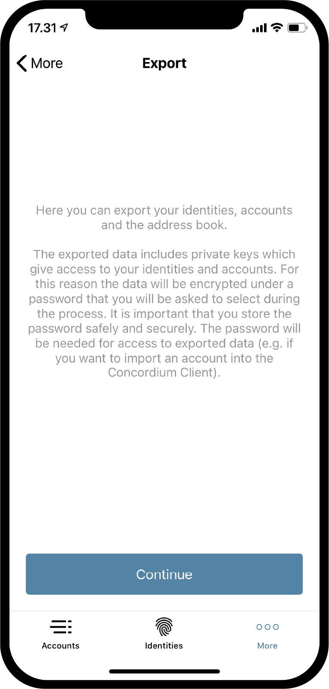
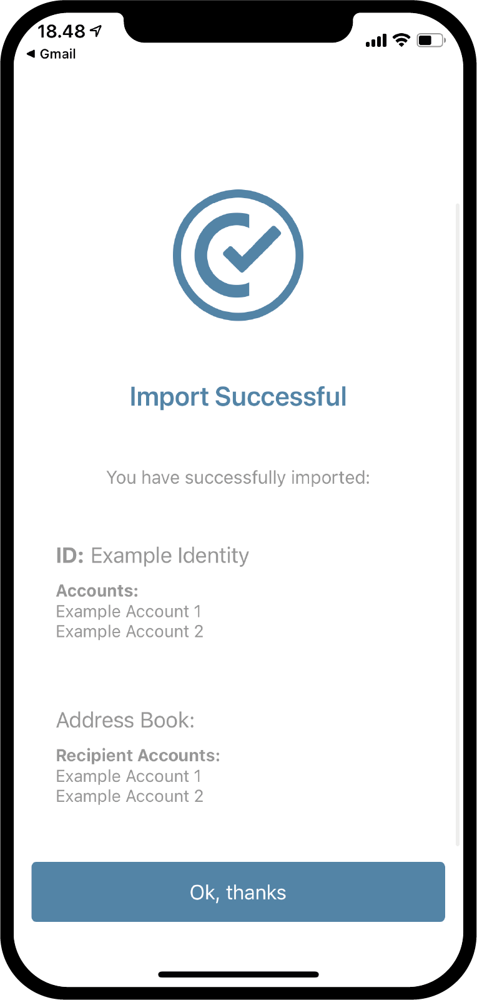

.. _Discord: https://discord.gg/xWmQ5tp

.. _testnet-explore-more:

========================================
Concordium ID: Diğer işlemleri incelemek
========================================

.. contents::
   :local:
   :backlinks: none

Export (Dışar Aktarım)
======================
Concordium ID uygulamasını kullanarak hesaplarınızı (accounts) ve kimliklerinizi (identities) dışarıya aktarmanız mümkündür. Bu işlemi denemek için *Mora page* menüsüne tıklayın. Uygulamanın Android veya IOS sürümünü kullanmanıza bağlı olarak *More page* sayfası aşağıdaki ekran örneğinden biraz farklı görünebilir. Android'de *Address Book*, *Export* ve *Import* olmak üzere 3 menü görüntülenir. IOS'te ise yalnızca *Address Book* ve *Export* seçenekleri bulunmaktadır. Bunun nedeni içe aktarma (import) işleminin platforma bağlı olarak iki farklı şekilde çalışmasıdır, buna daha sonra değineceğiz.

.. image:: images/concordium-id/exp1.png
      :width: 32%
.. image:: images/concordium-id/exp2.png
      :width: 32%

Dışarı aktarım işlemini başlatmak için **Export** seçeneğine tıklayın. Bu seçeneğe tıkladığınızda yeni bir sayfa açılacaktır, bu sayfada dışa aktarımın (export) ne olduğunu açıklayan bir bilgi notu görüntülenecektir. Bunu dikkatlice okumanızı öneririz. Bilgi notunu dikkatlice okuduktan sonra **Continue** tuşuna basın. Şimdi, sizden dışarı aktarılacak dosyaya atanacak bir şifreyi belirlemeniz ve sonrasında aynı şifreyi yeniden girerek doğrulamanız istenecektir. Aynı şifreyi iki kez girdikten sonra son adıma geçilir. Son adımda IOS veya Android işletim sisteminiz size dışarı aktarılacak dosyanın telefon işletim sistemi tarafından nereye kayıt edilmesini veya transfer edilmesini seçmenizi isteyecektir. Kayıt etmek istediğiniz veya kullanmayı tercih edeceğiniz transfer seçeneğini belirleyerek işlemi sonlandırarak dışa aktarımı tamamlayabilirsiniz.

.. image:: images/concordium-id/exp4.png
      :width: 32%

Import (İçe Aktarım)
====================
Önceki bölümde belirtildiği üzere içe aktarım özelliği IOS ve Android'de birbirinden biraz farklı çalışmaktadır. Android'de *More page* sayfasındaki *Import* (içe aktar) seçeneği size içeri aktarmak istediğiniz dosyaya göz atmanıza izin verir. Telefonunuz ve onun üzerinde çalışan işletim sistemine bağlı olarak bu sayfa farklı görünüme sahip olabilir. IOS'de ise içe aktarmak istediğiniz dosyaya Concordium ID uygulamasının dışında göz atmanız ve bu dosyaya tıklayıp *Share* (paylaş) seçeneğine tıklamalısınız. Bu size ilgili dosyayı işlemek üzere Concordium ID uygulamasını seçmeye izin vermenizi sağlayacaktır.

Dosyayı yukarıda açıklanan şekilde içe aktarmayı denediğinizde her iki platformda da dışarı aktarım yaparken belirlemiş olduğunuz şifre sorulacaktır. Bu şifreyi girip **Continue** (devam et) tuşuna bastığınızda, Concordium ID uygulaması sizden uygulama şifresi veya biyometri doğrulaması isteyecektir. Bu adımı da geçtiğinizde ise içe aktarım işlemi gerçeklecektir. İşlem gerçekleştiğinde içe aktarılmış *Accounts*,*Identities* ve *Address Book* girdilerini görebilir hale geleceksiniz.

.. image:: images/concordium-id/imp1.png
      :width: 32%

Address Book (Adres Defteri)
============================
Adından da rahatça anlaşılabileceği gibi *Address Book* (Adres Defteri) hesap adreslerinin tutulduğu bir yerdir. Eğer *Adres Defteri*'ne göz atacak olursanız sahip olduğunuz tüm hesap adreslerinin burada saklandığını göreceksiniz. Kendi adreslerinizi görmenin yanı sıra bu alana daha fazla kayıt ekleyebilirsiniz. **QR Code Sembolüne** basrak veya sağ üst köşede bulunan **artı işaretine** basarak adres defterinize yeni kayıtlar ekleyebilirsiniz. Bunu yaparak *Adres Defterinize* yeni bir alıcı adresi girebilir ve bu adrese bir takma isim verebilirsiniz. Elbette bir transfer yapmak istediğinizde *Adres defterinizdeki* kayıtları içerisinde arama yaparak göndereceğiniz adresi buradan seçebilirsiniz.

.. image:: images/concordium-id/add1.png
      :width: 32%
.. image:: images/concordium-id/add2.png
      :width: 32%

Destek ve Geri Bildirim
=======================

Herhangi bir sorunla karşılaşırsanız veya bir öneriniz varsa, sorunuzu veya geri bildirimlerinizi `Discord`_ üzerinden gönderin veya testnet@concordium.com adresine e-posta yazarak bize ulaşın.
