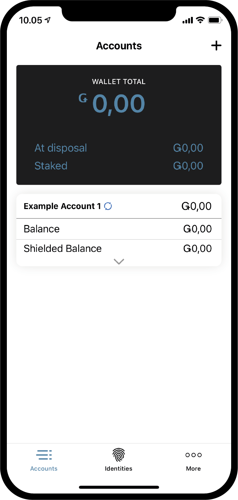

.. _Discord: https://discord.gg/xWmQ5tp

.. _testnet-get-started-tr:

===============================================
Concordium ID: Uygulama kurulumları ile başlama
===============================================

.. contents::
   :local:
   :backlinks: none

Bu kılavuzu takip etmeden önce, Concordium ID'yi :ref:`ilgili bölümde <testnet-get-the-app>` anlatıldığı şekilde tamamlamış olmalısınız. Lütfen öncelikle bu adımı tamamlayın, eğer tamamladıysanız devam edebilirsiniz.

Bir şifre ve biyometri tanımlama
================================

Concordium ID uygulamasını ilk kez açtığınızda, bir parola ve biyometrik kimlik doğrulaması ayarlanmasına yardımcı olacak bir akışla karşılanacaksınız. Bu size bir :ref:`glossary-initial-account` oluşturmanızda ve :ref:`glossary-identity-provider` edinmenizde size yol gösterecektir. İlk yarattığınız hesap, bir kimlik oluşturulduktan sonra :ref:`glossary-identity-provider` tarafından zincire gönderilen özel bir hesap türüdür.
İlk hesaptan yaptığınız işlemleri, normal hesaplarla da yapabilirsiniz, ancak ilk hesabın sahibi kimlik sağlayıcı tarafından bilinecektir. Kimliğiniz oluşturulduktan sonra, hesapları zincire kendiniz gönderebileceksiniz ve bunlar kimlik sağlayıcı tarafından bilinmeyecektir. Hesaplar hakkında daha fazla bilgiyi :ref:`Kimlikler ve hesaplar <reference-id-accounts>` sayfasından edinebilirsiniz.

Concordium ID'yi açtığınızda karşılaşacağınız ilk ekran budur ve tamamlamanız gereken süreç hakkında bilgi vermektedir. (Uygulama İngilizce dilinde olduğundan ekran görüntüleri İngilizce olarak aktarılmıştır.)

Devam etmeye hazırsanız **Yes, let’s go!** 'ya basabilirsiniz. Sonraki ekranda altı basamaklı bir şifre girmeniz istenecektir. Harfler de içeren tam bir şifre kullanmayı tercih ediyorsanız, bunu da bu ekranda yapabilirsiniz.

.. image:: images/concordium-id/int1.png
      :width: 32%
.. image:: images/concordium-id/int2.png
      :width: 32%

.. todo::

   Write a directive to make two or more images side-by-side centered

Bir pin kodu ya da tam bir parola seçtikten sonra, eger telefonunuz destekliyorsa, biyometri kullanma seçeneği ile karşılaşacaksınız,
ör. Yüz tanıma veya parmak izi olabilir. Eğer destekleniyor ise biyometri kullanmanızı öneririz.

.. image:: images/concordium-id/int3.png
      :width: 32%
      :align: center

İlk hesabınızı ve kimliğinizi talep edin
========================================

Daha sonra, yeni bir ilk hesap ve kimlik oluşturmak veya mevcut kimlik bilgilerini içe aktarmak arasında bir seçim yapacaksınız.
Concordium ID'yi ilk kez kullandığınızı varsayarsak, devam etmek için **İlk hesabımı oluşturmak istiyorum** 'u (**I want to create my initial account**) seçebilirsiniz.

.. image:: images/concordium-id/int4.png
      :width: 32%
      :align: center

Bir sonraki ekranda, ilk hesabın ne olduğunu ve kimliğiniz ile birlikte onu yaratmak için tamamlamanız gereken üç adımı göreceksiniz.
Kısacası, ilk hesap, seçtiğiniz kimlik sağlayıcı tarafından zincire sunulan bir hesaptır; bu, hesabın sahibi olduğunuzun bilineceği anlamına gelir. Daha sonra zincire kendi kendinize yarattığınız diğer hesapları gönderebileceksiniz, bu da bu hesapların sahibinin yalnızca sizin tarafınızdan bilineceği anlamına gelir.

.. image:: images/concordium-id/int5.png
      :width: 32%
      :align: center

Yukarıda belirtilen üç adım:

1. İlk hesabınızın adlandırılması
2. Kimliğinizi adlandırmak
3. Seçtiğiniz bir :ref:`glossary-identity-provider` dan ilk hesabı ve kimliği talep etme

Bir sonraki sayfada, ilk hesabınız için bir ad girmenizi isteyen ilk adımla karşılaşacaksınız. Devam düğmesine basmak sizi kimliğinizi adlandırmanız
gereken bir sonraki sayfaya götürecektir. Bu isimlerin her ikisi de sadece sizin tarafınızdan bilinecek, bu yüzden onlara istediğiniz ismi verebilirsiniz
(Hangi harfleri ve karakterleri kullanabileceğinizle ilgili bazi kısıtlamalar bulunmaktadır)

Aşağıdaki örnekte, ilk hesabımızı *Example Account 1* ve kimliğimizi *Example Identity* olarak adlandırmayı seçiyoruz.
Yukarıda da belirtildiği üzere, siz istediğiniz isimleri seçebilirsiniz.

.. image:: images/concordium-id/int6.png
      :width: 32%
.. image:: images/concordium-id/int7.png
      :width: 32%

**Continue to identity providers** seçeneğine basarak, *kimlik sağlayıcıları* arasında seçim yapmanız gereken bir sayfaya yönlendirileceksiniz.
Bir kimlik sağlayıcı, zincirde kullanılacak bir kimlik nesnesinin kullanımından önce kim olduğunuzu doğrulayacak harici bir varlıktır.
Şimdilik şunlardan birini seçebilirsiniz:

* *Notabene Development* seçeneği ile devam ederseniz size gerçek hayattaki kimlik doğrulaması olmadan bir test kimliği verecektir.
* *Notabene* seçeneği ile devam ederseniz gerçek hayattaki kimliğiniz doğrulanacaktır.

.. image:: images/concordium-id/int8.png
      :width: 32%
      :align: center

Notebene Development'ı seçerek, kimlik doğrulama adımlarına girmeden size bir test kimliği verilecektir. Notabene'yi seçerseniz,
bir kimlik nesnesi için doğrulama sürecinde size rehberlik edecek olan harici kimlik verme akışına yönlendirileceksiniz.

Kimlik verme akışlarından herhangi birini bitirdikten sonra, aşağıdaki ekranla karşılaşacaksınız. Size kimliğinizin ve ilk hesabınızın
bir özetini gösterecektir.

.. image:: images/concordium-id/int9.png
      :width: 32%
      :align: center

Seçtiğiniz kimlik sağlayıcıya bağlı olarak kimlik kartının düzeni biraz farklılık gösterebilir. Example Account 1'in Example Identity kimliğine sahip
olduğunu bu alanda görebilirsiniz. Bu işlem sırasında oluşturulan hesap, uygulamada *Initial (veya İlk)* ile işaretlenecektir, böylece kimlik sağlayıcı tarafından
zincire gönderilen ilk hesabın hangi hesap olduğunu bilirsiniz.

**Finish** tuşuna basarak *Hesaplar ekranına* yönlendirileceksiniz. Bu ekranda yeni oluşturduğunuz ilk hesabınızı görebileceksiniz.
Bu ekranda, *Beklemede simgesi* görüntüleniyor olabilir; bu, kimlik sağlayıcısının hala ilk hesabınızı ve kimliğinizi göndermeye ve oluşturmaya
çalıştığı anlamına gelir. Ayrıca ekranın altındaki **Identities** seçeneğine tıklayarak *Kimlikler ekranına* gidebilirsiniz. Bu ekranda,
yeni oluşturduğunuz kimliğinizi görebilirsiniz, kimlik sağlayıcının henüz bitirmemiş olması durumunda da biraz daha beklemeniz gerekebilir. Bu
durumda tek yapılması gereken, işlemlerin bitmesini beklemektir.

.. image:: images/concordium-id/int11.png
      :width: 32%

Destek ve Geri Bildirim
=======================

Herhangi bir sorunla karşılaşırsanız veya bir öneriniz varsa, sorunuzu veya geri bildirimlerinizi `Discord`_ üzerinden gönderin veya testnet@concordium.com adresine e-posta yazarak bize ulaşın.
