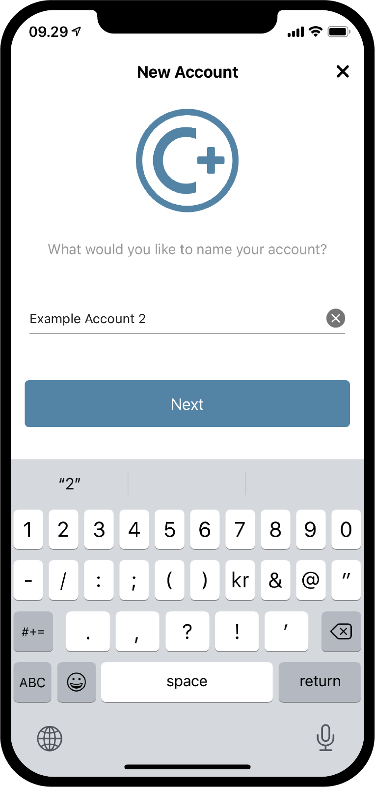
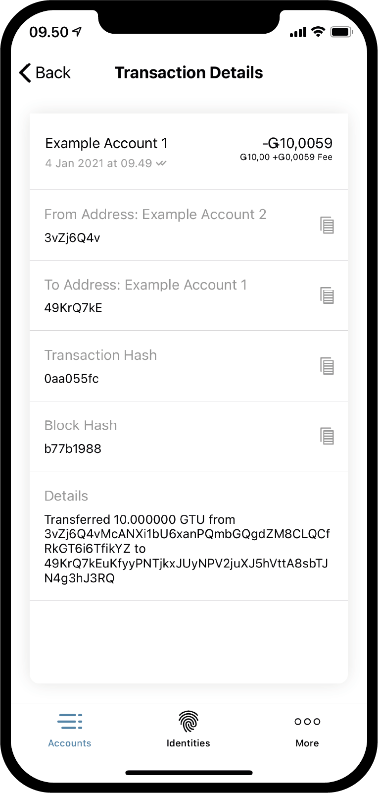

.. _Discord: https://discord.gg/xWmQ5tp

.. _guide-account-transactions-uk:

===================================================
Concordium ID: Початок роботи: акаунти і транзакції
===================================================

.. contents::
   :local:
   :backlinks: none

Перш ніж приступити до цієї довідки, ви повинні створити свій початковий рахунок і ідентифікатор (посвідчення), як описано в :ref:`попередній частині <testnet-get-started-uk>`.

Створення нового рахунку
========================
Перш ніж приступити до вивчення роботи з рахунками, балансами і транзакціями, давайте створимо другий рахунок.
Перейдіть на вкладку *Accounts*.
У верхньому правому куті ви побачите **плюсик**, натисніть його.
На наступному екрані вам преждложат ввести ім'я нового рахунку.
У цьому прикладі ми назвемо його *Example Account 2*, але ви можете назвати його як завгодно.

.. image:: images/concordium-id/acc1.png
      :width: 32%

Після того як ви натиснули **Next**, вам буде запропоновано вибрати ідентифікатор до якого буде прив'язаний новий рахунок.
На даний момент у вас, швидше за все, вже є один, але навіть якщо у вас їх декілька, можете вибрати будь-який зі списку.
Після вибору зони, ви перейдете до наступного екрану. Якщо ви вибрали не вашпервий ідентифікатор,
тобто рахунок який не був створений з початковим ідентифікатором, ви можете вибрати деякі властивості для показу :ref:`glossary-attribute`.
Це не обов'язково, і якщо у вас немає для цього особливої ​​причини, ми рекомендуємо пропустити цей крок і не показувати їх,
так як вони будуть вписані в ланцюжок і не можуть бути видалені.

.. image:: images/concordium-id/acc3.png
      :width: 32%
.. image:: images/concordium-id/acc4.png
      :width: 32%

Якщо ви натиснули кнопку **Reveal account attributes**, відкриється екран, де ви можете відключити атрибути які хочете показувати, потім натиснути **Submit account**.
Після натискання на кнопку **Submit account** на цій або на попередній сторінці, ви будете перенаправлені на фінальну сторінку створення облікового запису,
на якій буде коротка узагальнююча інформація та підтвердження що рахунок був створений.

.. image:: images/concordium-id/acc5.png
      :width: 32%
.. image:: images/concordium-id/acc6.png
      :width: 32%

Після натискання на кнопку **Ok, thanks** на цьому екрані, ви повернетеся на екран зі списком рахунків.
Ви можете побачити, що ваш новий рахунок все ще в обробці, так як для для цього може знадобитися кілька хвилин.
Якщо ви ще не пробували це зробити, ви можете натиснути *стрілку вниз*, на одній з карток рахунків, щоб побачити деталі.
Там містяться два нових розділу інформації: *at disposal* і *staked*.
Поруч буде вказано доступний залишок на відповідній частині рахунку.
Більше деталей ви можете знайти на сторінці :ref:`управління рахунками <managing_accounts>`

.. image:: images/concordium-id/acc7.png
      :width: 32%
.. image:: images/concordium-id/acc8.png
      :width: 32%

Cтворення транзакції
====================
Далі, спробуйте натиснути на розділ **Balance** на картці, щойно створеного рахунку.
На цьому екрані ви побачите поточний баланас, також тут ви зможете запросити 100 GTU для використання в рамках тестнета.
Запит 100 GTU - опція доступна для тестнетов і зокрема для тестнета 4 на рахунок буде перераховано 2000 GTU, не дивлячись на те що на кнопці написано 100.
Такий переклад доступний лише один раз.
Після натискання на кнопку запиту ви побачите що з'явилися повідомлення про транзакції, після чого, через деякий час, 2000. GTU будуть додані на ваш рахунок.

.. image:: images/concordium-id/acc9.png
      :width: 32%
.. image:: images/concordium-id/acc10.png
      :width: 32%

Тепер у нас є трохи токенов GTU на нашому рахунку давайте приступимо до транзакції.
Для цього натисніть на кнопку **SEND**.
На наступному екрані вам буде запропоновано ввести кількість токенов, яке ви хочете відправити. У цьому прикладі ми відправимо 10 GTU.

.. image:: images/concordium-id/acc11.png
      :width: 32%
.. image:: images/concordium-id/acc12.png
      :width: 32%

Визначившись з сумою, ми повинні вибрати одержувача. Для цього Намжил кнопку **Recipient or shield amount**.
На цьому екрані ви можете виконати пошук одержувача у вашій *адресній книзі* або сканувати QR код одержувача.
Як ви бачите на скрішоте, у нас є лише один збережений одержувач - *Example Account 1*.
Також тут є опція *Shield an amount*, до неї ми повернемося пізніше. Виберемо одержувача *Example Account 1* для прикладу.

.. image:: images/concordium-id/acc13.png
      :width: 32%
.. image:: images/concordium-id/acc14.png
      :width: 32%

Коли сума і одержувач обрані, натискаємо **Send Funds**, після чого побачимо екран підтвердження операції з сумою, адресою рахунку одержувача і відправника.
Після натискання на кнопку **Yes, send funds**, необхідно буде підтвердити свою особу паролем або біометричної ідентифікацією, після чого транзакція буде збережена в ланцюжок.
Завершення транзакції може зажадати декількох хвилин.

.. image:: images/concordium-id/acc15.png
      :width: 32%
.. image:: images/concordium-id/acc16.png
      :width: 32%

Тепер ми можемо бачити в списку *Transfers* рахунку *Example Account 2* що була знята сума і *комісія*.
Усі транзакції обкладаються комісією, яка залежить від типу транзаціі.
Натиснувши на транзакцію ви побачите додаткову інформацію.

.. image:: images/concordium-id/acc17.png
      :width: 32%

.. _move-an-amount-to-the-shielded-balance-uk:

Переміщення коштів на захищений баланс
======================================
Якщо ми повернемося назад, на екран *Accounts* (список рахунків), ми побачимо що 10 GTU були перераховані на *баланс* рахунку *Example Account 1*.
Як ви могли помітити раніше, кожен рахунок містить :ref:`glossary-shielded-balance`.
Якщо коротко, захищений баланс служить для зберігання зашифрованого залишку GTU на балансі рахунку.
Давайте спробуємо *захистити* деяку суму GTU на наш рахунок *Example Account 2*.
Для цього натиснемо на область **Shielded Balance** картки рахунку.

.. image:: images/concordium-id/acc19.png
      :width: 32%
.. image:: images/concordium-id/acc20.png
      :width: 32%

Далі, натискаємо на кнопку **SEND** знову і вводимо суму GTU для для додавання цих токенов на *Захищений баланс*.
Після чого тиснемо на **Select Recipient or shield amount**. Замість вибору одержувача, на цей раз тиснемо **Shield amount**.

.. image:: images/concordium-id/acc21.png
      :width: 32%
.. image:: images/concordium-id/acc22.png
      :width: 32%

Транзакція має бути підтверджена так само, як ми робили це раніше для звичайного перекладу.
Виконання транзакції може зайняти певний час.

.. image:: images/concordium-id/acc23.png
      :width: 32%
.. image:: images/concordium-id/acc24.png
      :width: 32%

Повернемося назад на екран *Accounts*, де тепер бачимо що 10 GTU знаходяться на *захищеності балансі* *Example Account 2*.
Якщо натиснути на область *Захищений баланс* картки рахунку, ви можете побачити що з'явилася тразакція *Shielded amount* в списку логів перекладів.
Створення захищає транзакції також обкладається комісією, але ця комісія буде знята з звичайного балансу рахунку.
Давайте спробуємо повернутися назад і поглянути на список перекладів звичайного *Балансу*.

.. image:: images/concordium-id/acc25.png
      :width: 32%
.. image:: images/concordium-id/acc26.png
      :width: 32%

Створення захищеної транзакції
==============================
Маючи захищені GTU, ми тепер можемо спробувати виконати *захищену транзакцію* (*Shielded transfer*), що має на увазі транзакцію захищених GTU.
Для початку перейдіть на екран *захищеного балансу* рахунку, який містить захищені GTU.
Потім натисніть кнопку **SEND**. Тепер ви можете ввести кількість і вибрати одержувача.
В даному прикладі ми вибрали 2 GTU. Після натискання **Select Recipient or unshield amount**, ви можете вибрати одержувача.
Для прикладу виберемо *Example Account 2*.

.. image:: images/concordium-id/acc27.png
      :width: 32%
.. image:: images/concordium-id/acc28.png
      :width: 32%

Після того як сума і одержувач обрані, можна продовжувати.
Так само як і в інших транзакціях, ви побачите вікно підтвердження, після чого повинні будете підтвердити свою особистість пінкод або біометричними даними,
після чого відправити захищену транзакцію в ланцюжок. Знову ж, завершення транзакції може зайняти певний час.

.. image:: images/concordium-id/acc29.png
      :width: 32%
.. image:: images/concordium-id/acc30.png
      :width: 32%

Тепер, якщо ви повернетеся на екран рахунків (*Accounts*), ви побачите невелику іконку щита, біля суми *Захищений баланс* рахунку одержувача.
Це означає що була отримана захищена транзакція.
Спробуйте натиснути на захищений баланс і переконайтеся, що для того щоб увійти вам необхідно використовувати пінкод або біометрії.
Це відбувається тому що ви повинні розшифрувати отриману захищену транзакцію, щоб побачити суму.

.. image:: images/concordium-id/acc31.png
      :width: 32%
.. image:: images/concordium-id/acc32.png
      :width: 32%

Зняття захисту з балансу
========================
Після розшифровки, сума стане видимою в *захищеному балансі* картки рахунку на екрані рахунків (*Accounts*).
Тепер, що якщо ми хочемо перемістити GTU з захищеного балансу на звичайний?
Давайте спробуємо перемістити 2 GTU на звичайний баланс за допомогою функції зняття захисту з суми.
Для цього, натисніть на кнопку **SEND** в захищеному балансі, введіть суму, потім натисніть **Select Recipient or unshield amount**, після чого виберіть **Unshield amount**.

.. image:: images/concordium-id/acc33.png
      :width: 32%
.. image:: images/concordium-id/acc34.png
      :width: 32%

Тепер завершите транзакцію так само, як ви робили в попередніх прикладах і подивіться на звичайний балас рахунку, щоб переконатися що захист була знята.
Якщо транзакція до цього часу була виконана, ви повинні побачити що сума перерахована на звичайний баланс.
Зверніть увагу, що це не 2 GTU, незважаючи на те що раніше ми вибрали цю суму для зняття захисту.
Вся справа в комісії, яка віднімається, в тому числі, за зняття захисту і списання відбувається з основного рахунку, що відповідає за транзакцію.

.. image:: images/concordium-id/acc35.png
      :width: 32%
.. image:: images/concordium-id/acc36.png
      :width: 32%

Поділитися адресою рахунку
==========================
Якщо хочете поділитися адресою вашого рахунку, натисніть на кнопку **Address**.
Відкриється сторінка, де будуть різні опції. Натиснувши кнопку **Share** ви зможете поділитися з ким-небудь своєю адресою.

.. image:: images/concordium-id/acc37.png
      :width: 32%
.. image:: images/concordium-id/acc38.png
      :width: 32%

Перерахунок за розкладом
========================
У блокчейні Concordium є можливість здійснювати транзакції через певні проміжки часу, це має назву *перерахунок за розкладом*.
Зараз ми не будемо заглиблюватися в подробиці створення подібного перекладу, поскільки це не може бути виконано в додатку Concordium ID, однак, в пріложніі ми можемо перевірити розклад.
Якщо у вас налаштований подібний переклад за розкладом, можете натиснути на кнопку **меню** в верхньому правому куті екрану з балансом.
Після чого відобразиться пункт **Release schedule** (розклад перекладів), натиснувши на який ви перейдете на екран, який містить інформацію про те, скільки GTU буде відправлено і коли.
Якщо хочете дізнатися більше про перекази за розкладом, можете знайти це на сторінках :ref:`concordium_client` і :ref:`transactions`.

.. image:: images/concordium-id/rel1.png
      :width: 32%
.. image:: images/concordium-id/rel2.png
      :width: 32%
.. image:: images/concordium-id/rel3.png
      :width: 32%

Підтримка і зворотний зв'язок
=============================

Якщо ви зіткнулися з проблемами або у вас виникли питання, зв'яжіться з нами в `Discord`_, або по електронній пошті testnet@concordium.com.
