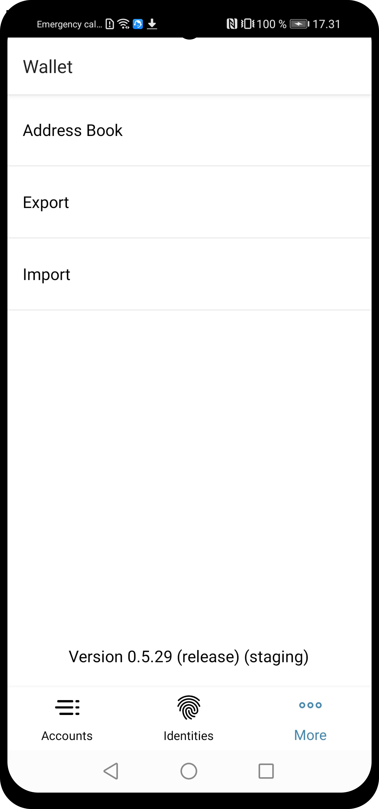

.. _Discord: https://discord.gg/xWmQ5tp

.. _testnet-explore-more-uk:

=======================================
Concordium ID: Вивчаємо сторінку *More*
=======================================

.. contents::
   :local:
   :backlinks: none

Експорт
=======
У вас є можливість експортувати ваші рахунки і ідентифікатори.
Для початку, відкрийте сторінку *More*.
Залежно від того, яку версію програми ви використовуєте (Android або iOS), сторінка *More* може трохи відрізнятися.
На Android ви побачите 3 пункту меню *Address Book*, *Export* і *Import*.
На iOS будуть доступні тільки *Address Book* і *Export*.
Це пов'язано з тим, що функція *Імпорт* працює по-різному, в залежності від платформи, але ми повернемося до цього пізніше.

.. image:: images/concordium-id/exp2.png
      :width: 32%

Щоб почати експорт, натисніть опцію **Export**. Ви потрапите на нову сторінку, на якій коротко пояснюється, що означає ця функція.
Ми рекомендуємо уважно її прочитати. Натиснувши **Continue**, ви потрапите на сторінку, на якій вам буде запропоновано ввести пароль для експортованого файл.
Ввівши його двічі, натискаємо **Continue**. В якості останнього кроку iOS або Android запитає у вас, що ви хочете зробити з експортованих файлом, використовуючи діалог операційної системи телефону.

.. image:: images/concordium-id/exp3.png
      :width: 32%
.. image:: images/concordium-id/exp4.png
      :width: 32%

Імпорт
======
Як згадувалося в попередньому розділі, функція імпорту працює трохи по-різному на iOS і Android.
На Android ви вибираєте пункт меню *Import* на сторінці *More*, який дозволить вам перейти до файлу, який ви хочете імпортувати.
В залежності від моделі телефону і версії Android, цей крок може трохи відрізнятися.
На iOS вам потрібно перейти до файлу поза Concordium ID, потім натисніть на нього і виберіть опцію *Share*.
Це дозволить вам вибрати Concordium ID в якості додатку для обробки файлу.

Відкривши файл на будь-який з платформ, вам спочатку буде запропоновано ввести пароль, обраний при експорті.
Після натискання **Continue** вам потрібно буде підтвердити себе за допомогою пароля або обраних біометричних даних при настроювати програму.
У підсумку ви отримаєте список імпортованих вами записів *Accounts*, *Identities* і *Address Book*.

.. image:: images/concordium-id/imp1.png
      :width: 32%
.. image:: images/concordium-id/imp2.png
      :width: 32%

Address Book
============
As the name suggests, the *Address Book* is a place to keep account addresses. If you browse to the *Address Book* you will see that
the addresses of your own accounts are already stored there. Besides seeing your own addresses, you can also add more entries to
the *Address Book*, either by pressing the **QR code symbol**, or pressing the **plus sign** in the upper right corner. By doing that you
can enter a new recipient address and give it a nickname in your *Address Book*. The entries in your address book can of course be
searched, when you make a transfer.

.. image:: images/concordium-id/add1.png
      :width: 32%
.. image:: images/concordium-id/add2.png
      :width: 32%

Support & Feedback
==================

If you run into any issues or have suggestions, post your question or
feedback on `Discord`_, or contact us at testnet@concordium.com.
