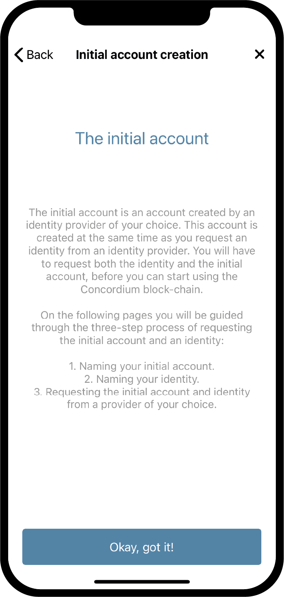

.. _Discord: https://discord.gg/xWmQ5tp

.. _testnet-get-started-uk:

========================================
Concordium ID: Початок роботи з додатком
========================================

.. contents::
   :local:
   :backlinks: none

Перед тим, як приступити до цієї довідки, ви повинні завершити установку Concordium ID, як описано в :ref:`попередній частині <testnet-get-the-app>`.

Установка пароля і біометрії
============================

Коли ви вперше відкриєте додаток Concordium ID, вас зустріне помічник, який допоможе вам налаштувати пароль і біометричну аутентифікацію,
створити :ref:`glossary-initial-account`, також допоможе вам отримати :ref:` glossary-identity`.
Початковий рахунок - це особливий тип рахунку, який передається в ланцюжок :ref:`glossary-identity-provider` при створенні ідентифікатора.
Ви можете виконувати ті ж транзакції з початковим рахунком, що і з звичайними рахунками, але власник вихідного рахунку буде відомий постачальнику посвідчень.
Після того, як ваш ідентифікатор буде створена, ви зможете додавати рахунки в вашу ланцюжок і постачальник посвідчень не дізнається про це.
Можете дізнатися більше про рахунки на сторінці :ref:`Рахунки і ідентифікатори <reference-id-accounts>`.

Це перший екран, який ви побачите при відкритті Concordium ID. Він пояснює як виконати початкову настройку, щоб почати роботу.

Якщо ви готові продовжити, просто натисніть **Yes, let's go!**.
На наступному екрані вам буде запропоновано ввести 6-значний пінкод.
Якщо ви віддаєте перевагу використовувати більш надійний пароль, що включає символи, така опція також доступна.

.. image:: images/concordium-id/int1.png
      :width: 32%
.. image:: images/concordium-id/int2.png
      :width: 32%

.. todo::

   Напишіть директиву, щоб зробити два або більше зображень по центру

Вибравши пінкод або надійний пароль, ви також маєте можливість прив'язати біометричні дані, якщо ваш телефон підтримує роботу з ними.
Це може бути розпізнавання особи або відбитків пальців. Ми рекомендуємо використовувати біометричні дані, якщо у вас є така можливість.

.. image:: images/concordium-id/int3.png
      :width: 32%
      :align: center

Запит початкового рахунку і ідентифікатора
==========================================

Далі у вас буде вибір між створенням нового початкового рахунку і ідентифікатора або імпортом вже існуючого набору.
Якщо ви вперше використовуєте Concordium ID, вибирайте **I want to create my initial account**, щоб продовжити.

.. image:: images/concordium-id/int4.png
      :width: 32%
      :align: center

На наступному екрані ви побачите опис того, що таке початковий рахунок, і три простих кроки, які ви повинні виконати, щоб отримати його і ідентифікатор.
Початковий рахунок - це обліковий запис, збережена в ланцюжок постачальником посвідчень, якого ви вибрали. Це означає, що постачальник буде знати, що ви є власником цього рахунку.
Пізніше ви зможете додавати рахунки в ланцюжок самостійно, а значить власник цих рахунків буде відомий тільки вам.

Три кроки, згадані вище:

1. Створення імені початкового рахунку
2. Створення імені ідентифікатора
3. Запит початкового рахунку і ідентифікатора у постачальника посвідчень (:ref:`glossary-identity-provider`), якого ви вибрали.

Перший крок ви побачите на наступній сторінці - вам буде запропоновано ввести ім'я для вашого початкового рахунку.
Після чого ви потрапите на наступну сторінку, на якій ви повинні придумати собі ідентифікатор.
Обидва ці значення будуть відомі тільки вам, так що ви можете називати як хочете (проте є деякі обмеження на те, які букви і символи ви можете використовувати).

У прикладі нижче ми вибрали ім'я рахунку *Example Account 1* і ідентифікатор *Example Identity*.
Як було згадано, ви можете вибрати будь-яке значення, яке хочете.

.. image:: images/concordium-id/int6.png
      :width: 32%
.. image:: images/concordium-id/int7.png
      :width: 32%

Натиснувши **Continue to identity providers**, ви потрапите на сторінку, де вам потрібно буде вибрати *постачальника посвідчень*.
Постачальник посвідчень - це зовнішня служба, яка перевіряє, хто ви, перед тим, як повернути об'єкт посвідчення, який буде використовуватися в ланцюжку.
На даний момент ви можете вибрати один з:

* *Notabene Development* який дасть вам тестовий ідентифікатор без реальної перевірки особистості.
* *Notabene* за допомогою якого буде перевірена ваша справжня особистість.

.. image:: images/concordium-id/int8.png
      :width: 32%
      :align: center

Вибравши Notebene Development, ви без зайвих слів отримаєте тестовий ідентифікатор.
Якщо ви виберете Notabene, ви ініціюєте зовнішню процедуру перевірки, яка проведе вас через весь процес отримання посвідчення.
Після завершення цього процесу ви повернетеся в Concordium ID.

Після завершення будь-якого з процесів видачі посвідчень ви побачите наступний екран.
На ньому ви побачите інформацію про вашому ідентифікатор особистості і початковому рахунку.

.. image:: images/concordium-id/int9.png
      :width: 32%
      :align: center

Залежно від обраного вами постачальника посвідчень зовнішній вигляд посвідчення особи може незначно відрізнятися.
Ви можете бачити, що *Example Account 1* належить ідентифікатором *Example Identity*.
Рахунок, створений під час цього процесу, буде відзначений в додатку як *(Initial)*, щоб ви бачили, який рахунок є початковим, відправленим в ланцюжок постачальником посвідчень.

Натиснувши **Finish**, ви потрапите на екран *Accounts*.
На цьому екрані ви зможете побачити недавно створений, початковий рахунок.
Також може відображатися значок *Pending*, що означає, що постачальник посвідчень все ще працює над створенням вашого початкового рахунку і ідентифікатора.
Перейдемо до екрану *Ідентифікатори*, натиснувши **Identities** в нижній частині екрана.
На цьому екрані ви побачите тільки що створений ідентифікатор, який також може бути в змозі обробки, якщо постачальник посвідчень ще не закінчив процес створення.
Все що вам залишається, це дочекатися його завершення.

.. image:: images/concordium-id/int10.png
      :width: 32%
.. image:: images/concordium-id/int11.png
      :width: 32%

Підтримка і зворотний зв'язок
=============================

Якщо ви зіткнулися з проблемами або у вас виникли питання, зв'яжіться з нами в `Discord`_, або по електронній пошті testnet@concordium.com.
