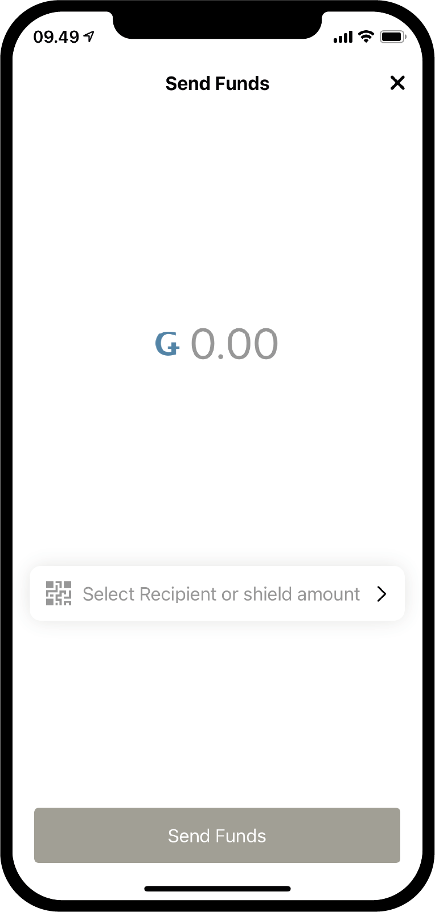
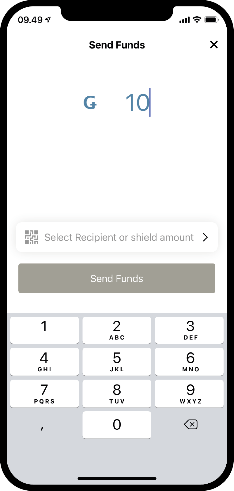

.. _Discord: https://discord.gg/xWmQ5tp

.. _guide-account-transactions:

=========================================================
Concordium ID：开始使用帐户和交易
=========================================================

.. contents::
   :local:
   :backlinks: none

· 在遵循本指南之前，您应该已经完成了请求初始帐户和身份的请求，如上一章 **<testnet-get-started>** 中所述。

创建一个新账户
====================
在介绍帐户，余额和交易如何工作之前，让我们创建第二个帐户。首先转到 **帐户** 页面。在右上角，您应该看到一个 **加号** 。按下以继续。在下一个界面上，将要求您命名新帐户。在此示例中，我们将选择名称  **Example Account 2** ，但是您可以选择所需的任何名称。

.. image:: images/concordium-id/acc1.png
      :width: 32%
.. image:: images/concordium-id/acc2.png
      :width: 32%

当按下Next时，将出现一个界面，您必须在该界面上决定使用哪个身份来打开新帐户。到目前为止，您可能只有一个，但是如果您有更多，则可以从列表中选择所需的身份。通过单击一个身份，您将进入下一个界面。创建非初始帐户（即在创建身份时未创建的帐户）时，您可以选择显示一些： :ref:`glossary-attribute`.。这是没有必要的，并且如果您没有特定的原因，我们建议您不要公开任何内容，因为已公开的属性将在链上且无法删除。

.. image:: images/concordium-id/acc3.png
      :width: 32%
.. image:: images/concordium-id/acc4.png
      :width: 32%

如果确实按了 **“显示帐户属性”**  按钮，则将转到下一页。您可以勾选要显示的属性，然后按 **"提交帐户"** 。在此页面或上一页中按 **“提交帐户”** ，将带您进入最终帐户创建页面，该页面将为您提供简短概述并告诉您该帐户已提交。

.. image:: images/concordium-id/acc5.png
      :width: 32%
.. image:: images/concordium-id/acc6.png
      :width: 32%

通过单击 **"确定，谢谢您"** 在提交概述中，您将返回到帐户页面。您可能会发现您的新帐户仍处于待处理状态，因为这可能需要几分钟才能最终确定。如果您尚未尝试这样做，则可以尝试按其中一张帐户卡上的向下箭头，以查看它会折叠到该卡上。这展示了两个新的信息： *可支配(at disposal)* 和 *已抵押(staked)* 。 **“可支配”** 字段将告诉您在给定的时刻有多少可用的帐户余额，以及您可以在 :ref:`managing accounts<managing_accounts>` 页面上详细了解的抵押金额。

.. image:: images/concordium-id/acc7.png
      :width: 32%
.. image:: images/concordium-id/acc8.png
      :width: 32%

进行交易
====================
接下来，我们尝试点击新创建帐户的 **“余额”** 。在此界面上，您可以看到帐户的当前余额，并且在这里，您还可以在测试网(Testnet)中请求100GTU。请求获取100 GTU是Testnet的(水龙头)功能. 而在Testnet 4中，它将实际上将2000 GTU转移到该帐户，即使该按钮显示为100GTU。 测试网中，每个新帐户仅仅可以获取一次GTU。点击下它，您可以看到交易被创建了。一会后，2000 GTU将会被添加到您的帐户中。

.. image:: images/concordium-id/acc9.png
      :width: 32%
.. image:: images/concordium-id/acc10.png
      :width: 32%

现在我们的帐户中有一些GTU，让我们尝试进行交易。按发送按钮执行此操作。在下一页上，您可以输入要转账的金额，然后选择收款人。在此示例中，我们将传输10 GTU。

确定金额后，我们现在将选择收款人。为此，请按 **“选择收款人(Recipient)”** 或 **“屏蔽数额(shield amount)”** 按钮。在此页面上，您可以在通讯簿中搜索收款人，也可以通过扫描接收帐户的 QR码 来添加收款人。正如您在界面截图中所看到的，我们仅保存了一个收款人，即 *示例帐户1* 。然后，我们可以选择 **Shield an amount** ，但稍后我们会再讨论。在此示例中，我们将选择 *示例帐户1* 作为我们的收款人。

.. image:: images/concordium-id/acc13.png
      :width: 32%
.. image:: images/concordium-id/acc14.png
      :width: 32%

选择 金额 和 收款人 后，我们可以按 **“发送资金”** 继续。通过这样做，我们将进入确认页面，在确认页面上确认金额，收款人和发送帐户。按 **是，发送资金** ，我们将使用密码或生物识别技术进行自我验证，然后将交易提交到链上。我们可能需要一些时间等待交易的最终完成。

.. image:: images/concordium-id/acc15.png
      :width: 32%
.. image:: images/concordium-id/acc16.png
      :width: 32%

现在，我们可以看到 **“示例帐户2 ”** 的 **“转帐(Transfers)”** 日志显示已扣除了该金额和一笔费用。所有交易都将收取费用，并且根据交易类型的不同，费用可能会有所不同。点击交易将使您看到更多它的详细信息。

.. image:: images/concordium-id/acc17.png
      :width: 32%
.. image:: images/concordium-id/acc18.png
      :width: 32%

.. _move-an-amount-to-the-shielded-balance:

将金额移动到 *被保护的余额(shielded balance)*
========================================
如果返回到 **“帐户”** 界面，现在可以看到 10 GTU 已转移到 **示例帐户1** 的余额中。您可能已经注意到，这些帐户还具有： :ref:`glossary-shielded-balance` 。简而言之，屏蔽(shielded)余额用于在帐户上持有GTU的屏蔽(shielded)（加密的）金额。现在让我们尝试在 **“示例帐户2 ”** 中添加一些受屏蔽(shielded)的GTU 。首先按下帐户卡的 **被保护的余额(Shielded Balance)** 。

.. image:: images/concordium-id/acc19.png
      :width: 32%
.. image:: images/concordium-id/acc20.png
      :width: 32%

接下来，再次按 **SEND** 按钮并输入要屏蔽(shielded)(shielded)的GTU数量，即在 **被保护的余额(Shielded Balance)** 中添加一些GTU。完成此操作后，让我们再次按 **“选择收款人”** 或 **“屏蔽(shielded)数量”** 。这次我们并没有选择接收者，而是按 **Shield amount** 。

.. image:: images/concordium-id/acc21.png
      :width: 32%
.. image:: images/concordium-id/acc22.png
      :width: 32%

现在，我们可以像常规转帐之前一样继续并确认交易。该交易可能需要一点时间才能在链上完成。

.. image:: images/concordium-id/acc23.png
      :width: 32%
.. image:: images/concordium-id/acc24.png
      :width: 32%

返回 **“帐户”** 界面，现在可以看到 **示例帐户2** 的 **被保护的余额(Shielded Balance)** 中有10 GTU 。如果点击帐户卡的  **被保护的余额(Shielded Balance)** ，则可以看到在转账日志 中有一个 **“Shielded amount”** 交易。创建屏蔽(shielded)交易也将收取一定费用，但该费用将从帐户的常规余额中扣除。尝试返回并查看常规余额的转账日志。

.. image:: images/concordium-id/acc25.png
      :width: 32%
.. image:: images/concordium-id/acc26.png
      :width: 32%

进行shielded转账
========================
有了一些可用的屏蔽(shielded)GTU，我们现在可以尝试进行shielded转账，这意味着我们可以将一些隐藏(加密)了数额的GTU进行转账。第一步，跳转到持有shielded GTU的帐户的 *受保护余额(shielded balance)* 界面。然后按发送按钮。现在，您将能够输入金额并选择收款人。在此示例中，我们选择了传输 2 GTU。按 **“选择收款人”** 或 **“取消屏蔽(unshielded)金额”** 按钮时，您将能够选择收款人。在此示例中，我们将选择 **“示例帐户2”** 。

.. image:: images/concordium-id/acc27.png
      :width: 32%
.. image:: images/concordium-id/acc28.png
      :width: 32%

有了金额和收款人之后，您现在可以继续。就像其他交易一样，您现在将看到一个确认界面，然后继续进行操作，就可以使用密码或生物识别技术来验证自己，然后将被屏蔽(shielded)的交易提交到链中。同样，该交易可能需要一些时间才能最终确定。

.. image:: images/concordium-id/acc29.png
      :width: 32%
.. image:: images/concordium-id/acc30.png
      :width: 32%

现在，如果您返回到 **“帐户”** 界面，您应该能够看到收款账户的 **“受保护的余额”** 中的金额旁边出现了一个小盾牌。这表明在的 **被保护的余额(Shielded Balance)** 上有新接收到的被屏蔽(shielded)的交易。尝试点击 **被保护的余额(Shielded Balance)** ，请注意，您必须输入密码或使用生物识别技术才能进入界面。发生这种情况是因为您需要先解密收到的被屏蔽(shielded)交易，然后才能看到交易中的金额。

.. image:: images/concordium-id/acc31.png
      :width: 32%
.. image:: images/concordium-id/acc32.png
      :width: 32%

揭开(Unshield)金额
==================
解密后，现在我们在 **被保护的余额(Shielded Balance)** 和 **“帐户”** 界面上的帐户卡上可以看到该金额了。现在，如果我们想将一些 GTU 从屏蔽(shielded)余额转移到常规余额，该怎么办？让我们尝试通过 *取消屏蔽(Unshielding)* 金额的操作将 2 GTU移至常规余额 。为此，请点击 **被保护的余额(Shielded Balance)** 中的 **“发送”** 按钮。输入2作为金额，然后按 **选择收款人** 或 **选择取消屏蔽(Unshield)金额** 。

.. image:: images/concordium-id/acc33.png
      :width: 32%
.. image:: images/concordium-id/acc34.png
      :width: 32%

接下来，我们就像完成其他交易一样完成交易，然后尝试跳转到帐户的常规余额以查看 *Unshielded* 金额。如果交易已经在链上完成，您现在应该可以看到常规余额中已显示 **未屏蔽(Unshielded)金额** 。请注意，虽然您刚刚取消屏蔽(Unshielded)的金额是2GTU，但这里它并不是2 GTU。这是因为进行任何事务（包括取消屏蔽(unshielding)）的费用将从负责该交易的帐户的常规余额中扣除。

.. image:: images/concordium-id/acc35.png
      :width: 32%
.. image:: images/concordium-id/acc36.png
      :width: 32%

分享您的帐户地址
==========================
如果要分享您的帐户地址，可以通过点击 **“地址”** 按钮轻松完成。这个操作将带您到一个页面，在这里您可以有多种共享帐户地址的方式。尝试按 **“共享”** 按钮，然后与某人共享您的地址。

.. image:: images/concordium-id/acc37.png
      :width: 32%
.. image:: images/concordium-id/acc38.png
      :width: 32%

了解 *Release schedule* 
==========================
在Concordium区块链上可以进行这样的一种交易，该类交易的转账金额需要随着时间流逝而逐步释放(收款人只能使用已经释放的部分), 这称为 *带计划* 的 *转账*。现在我们将不讨论如何进行这样的转账，因为它不能从concordium ID完成，但是让我们看看release schedule是怎样工作的。如果您收到一笔包含release schedule的转帐，则可以按余额界面右上角的 **汉堡菜单( burger menu)** ，这里你可以点击 **Release schedule** ，然后您将进入一个界面，其中显示着此转账将包含 *释放多少 GTU* 以及 *何时释放* 的信息。如果您想了解更多有关如何进行带"Release Schedule"的转账，您可以看一下: :ref:`concordium_client` 和 :ref:`transactions` 页面。

.. image:: images/concordium-id/rel1.png
      :width: 32%
.. image:: images/concordium-id/rel2.png
      :width: 32%
.. image:: images/concordium-id/rel3.png
      :width: 32%

支持与反馈
==================

如果您遇到任何问题或建议，请在 `Discord`_ 上发布您的问题或反馈，或通过  testnet@concordium.com 与我们联系。
