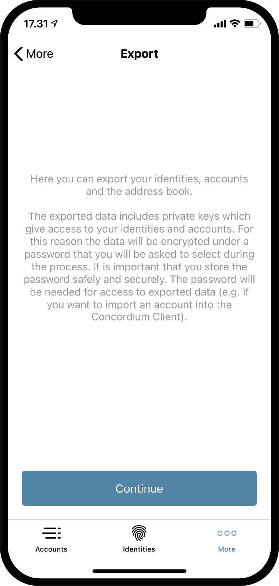
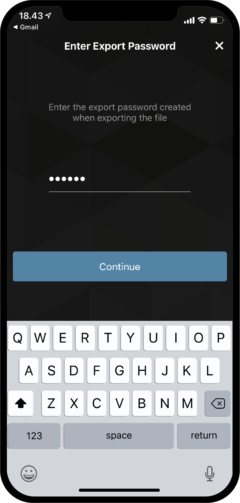

.. _Discord: https://discord.gg/xWmQ5tp

.. _testnet-explore-more:

=======================================
Concordium ID：浏览 *更多* 页面
=======================================

.. contents::
   :local:
   :backlinks: none

导出
======
使用Concordium ID应用程序可以导出您的账户和身份。首先，浏览至 *更多* 页面。
根据您使用的是Android还是iOS版本的应用程序，*更多* 页面的外观会略有不同。
在Android上，您将看到三个菜单项：*通讯录* ，*导出* 和 *导入* 。 
在iOS上，您只会看到 *通讯录* 和 *导出* 。
这是因为根据平台的不同，导入功能可以以两种不同的方式工作，稍后我们将回到这一点。

.. image:: images/concordium-id/exp1.png
      :width: 32%
.. image:: images/concordium-id/exp2.png
      :width: 32%

要开始导出，请点击 **导出** 选项。 这样做将带您进入一个新页面，该页面简要说明了导出的含义。
我们建议您仔细阅读。 按 **继续** 将带您进入一个页面，在该页面上将要求您输入密码。输入两次后，您可以继续。
最后，iOS或Android会根据您使用手机操作系统中的处理导出文件的方式。

.. image:: images/concordium-id/exp4.png
      :width: 32%

导入
=====
如上一节所述，导入功能在iOS和Android上的工作方式略有不同。
在Android上，按 *更多* 页面上的 *导入* 选项，这将使您浏览到要导入的文件。具体操作取决于您的手机、Android操作系统版本。 
在iOS上，您必须从Concordium ID程序外浏览文件，然后选择 *Share option* ，然后选择Concordium ID作为处理文件的应用程序。

在任一平台上打开文件后，首先将要求您输入导出时选择的密码。点击 **继续** 后，您将必须使用设置应用程序时所选的密码或生物特征来验证。
最后你会得到一个列表，即您导入的 *账户* ，*身份* 和 *通讯录* 。

.. image:: images/concordium-id/imp2.png
      :width: 32%

通讯录
============
顾名思义，*通讯录* 是保存账户地址的地方。如果浏览到 *通讯录* ，您将看到自己账户的地址已经存储在此处。
除了查看自己的地址外，您还可以向 *通讯录* 添加，点击 **QR code symbol**，或按右上角的 **加号**。输入新的接收人地址，并在您的 *通讯录* 中给它起一个昵称。 
在转帐时可以搜索通讯录中的条目。

.. image:: images/concordium-id/add1.png
      :width: 32%
.. image:: images/concordium-id/add2.png
      :width: 32%

支持与反馈
==================

如果您遇到任何问题或建议，请在 `Discord`_ 上发布您的问题或反馈，或通过testnet@concordium.com与我们联系。
